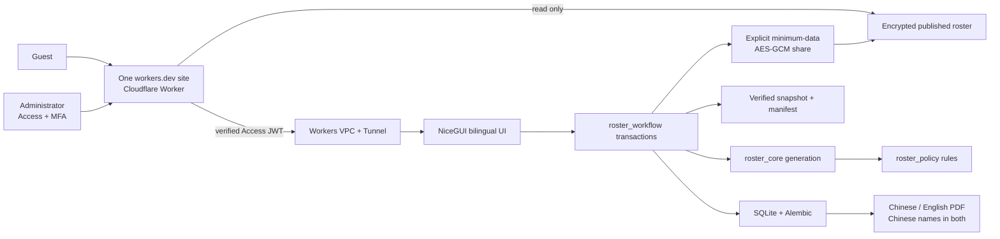

# Sing Yin Study Prefect Duty Roster System

> **Not to be served, but to serve. — Mark 10:45**

I am LI Chuangjie Jacky, Head Study Prefect for 2026–2027 at Sing Yin Secondary
School. I co-created this maintained, local-first roster platform with Codex so
that future Head Study Prefects can inherit a safe and understandable weekly process:

**Feedback and contact:** Questions or suggestions about the workflow, interface,
fairness explanation, or handover are welcome at
[`s10777@syss.edu.hk`](mailto:s10777@syss.edu.hk). Include an OP/REQ support
reference when one is shown, but do not attach names, leave details, rosters,
PDFs, databases, backups, screenshots, or complete logs.

**prepare → generate draft → review → publish once → export bilingual PDF →
adjust published leave → explain fairness → back up, restore, and hand over.**

[Traditional Chinese README](README.md) · [Operator guide](docs/OPERATOR_GUIDE.md)
· [Architecture](docs/NICEGUI_ARCHITECTURE.md) · [Release status](PROJECT_STATUS.md)
· [Canonical-site access guide](docs/PUBLIC_ROSTER_VIEWER.md)

## Repository editions

| Branch | Platform | Status |
|---|---|---|
| `main` | NiceGUI + SQLite, self-hosted | Current maintained release |
| `nicegui-self-hosted` | Dedicated Windows or Linux host | Platform-labelled release snapshot |
| `streamlit-cloud` | Streamlit Cloud | Preserved legacy reference |

The NiceGUI edition is a substantial architectural rebuild. It does not copy
the Streamlit page handlers: policy remains in `roster_policy`, generation in
`roster_core`, and durable work in `roster_workflow`.

## Canonical daily entry and Windows maintenance start

The only URL distributed to users is
<https://sing-yin-roster-viewer.singyin-study-prefect.workers.dev/>. Guests stay
in read-only mode. An approved operator selects **Admin login**, completes the
Cloudflare Access account sign-in and MFA, and returns to the same site with the
NiceGUI editor unlocked. The Access session lasts at most eight hours; select
**Log out** when finished. The application has no custom password database.

The commands below prepare a host or maintenance workstation; they are not a
second normal entry point.

```powershell
python -m pip install --require-hashes -r requirements.lock
Copy-Item .env.example .env
```

During maintenance or a Cloudflare outage, double-click
`START_SING_YIN_ROSTER.cmd`. The launcher reuses an existing service, resolves
local port conflicts, waits for a real HTTP response, and opens the exact local
URL. Localhost and the enrolled private-WARP address remain recovery paths only.

For a new dedicated Windows 11 host, follow the zero-knowledge
[`WINDOWS_DEDICATED_HOST_SETUP.md`](docs/WINDOWS_DEDICATED_HOST_SETUP.md).
It includes idempotent preparation and Task Scheduler scripts. Optional remote
browser access is prepared separately by
[`CLOUDFLARE_REMOTE_ACCESS_SETUP.md`](docs/CLOUDFLARE_REMOTE_ACCESS_SETUP.md),
which keeps the origin on `127.0.0.1` and refuses activation unless an
unauthenticated request is redirected to Cloudflare Access.

For a fully isolated fictional rehearsal, double-click
`START_PRACTICE_MODE.cmd`. Practice Mode has separate SQLite, backups, logs,
preferences, port range, persistent bilingual identity, and non-official PDF
marking. Close it and use `RESET_PRACTICE_MODE.cmd` for a clean rehearsal.

## Operator workflow

1. Verify Chinese names, roles, classes, and available days.
2. Record known pre-generation leave for the correct Monday-based week.
3. Generate and review the draft. Vacancies remain visible.
4. Make any manual draft change through the audited reason form.
5. Publish once. Publication—not draft generation—posts `history_weight`.
6. Download the Chinese or English landscape A4 schedule; names remain Chinese. The export dialog can hide the crest. The clean sharing version omits the internal-use line, page number, and Scripture hint by default; enable the supplementary footer only for an intentional archival copy.
7. For a late absence, use the published-duty adjustment workflow rather than
   regenerating the week.
8. Review fairness, verified backups, handover readiness, and recovery evidence.
9. When recipients need browser-direct viewing, explicitly create an expiring,
   revocable same-host `/view#…` link for the published roster. After a
   published-duty adjustment, issue a fresh link and revoke the old one.

## Policy invariants

- Assistant Head Study Prefects serve only `Assist. in charge`.
- Study Prefects serve only Rooms 302, 303, and 202.
- Room 302: one prefect, Monday–Friday.
- Room 303: two prefects, Monday–Friday.
- Room 202: two prefects, Monday, Wednesday, and Thursday only.
- No same-person duplicate duty on one day.
- Generated duties are not consecutive across days.
- Persistent `history_weight` remains the fairness anchor.

## Platform & team

The in-app **Platform & team** centre explains why the service exists before
showing how it is built. It combines an anonymous live readiness snapshot,
the official Study Prefect Team roles with explanatory responsibility titles,
four capability groups, four outcome-led solutions, operating principles, and
the co-creation note. The live strip never exposes names, classes, leave,
roster content, backup paths, or audit records.

Official roles remain Head Study Prefect, Assistant Head Study Prefect, Study
Prefect, and Teacher Advisor. Labels such as Service Governance Lead and Room
Service Steward explain accountability only; they are not database values or
replacement school titles. Weekly Operations, Fairness Assurance, Service
Experience, and Systems Continuity are capability groups, not claims of extra
staff or headcount.

## Engineering & quality evidence

The in-app engineering page turns the strongest evidence from this README,
the architecture guide, and the release report into a readable quality centre.
It presents the complete automated suite, the current report's real passed/total
gate ratio, a five-layer system blueprint, six reliability capabilities, and the
four-stage build story. The gate chain includes browser performance, bounded
memory growth, and phone-width overflow checks. These are release facts, not
usage, commercial, or vanity KPIs; source changes make previous evidence stale.

## Architecture



SQLite writes use WAL, foreign keys, busy timeouts, transactions, online
snapshots, SHA-256 manifests, integrity checks, and managed restore. A
database-level publication claim prevents two browser tabs from posting the
same fairness workload twice.

The separate in-app **System architecture & trust** page stays focused on the
six-stage service lifeline, five owning layers, four verifiable trust
contracts, recovery boundaries, and operator FAQ. This separation keeps brand
context discoverable without making a daily operator scan one oversized page.

## Interface quality

- Traditional Chinese first, complete English counterpart.
- Light and dark themes with paired atmosphere artwork.
- Phone-specific roster and prefect cards rather than clipped desktop tables.
- Keyboard focus, semantic landmarks, 44px actions, reduced-motion support.
- Dignified Daily Verse reading language separate from the workbench.
- Optional local and visible YouTube music controls with no autoplay.
- Privacy-safe `OP-...` and `REQ-...` support references.

## Deployment

The maintained OP application remains a long-running Python service on a
dedicated Windows 11 PC, with NiceGUI bound to `127.0.0.1`. One canonical
`workers.dev` site is the public front door: unauthenticated guests stay
read-only, while **Admin login** invokes a path-specific Cloudflare Access
policy. After Access authentication, the Worker independently verifies the JWT
signature, audience, issuer, expiry, and exact administrator email before
proxying the request through Workers VPC and the existing Tunnel. Passwords and
MFA remain with the Cloudflare identity provider; no password hash is stored by
NiceGUI, SQLite, KV, backups, or Git.

Same-host `/view#…` links are explicitly created, expiring and revocable. The
Windows host encrypts the minimum published-roster snapshot with AES-256-GCM;
Cloudflare KV stores ciphertext, nonce, and minimum week/creation/expiry
metadata, while the key stays in the URL fragment. Localhost and private WARP
are maintenance fallbacks, not additional URLs to distribute. See
[`PUBLIC_ROSTER_VIEWER.md`](docs/PUBLIC_ROSTER_VIEWER.md) and
[`DEPLOYMENT_DECISION.md`](docs/DEPLOYMENT_DECISION.md) before changing the
access boundary.

## Repository archive

The repository includes source, documentation, tests, design assets, built-in
music, fictional SQLite evidence, privacy-safe logs, and browser screenshots.
Operational credentials, session secrets, dependency caches, `.next`,
`node_modules`, `__pycache__`, and temporary performance datasets are not
project source and are regenerated or supplied on the host.

`archive/MANIFEST.json` records file sizes and SHA-256 hashes. The archive
builder refuses a SQLite database that contains roster, leave, publication,
adjustment, or fairness rows.

## Verification

```powershell
python -m pip install -r requirements-dev.txt
python -m playwright install chromium
python -X utf8 scripts\verify_release_candidate.py
```

The release candidate runs ten fail-closed checks: repository hygiene, supply-chain
security, the complete Python suite, compilation, dependency integrity, browser
smoke, measured runtime performance and memory stability, the fictional-data
write/PDF and restore pipeline, strict deployment readiness, and
committed-without-backup recovery. Machine evidence remains separate from the
final operator/advisor acceptance checklist.

## Co-creation

I am LI Chuangjie Jacky, Head Study Prefect for 2026–2027. I co-created this
system with Codex under the Study Prefect Systems & Stewardship Office identity.

Codex and I are the only two co-creators of this NiceGUI rebuild and formal
release. The office name is our two-member project identity;
it does not represent additional developers, contractors, or a separate team.

I began with a practical scheduling need, but the work grew into a platform that
treats fairness, responsibility, recovery, and handover seriously. I hope future
Head Study Prefects inherit not merely a screen, but a process they can understand,
operate, explain, recover, and hand over—while making fairness visible and reducing
avoidable burden.

## License

The software is available under the [MIT License](LICENSE). The separate
[project notice](NOTICE.md) records that this formal release was completed only
by LI Chuangjie Jacky and Codex without restricting the MIT grant.
