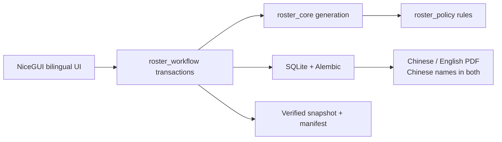

# Sing Yin Study Prefect Duty Roster System

> **Not to be served, but to serve. — Mark 10:45**

This is the maintained, local-first roster platform for the Head Study Prefect
at Sing Yin Secondary School. It supports the complete weekly operating line:

**prepare → generate draft → review → publish once → export bilingual PDF →
adjust published leave → explain fairness → back up, restore, and hand over.**

[Traditional Chinese README](README.md) · [Operator guide](docs/OPERATOR_GUIDE.md)
· [Architecture](docs/NICEGUI_ARCHITECTURE.md) · [Release status](PROJECT_STATUS.md)

## Repository editions

| Branch | Platform | Status |
|---|---|---|
| `main` | NiceGUI + SQLite, self-hosted | Current maintained release |
| `nicegui-self-hosted` | Dedicated Windows or Linux host | Platform-labelled release snapshot |
| `streamlit-cloud` | Streamlit Cloud | Preserved legacy reference |

The NiceGUI edition is a substantial architectural rebuild. It does not copy
the Streamlit page handlers: policy remains in `roster_policy`, generation in
`roster_core`, and durable work in `roster_workflow`.

## Quick start on Windows

```powershell
python -m pip install -r requirements.txt
Copy-Item .env.example .env
```

Then double-click `START_SING_YIN_ROSTER.cmd`. The launcher reuses an existing
service, resolves local port conflicts, waits for a real HTTP response, and
opens the exact local URL.

For a fully isolated fictional rehearsal, double-click
`START_PRACTICE_MODE.cmd`. Practice Mode has separate SQLite, backups, logs,
preferences, port range, persistent bilingual identity, and non-official PDF
marking. Close it and use `RESET_PRACTICE_MODE.cmd` for a clean rehearsal.

## Operator workflow

1. Verify Chinese names, roles, classes, and available days.
2. Record known pre-generation leave for the correct Monday-based week.
3. Generate and review the draft. Vacancies remain visible.
4. Make any manual draft change through the audited reason form.
5. Publish once. Publication—not draft generation—posts `history_weight`.
6. Download the Chinese or English landscape A4 schedule; names remain Chinese.
7. For a late absence, use the published-duty adjustment workflow rather than
   regenerating the week.
8. Review fairness, verified backups, handover readiness, and recovery evidence.

## Policy invariants

- Assistant Head Study Prefects serve only `Assist. in charge`.
- Study Prefects serve only Rooms 302, 303, and 202.
- Room 302: one prefect, Monday–Friday.
- Room 303: two prefects, Monday–Friday.
- Room 202: two prefects, Monday, Wednesday, and Thursday only.
- No same-person duplicate duty on one day.
- Generated duties are not consecutive across days.
- Persistent `history_weight` remains the fairness anchor.

## Architecture



SQLite writes use WAL, foreign keys, busy timeouts, transactions, online
snapshots, SHA-256 manifests, integrity checks, and managed restore. A
database-level publication claim prevents two browser tabs from posting the
same fairness workload twice.

## Interface quality

- Traditional Chinese first, complete English counterpart.
- Light and dark themes with paired atmosphere artwork.
- Phone-specific roster and prefect cards rather than clipped desktop tables.
- Keyboard focus, semantic landmarks, 44px actions, reduced-motion support.
- Dignified Daily Verse reading language separate from the workbench.
- Optional local and visible YouTube music controls with no autoplay.
- Privacy-safe `OP-...` and `REQ-...` support references.

## Deployment

The maintained edition is a long-running Python application, not a static site.
It can run on a dedicated Windows PC or a Linux host such as Raspberry Pi. A
future remote route should keep NiceGUI bound to `127.0.0.1` and place a
Cloudflare Tunnel protected by Cloudflare Access in front of it. See
`docs/DEPLOYMENT_DECISION.md` before changing network mode.

## Repository archive

The repository includes source, documentation, tests, design assets, built-in
music, fictional SQLite evidence, privacy-safe logs, and browser screenshots.
Operational credentials, session secrets, dependency caches, `.next`,
`node_modules`, `__pycache__`, and temporary performance datasets are not
project source and are regenerated or supplied on the host.

`archive/MANIFEST.json` records file sizes and SHA-256 hashes. The archive
builder refuses a SQLite database that contains roster, leave, publication,
adjustment, or fairness rows.

## Verification

```powershell
python -m pip install -r requirements-dev.txt
python -m playwright install chromium
python -X utf8 scripts\verify_release_candidate.py
```

The release candidate runs repository hygiene, the complete Python suite,
compilation, dependency integrity, browser smoke, the fictional-data write/PDF
and restore pipeline, strict deployment readiness, and committed-without-backup
recovery. Machine evidence remains separate from the final operator/advisor
acceptance checklist.

## Co-creation

This system was co-created by LI Chuangjie Jacky, 2026–2027 Head Study Prefect,
and Codex under the Study Prefect Systems & Stewardship Office identity.

LI Chuangjie Jacky and Codex are the only two co-creators of this NiceGUI
rebuild and formal release. The office name is our two-member project identity;
it does not represent additional developers, contractors, or a separate team.

Its lasting value is not a particular screen. It is a process that future Head
Study Prefects can understand, operate, explain, recover, and hand over—while
making fairness visible and reducing avoidable burden.

## License

The software is available under the [MIT License](LICENSE). The project note in
that file records its co-creation context without restricting the MIT grant.
