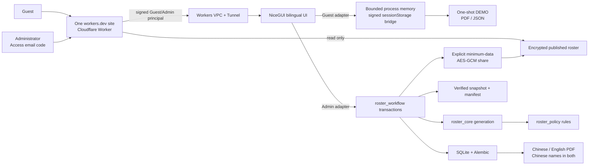

# Sing Yin Study Prefect Duty Roster System

> **Verified production truth (2026-07-31):** the Windows origin is running clean annotated `v1.2.0-rc.41` at `74072b0175ff64807312a8cc5b9cd016b6628210`; canonical Worker version `610092f6-59d4-4fd4-ab3a-3fbf1dd2c64e` serves 100% of traffic. The rc41 298-file fingerprint `cd4344d33f78ba160500a5921382d65e5aece8574a3c0edd1a30b4088ad10186` passed all 15 formal gates. Verified production backup `20260730-160630-793049-manual_verified_backup.sqlite3` with SHA-256 `21feb26a1c7ffad17bfd9b74192a8917dfee910f1cbd1e6fa20e0a4c4ffc525f` passed isolated restore, fairness, row-count and restore-audit checks; origin health/readiness, zero-percent version smoke, 100% Worker promotion, and canonical health/entrance/Viewer checks also passed. The first controlled paired rollback is rc40 origin `2ec900a5ef1c021183717dfa648ef76b55452ffb` with the previous Worker `2cb38b05-6091-43be-86d3-d9f3ccae1ceb`. Rc39 at `80b9de7ea8abce57b67c6041e580f915a819315e`, rc35 at `570e29f745eef7c1995635d1b187021a8fec6ea4`, and Worker `d7069f99-81b4-4388-aa28-383b58bfc68f` remain deeper recovery evidence. Supervised Head Study Prefect and teacher-advisor acceptance remains open. Any older live/candidate wording below is historical evidence and is superseded by this notice.
>
> **Historical clean-release evidence (2026-07-27):** the clean controlled Windows origin ran annotated tag `v1.2.0-rc.30` at commit `74b84f43786b00feb15b51a6270ff71c9430773f`; Worker `11763f08-d40d-46d5-93dc-5ca2599d4154` passed zero-percent smoke and then served 100% of traffic. The 296-file runtime fingerprint `15d155d8d745b14b574b08d793150c93aa77946e7d17a63030844c44adededbc` passed all 14 formal gates, and verified backup `20260727-023041-069097-manual_verified_backup.sqlite3` with SHA-256 `6e2f44d2e577389d19de2feb5dd0a36260794ef2188551d6f604e46b7ac74e1b` passed isolated restore, fairness, row-count, and restore-audit checks. Origin health/readiness, canonical root/health, rendered desktop/320px theme controls, and the Guest Engineering ≈10B disclosure passed. This was the fully verified clean pair at that time; current rc41 production and the rc40 first paired rollback are recorded above. Supervised Head Study Prefect and teacher-advisor acceptance remains outstanding.
>
> **Historical rc31 source candidate (frozen, never deployed):** branch `codex/rc31-unified-theme-controls` combined the binary Light／Dark control with complete deterministic room-schedule solving and strict slot/weight validation, bounded Admin／Guest generated-file delivery, rendered-state mobile-drawer focus synchronization, universal business-write admission, diagnostic-only recovery-marker startup, exact-byte staged backup／handover／restore verification, migration-provenance guards, and fail-closed host／Worker identity parity. Its 297 deployable source files passed all 15 formal `--release` gates with fingerprint `7f405269322e67ddc1fdfd5dde004af5079b315725487303fbecd8e1c0954042`. It is retained as historical source evidence only and has been superseded by current rc41 production; it is not a current candidate, deployment, or rollback target.
>
> **Not to be served, but to serve. — Mark 10:45**

I am LI Chuangjie Jacky, Head Study Prefect for 2026–2027 at Sing Yin Secondary
School. I co-created this maintained, local-first roster platform with Codex so
that future Head Study Prefects can inherit a safe and understandable weekly process:

**Feedback and contact:** Start from **Problem report / Support** in the website,
then email the generated support reference and redacted summary to
[`s10777@syss.edu.hk`](mailto:s10777@syss.edu.hk). An administrator may explicitly
consent to saving bounded TXT, JSON, or PNG evidence in the host-local support
inbox. Guest, Public, and Viewer reports remain browser-only. Never submit
passwords, tokens, cookies, a complete database, or a complete backup; include
only the smallest relevant extract of names, leave details, rosters, PDFs,
screenshots, or logs when it is genuinely necessary. See the
[local support and incident workflow](docs/SUPPORT_AND_INCIDENT_WORKFLOW.md).

**prepare → generate draft → review → publish once → export bilingual PDF →
adjust published leave → explain fairness → back up, restore, and hand over.**

The public entrance presents one prepared duty desk in paired morning-light and evening-dark versions. An unlabelled ledger, three paper workflow markers, and a restrained teal line convey record keeping, the three-step weekly sequence, and continuous service. Both original WebP assets are local to the project and contain no people, student data, writing, crest, external tracking, or third-party image request; reduced-motion mode remains a fully readable static entrance.

The workbench extends that rule across every principal route. Weekly operations, people/fairness, administration/recovery, and support each use one local AI-generated light/dark atmosphere pair; Daily Verse uses a same-composition morning/night v2 pair. Images are confined to headers, narrative heroes, empty states, and non-sensitive reading surfaces. They never sit behind names, tables, forms, fairness data, warnings, dialogs, controls, or PDFs. Only the current route and resolved appearance consume the relevant asset. All ten new or replacement WebPs are `1600×900` and at most 180 KB; prompts, SHA-256 digests, prohibited placements, and human review are recorded in the [atmosphere asset manifest](docs/design/ATMOSPHERE_ASSET_MANIFEST.md).

Interaction motion is semantic and auditable. Only Settings, the appearance toggle, Backup Settings navigation, History, and Undo may use bounded rotation. Restore, draft, publish, import, directory management, verse refresh, and support actions retain truthful lifecycle or glyph morphs without a second rotation. Sound and music-autoplay switches receive a clearer short inset press. Button hosts, labels, focus rings, and layout never rotate or shift, while busy, disabled, reconnect, and reduced-motion states clear transforms immediately.

[Traditional Chinese README](README.md) · [Operator guide](docs/OPERATOR_GUIDE.md)
· [Architecture](docs/NICEGUI_ARCHITECTURE.md) · [Release status](PROJECT_STATUS.md)
· [Assist assignment modes](docs/ROSTER_POLICY_MODES.md)
· [Canonical-site access guide](docs/PUBLIC_ROSTER_VIEWER.md)

## Start here

The repository serves operators, visitors, advisors, successors, maintainers,
and reviewers. Start from the job you need to complete rather than from the
longest document:

| Reader or task | First entry | Continue with |
|---|---|---|
| Visitor who wants a complete trial without retained data | [Canonical site](https://sing-yin-roster-viewer.singyin-study-prefect.workers.dev/) → **Try the fictional demo** | [Canonical-site guide](docs/PUBLIC_ROSTER_VIEWER.md) |
| Head Study Prefect completing official weekly work | [Canonical site](https://sing-yin-roster-viewer.singyin-study-prefect.workers.dev/) → **Administrator sign in** | [Operator guide](docs/OPERATOR_GUIDE.md) |
| Advisor reviewing publication, fairness, or handover | [Acceptance evidence matrix](docs/ACCEPTANCE_EVIDENCE.md) | [Release and handover guide](docs/RELEASE_HANDOVER.md) |
| Any user reporting an error, failed download, or display problem | Canonical site → **Problem report / Support** | [Local support and incident workflow](docs/SUPPORT_AND_INCIDENT_WORKFLOW.md) |
| Successor rehearsing before receiving official data | `START_PRACTICE_MODE.cmd` | [Quick start](docs/QUICKSTART.md) and [operator guide](docs/OPERATOR_GUIDE.md) |
| IT maintainer deploying, recovering, or tracing an OP reference | [Documentation index](docs/DOCUMENTATION_INDEX.md) | [Windows host setup](docs/WINDOWS_DEDICATED_HOST_SETUP.md) and [update workflow](docs/UPDATE_WORKFLOW.md) |
| Security reviewer or vulnerability reporter | [Security and privacy model](docs/SECURITY_AND_PRIVACY.md) | [Private reporting policy](SECURITY.md) and [branch strategy](docs/BRANCH_STRATEGY.md) |
| Developer or reviewer changing code | [NiceGUI architecture](docs/NICEGUI_ARCHITECTURE.md) | [Risk-led code review](docs/CODE_ACCEPTANCE_REVIEW.md), [AI Agent worktree guide](docs/AI_AGENT_GIT_GUIDE.md), and [contributing guide](CONTRIBUTING.md) |

### Access and data boundary

| Mode | Interface | Data and retention | Explicit boundary |
|---|---|---|---|
| Public entrance | Public branded gateway | Reads no official directory or roster | Routes only to Admin, Guest, or an already-held share link |
| Guest | The same NiceGUI routes, navigation, and workflow as Admin | Per-tab fictional in-memory workspace; cleared on sign-out, expiry, revocation, or restart | No AI, import, upload, official persistence, backup/restore, Viewer publication, or costly external operation; only one-shot `DEMO` downloads bound to the verified Guest mode and session |
| Admin | Complete NiceGUI workbench | Official SQLite, verified backups, and local audit on the controlled Windows origin | Requires Cloudflare Access and a signed principal; high-risk writes also require version, confirmation, idempotency, and backup obligations |
| Viewer | Read-only `/view#…` roster | Ciphertext in Worker KV; the decryption key remains in the URL fragment | Cannot sign in, edit, elevate identity, or enumerate other rosters; expires and can be revoked |
| Practice | The official local workflow with fictional content | Separate `data/practice/` SQLite, backups, logs, and preferences | Every output is non-official and official data is never read or written |
| Local maintenance | localhost, controlled private WARP, or loopback SSH | Protected host data and maintenance evidence | Recovery and deployment only; never a second daily site |

### Waiting and progress behaviour

Admin and Guest entries share one state lifecycle. Activation immediately locks duplicate identity choices and shows role-specific copy; the thin progress track appears only after 150 ms. If the page is still visible after eight seconds, the entry unlocks for a safe retry and keeps sign-in help plus a privacy-safe support reference that contains no email, token, or internal stack. Welcome audio remains independent: playback failure can never block the selected identity.

Official writes, reports, exports, backups, and restores use one phased progress treatment: **prepare → process safely → complete**. Unmeasured work is indeterminate or phased and no longer invents 14% or 56%; a percentage is allowed only when the service supplies real `completed/total` data. Route navigation shows a top track only after 150 ms and cleans it on completion, return, or page exit. A timed-out official write is not automatically retried because timeout does not prove failure; review the visible state and OP/REQ reference first. Guest-denied import, upload, official persistence, or costly operations fail at the capability boundary before loading begins. Keyboard, forced-colours, and reduced-motion users receive equivalent static state information.

The [documentation index](docs/DOCUMENTATION_INDEX.md) records document
ownership, source-of-truth precedence, configuration classes, data lifecycles,
verification levels, known limits, and the update triggers that keep the set
complete.

### Local problem reporting and diagnostics

`/support` is the single reporting entry. The Worker serves an entirely
browser-local form to unauthenticated Public and Viewer visits, while verified
Admin and Guest visits reach the shared NiceGUI support workspace. The first
level asks only what happened, where it happened, and what was expected; route,
action, impact, and attachments are progressively disclosed. An Admin must explicitly confirm
host-local persistence. Support records never join roster transactions, the
official SQLite database, the fairness ledger, or roster backups. Guest,
Public, and Viewer modes can only download or copy a browser-local report.
Maintainers inspect the local inbox with `scripts/inspect_support_inbox.py` and
can create a secret-free host summary with
`scripts/collect_host_security_summary.ps1`. See the
[support-inbox threat model](docs/THREAT_MODEL_SUPPORT_INBOX.md) and the
[content-design audit](docs/CONTENT_DESIGN_AUDIT.md).

### One product, four distinct zones

These are not four separate sites. They are four reading and operating contexts inside the same **Service Weave** product:

| Zone | First question | Primary content |
|---|---|---|
| Public Product Entrance | What is this, and which identity should I use? | Product purpose, Guest demo, Admin sign-in, share links, and a short devotional prelude |
| Unified Operations Workbench | What is the next safe action? | Devotional, generate, review/export, published-duty absence, prefects, fairness, and handover |
| Trust & Engineering Hub | Why can this result be trusted? | Mission, engineering evidence, architecture, data lifecycle, recovery, and verification |
| Documentation & Developer Portal | How does a successor or maintainer find the right procedure? | Getting started, operator guide, handover, technical reference, documentation index, and release procedure |

Admin is the canonical operational product. Guest uses the same routes, navigation, components, and roster experience, while the server switches it to a fictional temporary workspace and denies permanent writes, uploads, AI, backups, shares, and costly external work below the UI. The routine sidebar follows real work; platform story, engineering evidence, and architecture sit in a distinct **Trust & Documentation** portal so institutional narrative never interrupts the weekly roster flow. See [Product research and information-architecture decisions](docs/PRODUCT_RESEARCH_AND_IA_DECISIONS.md) for the source review, adopted principles, adaptations, and rejected alternatives.

**Historical clean baseline (2026-07-27):** `v1.2.0-rc.30`／`74b84f43786b00feb15b51a6270ff71c9430773f`; the production-truth notice at the top of this file governs the active runtime.
It previously ran at `C:\SingYinRoster`. At that verified rollout, `/healthz` was healthy and `/readyz` was ready with
`writeReady=true` and `policyVersion=2026.07.22-assist-modes`. The controlled
switch created `20260727-023041-069097-manual_verified_backup.sqlite3` and passed
its SHA-256 checksum, database integrity, fairness reconciliation, row matching,
restore audit, and isolated restore. Its SHA-256 is
`6e2f44d2e577389d19de2feb5dd0a36260794ef2188551d6f604e46b7ac74e1b`. Source
fingerprint `15d155d8d745b14b574b08d793150c93aa77946e7d17a63030844c44adededbc`
passed all 14／14 formal gates (the complete Python suite, 3 motion contracts,
and 46 Worker contracts). Worker version `11763f08-d40d-46d5-93dc-5ca2599d4154`
passed zero-percent version smoke before promotion to 100%. Canonical root,
capability health, desktop／320px theme controls, and Guest Engineering disclosure
passed live checks. The first-level origin rollback is rc27／
`c4c728aa41c9b0122aaa2c015b3cc38e246db43d`; Worker
`d7b51f21-7692-418d-866c-034c2c57292d` is the immediately previous edge version.
Supervised Head Study Prefect and teacher-advisor
acceptance remains open.

**Public security and release integrity:** Public browsers reach only the
Cloudflare Worker; the official NiceGUI origin remains loopback-only. Admin
access requires Cloudflare Access, the private exact-email allowlist, a bounded
session, and a request-bound HMAC principal. GitHub `main` accepts only pull
requests that pass `test-and-audit` and Python／Worker CodeQL; force-push and
deletion are blocked, Actions references must use full SHAs, and a created `v*`
release tag cannot be updated or deleted. See the complete
[security and privacy model](docs/SECURITY_AND_PRIVACY.md) for threat boundaries,
data classes, incident response, and residual limits.

The retained **v1.1 rollback** record is historical recovery evidence only; it
does not replace the current rc41 production truth or rc40 first paired rollback.

The public entrance, shared-roster viewer, and NiceGUI workbench use the same
`Copyright © 2026 LI Chuangjie` page-footer attribution. Clean group-sharing
roster PDFs retain their explicit supplementary-footer export option.

Non-interactive editorial cards gain a quiet fine-pointer ambient follow-light and focus-within halo without lift or cursor change; action cards keep the existing lift + glow. Current rc41 production includes Assist fixed-weekday／flexible-weekly modes plus the versioned Service Weave `ProductIdentity`,
central `PageDefinition` catalogue, public NiceGUI component API, explicit CSS
ownership, filterable Engineering evidence index, internal Developer Reference,
bounded Guest preferences, unified generated-file delivery, the browser／PDF
roster matrix, and auditable published-roster withdrawal.

Current rc41 production retains and re-verifies admission control that rejects excess Guest sessions without
evicting active users, stronger import and network bounds, aggregate fairness
reconciliation, explicit return paths, and stable button containers whose icons
transform internally. Its 298-file fingerprint
`cd4344d33f78ba160500a5921382d65e5aece8574a3c0edd1a30b4088ad10186`
passed all 15 formal gates before the controlled origin rollout. Worker
`610092f6-59d4-4fd4-ab3a-3fbf1dd2c64e` passed zero-percent version smoke and
canonical verification before and after its promotion to 100% traffic.

## Repository editions

| Branch | Platform | Status |
|---|---|---|
| `codex/login-copy-music-rc18` | NiceGUI + SQLite, historical release source | Superseded rc18 `fd504a8` entrance, devotional, interaction and rollback line |
| `codex/service-weave-v1-2-editorial` | NiceGUI + SQLite, historical source | Previous Service Weave editorial integration line |
| `codex/unified-guest-redesign` | NiceGUI + SQLite, Windows self-hosted | Previous unified-guest architecture line; no longer the formal baseline |
| `main` | NiceGUI + SQLite, self-hosted | Current production is clean `v1.2.0-rc.41`; first paired rollback is rc40 origin plus the previous Worker |
| `nicegui-self-hosted` | Dedicated Windows or Linux host | Platform-labelled release snapshot |
| `streamlit-cloud` | Streamlit Cloud | Preserved legacy reference |

The NiceGUI edition is a substantial architectural rebuild. It does not copy
the Streamlit page handlers: policy remains in `roster_policy`, generation in
`roster_core`, and durable work in `roster_workflow`.

## Canonical daily entry and Windows maintenance start

The only URL distributed to users is
<https://sing-yin-roster-viewer.singyin-study-prefect.workers.dev/>.

The live v1.2 product uses one NiceGUI renderer for both identities: a visitor
selects **Guest experience** to receive a bounded 30-minute fictional workspace,
while an approved operator selects **Admin login**, enters an exact allowlisted
email address and the one-time code sent by Cloudflare Access, and receives the
official workflow at the same routes. `/guest` and `/try` are compatibility
redirects, not a static tour or second trial product. An explicitly issued
`/view#…` link remains the separate encrypted, read-only published-roster viewer.

The Worker and origin authenticate both modes with server-verified, HMAC-signed
principals. Historical rc30 passed 14／14 formal gates against its own
296-input fingerprint `15d155d8d745b14b574b08d793150c93aa77946e7d17a63030844c44adededbc`,
including isolated Admin/Guest browser, mobile, reduced-motion, performance,
write/PDF, backup, and recovery evidence. The application has no custom password database.

The commands below prepare a host or maintenance workstation; they are not a
second normal entry point.

```powershell
python -m pip install --require-hashes -r requirements.lock
Copy-Item .env.example .env
```

During maintenance or a Cloudflare outage, double-click
`START_SING_YIN_ROSTER.cmd`. The launcher reuses an existing service, resolves
local port conflicts, waits for a real HTTP response, and opens the exact local
URL. Localhost and the enrolled private-WARP address remain recovery paths only.

For a new dedicated Windows 11 host, follow the zero-knowledge
[`WINDOWS_DEDICATED_HOST_SETUP.md`](docs/WINDOWS_DEDICATED_HOST_SETUP.md).
It includes idempotent preparation and Task Scheduler scripts. Optional remote
browser access is prepared separately by
[`CLOUDFLARE_REMOTE_ACCESS_SETUP.md`](docs/CLOUDFLARE_REMOTE_ACCESS_SETUP.md),
which keeps the origin on `127.0.0.1` and refuses activation unless an
unauthenticated request is redirected to Cloudflare Access.

Key-only host maintenance is documented separately in
[`WINDOWS_SSH_MAINTENANCE.md`](docs/WINDOWS_SSH_MAINTENANCE.md). The SSH server
binds only to loopback, disables password authentication and forwarding, and
does not create a public or LAN-facing port 22.

For a fully isolated fictional rehearsal, double-click
`START_PRACTICE_MODE.cmd`. Practice Mode has separate SQLite, backups, logs,
preferences, port range, persistent bilingual identity, and non-official PDF
marking. Close it and use `RESET_PRACTICE_MODE.cmd` for a clean rehearsal.

The Dashboard devotional direction offers **Default setting**, **Clear
guidance**, and **Quiet comfort**. The default follows the current appearance
as a recommendation only. The public entrance makes one honest welcome-music
attempt on every visit, starts new browsers at 50%, and preserves every
explicitly selected volume, including 25%. With no explicit entry-sound choice,
the Administrator or Guest CTA itself is the trusted “enter with music” action:
it calls playback synchronously, then reaches exactly the selected identity
route whether playback succeeds, is rejected, is unsupported, is interrupted,
or exceeds the short startup budget. Music is never an authentication gate.
**Default: Enter with music** and **Continue quietly** remain optional preference
and recovery controls; explicit quiet intent or manual pause wins for the
current entrance visit. Generic page interactions do not trigger a hidden
retry, browser media policy remains authoritative, and visible play, pause,
next, and volume controls remain available. Signed-in page-context music continues to follow the workbench
cross-page autoplay preference. A versioned preference migration upgrades only
an exact former 24% or 35% workbench default. If two consecutive routes resolve
to the same local track, the current browser session continues its position and
playing/paused state instead of restarting it; this continuity never enters
SQLite or permanent browser storage.

At the end of a school year, use **Prepare new school-year directory** from the
Handover Guide only after the final roster, published-duty adjustments, and
fairness reconciliation are complete. The workflow takes the maintenance lock,
creates verified before/after backups, archives active prefect records, and
withdraws unused pre-generation leave. It preserves old rosters, the fairness
ledger, audit history, and archived names; it is not a database wipe.

The official clean-first-use contract requires the application to start with an
empty migrated database and never auto-seed demonstration prefects. Seeing an
empty directory on first use is correct: import and review the real directory
only after rehearsal. Fictional seed data belongs to Practice Mode and the
bounded v1.2 Guest adapter, never the official database. The installed host
still requires Viewer-link revocation and the separately authorised controlled
reset before an empty official-data state may be claimed; the rc5 application
rollout does not perform that data-clearing operation.

### v1.2 formal baseline: one Guest and Admin product

Guest and Admin use the same NiceGUI routes, navigation, components, and weekly
sequence. A server-verified `PageContext` resolves either the official
`RosterWorkflow` and SQLite database or a bounded `GuestWorkspaceAdapter`
populated only with fixed fictional Chinese names. UI hiding is not the
security boundary: callbacks, services, downloads, exports, storage, sharing,
and integrations recheck capabilities.

Each Guest tab receives a separate process-memory workspace. The origin pushes
each meaningful revision back to that exact tab as a signed token stored only
in `sessionStorage`. A refresh can restore the latest token only after the
server verifies its session, workspace, tab, revision, application boot, and a
live-connection nonce. Duplicated tabs receive new workspaces; copied,
tampered, expired, stale, or old-boot tokens are rejected and replaced by the
safe fictional fixture. Sign-out, expiry, revocation, and cross-tab session
termination clear temporary state. Guest PDF/JSON downloads are memory-only,
one-shot, `DEMO`-marked, and `Cache-Control: no-store`.

Guest language, appearance, music, and sound preferences are retained only in
a bounded origin-memory store for the verified session, so refresh and route
changes remain coherent without creating permanent Guest data. Sign-out,
expiry, revocation, or origin restart clears them. Admin keeps its user-level
preference store. Public／Viewer does not read or continuously synchronize either
workspace. Only deliberate Admin／Guest entry may stage a normalized explicit
`light` or `dark` hint for at most 120 seconds. The Worker validates it, carries
it inside the signed session and request-bound principal, and clears the staging
cookie when the session is minted; an existing destination preference always
wins. Both identities use one credentialed generated-file delivery
path which checks HTTP status and media type before creating a temporary browser
download; failures expose a bilingual recovery action and support reference.
The bounded registry binds every ticket to the verified access mode and session,
rejects cross-mode replay without consuming the ticket, and reserves capacity
for Admin so Guest saturation cannot block official generated-file delivery.
Guest files are capped at 5 MiB and Admin files at 64 MiB; the registry is capped
at 128 MiB and reserves 64 MiB plus 16 tickets for Admin.

An incorrectly published week is not physically deleted. **Withdraw published
roster** accepts an optional explanatory reason while still requiring the expected version and idempotent command. The same
transaction preserves the original evidence, posts the inverse of the version's
net fairness effect, creates audit and backup obligations, and requests
revocation of existing shares before a corrected week can be generated.

Historical rc30 passed its matching 14-gate report, fresh verified backup,
isolated restore, origin rollout, zero-percent Worker smoke, 100% promotion, and canonical
rendered checks. Exact operating commands are documented in
[`PUBLIC_ROSTER_VIEWER.md`](docs/PUBLIC_ROSTER_VIEWER.md) and
[`WINDOWS_DEDICATED_HOST_SETUP.md`](docs/WINDOWS_DEDICATED_HOST_SETUP.md). The
complete risk matrix is in [`UPDATE_WORKFLOW.md`](docs/UPDATE_WORKFLOW.md).

## Operator workflow

1. Verify Chinese names, roles, classes, available days, and each Assistant Head Study Prefect's fixed Assist weekday when the legacy mode is required.
2. Choose **Fixed weekday** or **Flexible weekly** before generating. A new week defaults to Fixed weekday; an existing week reopens with its saved mode.
3. Record known pre-generation leave for the correct Monday-based week.
4. Generate and review the draft. Vacancies remain visible.
5. Make any manual draft change through the audited reason form.
6. Publish once. Publication—not draft generation—posts `history_weight`.
7. Download the Chinese or English landscape A4 schedule; names remain Chinese. The export dialog can hide the crest. The clean sharing version omits the internal-use line, page number, and Scripture hint by default; enable the supplementary footer only for an intentional archival copy.
8. For a late absence, use the published-duty adjustment workflow rather than
   regenerating the week.
9. Review fairness, verified backups, handover readiness, and recovery evidence.
10. When recipients need browser-direct viewing, explicitly create an expiring,
   revocable same-host `/view#…` link for the published roster. After a
   published-duty adjustment, issue a fresh link and revoke the old one.

Fixed-weekday mode keeps each active Assistant Head Study Prefect on the same weekday while the directory and declared availability remain unchanged. A leave replacement covers that week-local duty only and never changes the permanent weekday owner. Flexible-weekly mode remains deterministic and auditable, uses persistent fairness history as its primary assignment cost, honours declared available days, and avoids repeating the immediately previous Assist weekday when fairness and feasibility permit. Only Assistant Head Study Prefects are eligible for `Assist. in charge`; unchecked availability days are unavailable in both modes. An existing roster week always reopens with its persisted mode. See [Assist assignment modes](docs/ROSTER_POLICY_MODES.md).

Ordinary-room assignment uses fairness-ordered deterministic backtracking rather than committing the first locally preferred candidate. Daily matching feasibility and failed-state pruning allow the solver to recover when an early fair choice would block later coverage. The final validator requires a non-empty roster, the exact canonical weekday/seat multiset, and canonical duty weights; if no complete policy-valid schedule exists for the supplied directory, availability, and leave constraints, generation stops with a controlled no-solution result.

## Policy invariants

- Assistant Head Study Prefects serve only `Assist. in charge`.
- Fixed-weekday mode preserves the configured Assistant Head Study Prefect weekday; Flexible-weekly mode rotates only among declared available weekdays.
- Unchecked availability days are unavailable and cannot be overridden by either Assist mode or room scheduling.
- Pre-generation leave can cause a one-duty replacement, but never rewrites the fixed-weekday owner.
- Study Prefects serve only Rooms 302, 303, and 202.
- Room 302: one prefect, Monday–Friday.
- Room 303: two prefects, Monday–Friday.
- Room 202: two prefects, Monday, Wednesday, and Thursday only.
- No same-person duplicate duty on one day.
- Generated duties are not consecutive across days.
- Persistent `history_weight` remains the fairness anchor.

## Platform & team

The in-app **Platform & team** centre explains why the service exists before
showing how it is built. It combines an anonymous live readiness snapshot,
the official Study Prefect Team roles and their real responsibilities, four
plain work areas, four outcome-led solutions, operating principles, and the
co-creation note. The live strip never exposes names, classes, leave,
roster content, backup paths, or audit records.

Official roles remain Head Study Prefect, Assistant Head Study Prefect, Study
Prefect, and Teacher Advisor. The product states each role's real responsibilities
directly and does not create corporate-style replacement titles. Weekly rostering
and publishing, fairness review and explanation, guidance and support, and backup,
recovery and handover are work areas, not departments, offices, or extra staff.

## Engineering & quality evidence

The in-app engineering page turns the strongest evidence from this README,
the architecture guide, and the release report into a readable quality centre.
It presents the complete automated suite, the current report's real passed/total
gate ratio, a five-layer system blueprint, six reliability capabilities, and the
four-stage build story. The gate chain includes browser performance, bounded
memory growth, and phone-width overflow checks. These are release facts, not
usage, commercial, or vanity KPIs; source changes make previous evidence stale.

## Architecture



SQLite writes use WAL, foreign keys, busy timeouts, transactions, online
snapshots, SHA-256 manifests, integrity checks, and managed restore. Recovery
snapshots must be self-contained and are rejected if adjacent WAL, SHM, or
journal sidecars exist. Managed restore stages and re-verifies the exact database
and JSON-manifest bytes, accepts only the supported migration chain, rejects
pending backup obligations, and validates the current schema, foreign keys, and
fairness state before installation. A durable recovery marker starts the runtime
in diagnostic-only mode before migrations or database sessions; all business
writes remain fail-closed until controlled recovery succeeds. A
database-level publication claim prevents two browser tabs from posting the
same fairness workload twice.

The separate in-app **System architecture & trust** page stays focused on the
six-stage service lifeline, five owning layers, four verifiable trust
contracts, recovery boundaries, and operator FAQ. This separation keeps brand
context discoverable without making a daily operator scan one oversized page.

## Interface quality

- Traditional Chinese first, complete English counterpart.
- One explicit binary Light／Dark appearance control with paired atmosphere artwork. While the preference is missing or unset, the resolved theme follows the operating system; the first activation stores the opposite resolved mode, and later activations alternate explicit Light and Dark. The language action always names its destination as the autonym English／EN or 繁體中文／繁中.
- Phone-specific roster and prefect cards rather than clipped desktop tables.
- Keyboard focus, semantic landmarks, 44px actions, reduced-motion support.
- Dignified Daily Verse reading language separate from the workbench.
- Signed-in local ambience makes one autoplay attempt at the 50% browser-local default after each page is ready.
  The operator can pause it or turn cross-page autoplay off at any time. The
  public entrance separately attempts playback on every visit and, if the
  browser blocks sound, presents one explicit **Enter with music** recovery
  action plus **Continue quietly**. Controls expose playing, paused,
  browser-blocked, transport, decoding, and off states. The
  separate visible YouTube player never autoplays.
- Privacy-safe `OP-...` and `REQ-...` support references.

Mature SaaS patterns are treated as hypotheses, not a visual target. The system
adopts a pattern only when it improves first-use comprehension, task completion,
recovery, phone／tablet／desktop use, or accessibility; it deliberately omits pricing tiers,
marketing funnels, invented KPIs, and decorative density from the operator
workbench.

The rc19 device contract treats tablets as a third form factor rather than a
stretched phone. One candidate matrix covers 768×1024 and 820×1180 adaptive
touch tablets, a 1024×768 compact desktop-shell touch tablet, and a 1440×1024 full desktop,
alongside phone portrait, narrow zoom reflow and phone landscape.
The mobile and desktop verifiers contribute complementary evidence to that same
matrix; the URL, session, data, policy, audit, PDF and content order remain shared
across every composition. These are candidate requirements, not deployed rc19
results; see the [acceptance evidence matrix](docs/ACCEPTANCE_EVIDENCE.md).

The bilingual [Code acceptance and risk-led review](docs/CODE_ACCEPTANCE_REVIEW.md)
defines the trust-boundary map, failure-path coverage, configuration and safety
constants, 10×／100× performance review, dependency ownership, and the different
evidence required for a minimal local check versus a formal release.

## Deployment

The maintained OP application remains a long-running Python service on a
dedicated Windows 11 PC, with NiceGUI bound to `127.0.0.1`. In the verified v1.2
rc5 design, the canonical `workers.dev` site is the public front door:
**Guest experience** creates a time-limited signed Guest session, while
**Admin login** invokes a path-specific Cloudflare Access policy. Both verified
modes are proxied to the same NiceGUI origin with different signed principals;
the origin resolves different adapters. After Access authentication, the
Worker independently verifies the JWT signature, audience, issuer, expiry, and
exact administrator email, then issues a short-lived signed HttpOnly
administrator session which never contains the Access JWT. Cloudflare sends
the one-time email code; no password hash is stored by NiceGUI, SQLite, KV,
backups, or Git.

The formal server-mode host receives an independent `SING_YIN_STORAGE_SECRET`
from its protected `.env`; local and practice modes may use their ignored,
managed runtime secret. The Worker requires `ADMIN_BEARER_TOKEN` and
`ADMIN_SESSION_SECRET` in Cloudflare secret storage. The Worker bearer must
match `SING_YIN_PUBLIC_ROSTER_VIEWER_ADMIN_TOKEN` in the protected origin
settings. A rotation updates both sides in one controlled maintenance window,
restarts the dedicated task, proves replacement HTTP 200 and retired HTTP 401,
and rolls both sides back if any step fails. Secret values never belong in Git,
documentation, screenshots, logs, or backups.

Same-host `/view#…` links are explicitly created, expiring and revocable. The
Windows host encrypts the minimum published-roster snapshot with AES-256-GCM;
Cloudflare KV stores ciphertext, nonce, and minimum week/creation/expiry
metadata, while the key stays in the URL fragment. Because KV is eventually
consistent, the application waits until the anonymous Viewer can read the exact
encrypted record before revealing the link or its key. If that check times out,
no key is issued and the Worker receives an exact content-key withdrawal
request. Localhost and private WARP are maintenance fallbacks, not additional
URLs to distribute. See
[`PUBLIC_ROSTER_VIEWER.md`](docs/PUBLIC_ROSTER_VIEWER.md) and
[`DEPLOYMENT_DECISION.md`](docs/DEPLOYMENT_DECISION.md) before changing the
access boundary.

## Repository archive

The repository includes source, documentation, tests, design assets, built-in
music, fictional SQLite evidence, privacy-safe logs, and browser screenshots.
Operational credentials, session secrets, dependency caches, `.next`,
`node_modules`, `__pycache__`, and temporary performance datasets are not
project source and are regenerated or supplied on the host.

`archive/MANIFEST.json` records file sizes and SHA-256 hashes. The archive
builder refuses a SQLite database that contains roster, leave, publication,
adjustment, or fairness rows.

## Verification

```powershell
python -X utf8 scripts\verify_update.py
```

This is the normal one-command entry point. Documentation, test-only, CI,
Worker, and deployable runtime changes receive different fail-closed profiles;
unknown paths are upgraded to full verification. Independent read-only checks
run concurrently. A formal runtime release still uses:

```powershell
python -m pip install -r requirements-dev.txt
python -m playwright install chromium
python -X utf8 scripts\verify_release_candidate.py
```

The formal release candidate runs fail-closed checks for repository hygiene,
supply-chain security, Cloudflare Worker Deno contracts, the complete Python
suite, compilation, dependency integrity, desktop browser smoke, measured
runtime performance and memory stability, the fictional-data write/PDF and
restore pipeline, independent mobile adaptation, strict deployment readiness,
committed-without-backup recovery, and the isolated unified-Guest workflow.
Semantic icon motion is governed by one shared grammar rather than page-specific
rotation or drift. Temporary previews communicate an action's outcome, while
sound, theme, playback, and drawer controls always preserve their true persistent
state. Glyphs collapse and crossfade inside a fixed 24x24 slot; the button host
never moves, tilts, or resizes. Disabled, busy, pointer, keyboard, coarse-touch,
reduced-motion, forced-colour, reconnect, and DOM-replacement paths are explicit.
Bounded rotation is restricted to Settings, a real appearance change, Backup
Settings navigation, History, and Undo. Restore and controls with an existing
glyph story remain lifecycle-morph only.
The focused inventory, state-machine, and disposable-browser checks are
`scripts/audit_icon_semantics.py`,
`nicegui_app/assets/motion/sing-yin-icon-story-state_test.js`, and
`scripts/verify_semantic_icon_motion.py`.

The formal verifier has fourteen gates, including the independent icon-state-machine
contract; the final matching fingerprint is recorded only after the frozen-source
rerun. Machine evidence remains separate
from the final operator/advisor acceptance checklist and from the live
host/Cloudflare switchover evidence.

## Co-creation

I am LI Chuangjie Jacky, Head Study Prefect for 2026–2027. I co-created this
system with Codex, presented as **Study Prefect Team · Service Weave co-creation**.

**Creator profile:** 李創杰 · LI Chuangjie, Jacky · [Instagram @5662jacky](https://www.instagram.com/5662jacky/)

Codex and I are the only two co-creators of this NiceGUI rebuild and formal
release. This is a project credit, not a separate office, department, rank,
contractor group, or additional team.

I began with a practical scheduling need, but the work grew into a platform that
treats fairness, responsibility, recovery, and handover seriously. I hope future
Head Study Prefects inherit not merely a screen, but a process they can understand,
operate, explain, recover, and hand over—while making fairness visible and reducing
avoidable burden.

## License

The software is available under the [MIT License](LICENSE). The separate
[project notice](NOTICE.md) records that this formal release was completed only
by LI Chuangjie Jacky and Codex without restricting the MIT grant.
