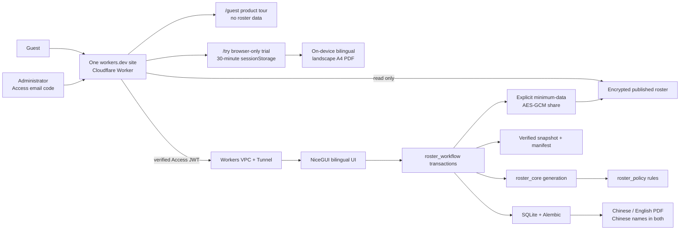

# Sing Yin Study Prefect Duty Roster System

> **Not to be served, but to serve. — Mark 10:45**

I am LI Chuangjie Jacky, Head Study Prefect for 2026–2027 at Sing Yin Secondary
School. I co-created this maintained, local-first roster platform with Codex so
that future Head Study Prefects can inherit a safe and understandable weekly process:

**Feedback and contact:** Questions or suggestions about the workflow, interface,
fairness explanation, or handover are welcome at
[`s10777@syss.edu.hk`](mailto:s10777@syss.edu.hk). Include an OP/REQ support
reference when one is shown, but do not attach names, leave details, rosters,
PDFs, databases, backups, screenshots, or complete logs.

**prepare → generate draft → review → publish once → export bilingual PDF →
adjust published leave → explain fairness → back up, restore, and hand over.**

[Traditional Chinese README](README.md) · [Operator guide](docs/OPERATOR_GUIDE.md)
· [Architecture](docs/NICEGUI_ARCHITECTURE.md) · [Release status](PROJECT_STATUS.md)
· [Canonical-site access guide](docs/PUBLIC_ROSTER_VIEWER.md)

**Current production deployment (2026-07-16):** immutable
`v1.1.0-rc.16` runs from `C:\SingYinRoster` through the dedicated Windows
scheduled task. NiceGUI listens only on `127.0.0.1:8080`; the `cloudflared`
service and canonical Worker are healthy. The internal administrator API bearer
credential has been synchronously rotated, with the replacement accepted and
the retired credential rejected. A supervised Windows reboot, administrator
login/logout, long reconnect, upload and PDF acceptance remain outstanding;
official-data cleanup remains a separately authorized operation.

## Repository editions

| Branch | Platform | Status |
|---|---|---|
| `main` | NiceGUI + SQLite, self-hosted | Current maintained release |
| `nicegui-self-hosted` | Dedicated Windows or Linux host | Platform-labelled release snapshot |
| `streamlit-cloud` | Streamlit Cloud | Preserved legacy reference |

The NiceGUI edition is a substantial architectural rebuild. It does not copy
the Streamlit page handlers: policy remains in `roster_policy`, generation in
`roster_core`, and durable work in `roster_workflow`.

## Canonical daily entry and Windows maintenance start

The only URL distributed to users is
<https://sing-yin-roster-viewer.singyin-study-prefect.workers.dev/>. Guests can
read the data-free platform tour at `/guest`, use `/try` for a 30-minute
device-only fictional trial, or view an explicitly issued read-only
`/view#…` roster. An
approved operator selects **Admin login**, enters an exact
allowlisted email address and the one-time code sent by Cloudflare Access, and
returns to the same site with the NiceGUI editor unlocked. The signed browser
session lasts at most eight hours; select
**Log out** when finished. The application has no custom password database.

The canonical Worker, guest routes, read-only Viewer, Access redirect, VPC
health and mobile/light/dark browser matrix are live and automated. The
dedicated Windows scheduled task now runs the single loopback origin under the
non-administrative service account. Administrator remote editing still needs
supervised sign-off for login, logout, long-lived WebSocket reconnection, upload
and PDF delivery; automatic recovery still needs one supervised reboot proof.

The commands below prepare a host or maintenance workstation; they are not a
second normal entry point.

```powershell
python -m pip install --require-hashes -r requirements.lock
Copy-Item .env.example .env
```

During maintenance or a Cloudflare outage, double-click
`START_SING_YIN_ROSTER.cmd`. The launcher reuses an existing service, resolves
local port conflicts, waits for a real HTTP response, and opens the exact local
URL. Localhost and the enrolled private-WARP address remain recovery paths only.

For a new dedicated Windows 11 host, follow the zero-knowledge
[`WINDOWS_DEDICATED_HOST_SETUP.md`](docs/WINDOWS_DEDICATED_HOST_SETUP.md).
It includes idempotent preparation and Task Scheduler scripts. Optional remote
browser access is prepared separately by
[`CLOUDFLARE_REMOTE_ACCESS_SETUP.md`](docs/CLOUDFLARE_REMOTE_ACCESS_SETUP.md),
which keeps the origin on `127.0.0.1` and refuses activation unless an
unauthenticated request is redirected to Cloudflare Access.

For a fully isolated fictional rehearsal, double-click
`START_PRACTICE_MODE.cmd`. Practice Mode has separate SQLite, backups, logs,
preferences, port range, persistent bilingual identity, and non-official PDF
marking. Close it and use `RESET_PRACTICE_MODE.cmd` for a clean rehearsal.

At the end of a school year, use **Prepare new school-year directory** from the
Handover Guide only after the final roster, published-duty adjustments, and
fairness reconciliation are complete. The workflow takes the maintenance lock,
creates verified before/after backups, archives active prefect records, and
withdraws unused pre-generation leave. It preserves old rosters, the fairness
ledger, audit history, and archived names; it is not a database wipe.

The official clean-first-use contract requires the application to start with an
empty migrated database and never auto-seed demonstration prefects. Seeing an
empty directory on first use is correct: import and review the real directory
only after rehearsal. Fictional seed data belongs to Practice Mode and the
public browser trial, never the official database. The installed host still
requires a verified backup, Viewer-link revocation, controlled reset, complete
verification, and deployment before this state may be claimed as live.

### Live product tour and browser-only trial

The following contract is deployed at the canonical site and has focused tests
plus a dedicated production-browser verifier:

`/guest` presents the product purpose, weekly journey, fairness safeguards, and
the boundary around protected operations. `/try` then loads a fixed fictional
Chinese-name directory and lets a visitor add trial leave, generate and review
a roster, and download a bilingual landscape A4 PDF. All names remain Chinese.

The Worker serves only version-controlled, same-origin HTML, CSS, and JavaScript
assets for these pages. Trial interaction makes no application API call and
does not touch VPC, NiceGUI, SQLite, KV, the fairness ledger, backups, or server
logs. State is held in the current tab's `sessionStorage`, expires after 30
minutes, and is removed when the tab closes or the visitor resets it. A PDF
persists only when the visitor explicitly saves the downloaded file. Trial
results cannot be published, shared through `/view#…`, or imported into the
official workbench.

For every release, a maintainer runs the focused Python tests, Worker Deno
contracts, complete Python suite, and `scripts/verify_guest_trial.py`. Routine
changes first use `python -X utf8 scripts\verify_update.py`; it selects the
smallest safe profile and upgrades unknown or deployable changes to full
verification. Exact commands and the one-time official-host reset procedure are documented in
[`PUBLIC_ROSTER_VIEWER.md`](docs/PUBLIC_ROSTER_VIEWER.md) and
[`WINDOWS_DEDICATED_HOST_SETUP.md`](docs/WINDOWS_DEDICATED_HOST_SETUP.md). The
complete risk matrix is in [`UPDATE_WORKFLOW.md`](docs/UPDATE_WORKFLOW.md).

## Operator workflow

1. Verify Chinese names, roles, classes, and available days.
2. Record known pre-generation leave for the correct Monday-based week.
3. Generate and review the draft. Vacancies remain visible.
4. Make any manual draft change through the audited reason form.
5. Publish once. Publication—not draft generation—posts `history_weight`.
6. Download the Chinese or English landscape A4 schedule; names remain Chinese. The export dialog can hide the crest. The clean sharing version omits the internal-use line, page number, and Scripture hint by default; enable the supplementary footer only for an intentional archival copy.
7. For a late absence, use the published-duty adjustment workflow rather than
   regenerating the week.
8. Review fairness, verified backups, handover readiness, and recovery evidence.
9. When recipients need browser-direct viewing, explicitly create an expiring,
   revocable same-host `/view#…` link for the published roster. After a
   published-duty adjustment, issue a fresh link and revoke the old one.

## Policy invariants

- Assistant Head Study Prefects serve only `Assist. in charge`.
- Study Prefects serve only Rooms 302, 303, and 202.
- Room 302: one prefect, Monday–Friday.
- Room 303: two prefects, Monday–Friday.
- Room 202: two prefects, Monday, Wednesday, and Thursday only.
- No same-person duplicate duty on one day.
- Generated duties are not consecutive across days.
- Persistent `history_weight` remains the fairness anchor.

## Platform & team

The in-app **Platform & team** centre explains why the service exists before
showing how it is built. It combines an anonymous live readiness snapshot,
the official Study Prefect Team roles with explanatory responsibility titles,
four capability groups, four outcome-led solutions, operating principles, and
the co-creation note. The live strip never exposes names, classes, leave,
roster content, backup paths, or audit records.

Official roles remain Head Study Prefect, Assistant Head Study Prefect, Study
Prefect, and Teacher Advisor. Labels such as Service Governance Lead and Room
Service Steward explain accountability only; they are not database values or
replacement school titles. Weekly Operations, Fairness Assurance, Service
Experience, and Systems Continuity are capability groups, not claims of extra
staff or headcount.

## Engineering & quality evidence

The in-app engineering page turns the strongest evidence from this README,
the architecture guide, and the release report into a readable quality centre.
It presents the complete automated suite, the current report's real passed/total
gate ratio, a five-layer system blueprint, six reliability capabilities, and the
four-stage build story. The gate chain includes browser performance, bounded
memory growth, and phone-width overflow checks. These are release facts, not
usage, commercial, or vanity KPIs; source changes make previous evidence stale.

## Architecture



SQLite writes use WAL, foreign keys, busy timeouts, transactions, online
snapshots, SHA-256 manifests, integrity checks, and managed restore. A
database-level publication claim prevents two browser tabs from posting the
same fairness workload twice.

The separate in-app **System architecture & trust** page stays focused on the
six-stage service lifeline, five owning layers, four verifiable trust
contracts, recovery boundaries, and operator FAQ. This separation keeps brand
context discoverable without making a daily operator scan one oversized page.

## Interface quality

- Traditional Chinese first, complete English counterpart.
- Light and dark themes with paired atmosphere artwork.
- Phone-specific roster and prefect cards rather than clipped desktop tables.
- Keyboard focus, semantic landmarks, 44px actions, reduced-motion support.
- Dignified Daily Verse reading language separate from the workbench.
- Local ambience makes one low-volume autoplay attempt after each page is ready.
  The operator can pause it or turn cross-page autoplay off at any time, and the
  control exposes playing, paused, browser-blocked, and off states. The separate
  visible YouTube player never autoplays.
- Privacy-safe `OP-...` and `REQ-...` support references.

Mature SaaS patterns are treated as hypotheses, not a visual target. The system
adopts a pattern only when it improves first-use comprehension, task completion,
recovery, mobile use, or accessibility; it deliberately omits pricing tiers,
marketing funnels, invented KPIs, and decorative density from the operator
workbench.

## Deployment

The maintained OP application remains a long-running Python service on a
dedicated Windows 11 PC, with NiceGUI bound to `127.0.0.1`. One canonical
`workers.dev` site is the public front door: unauthenticated guests stay
read-only, while **Admin login** invokes a path-specific Cloudflare Access
policy. After Access authentication, the Worker independently verifies the JWT
signature, audience, issuer, expiry, and exact administrator email, then issues
a short-lived signed HttpOnly administrator session which never contains the
Access JWT. Every proxied request revalidates that session before travelling
through Workers VPC and the existing Tunnel. Cloudflare sends the one-time
email code; no password hash is stored by NiceGUI, SQLite, KV, backups, or Git.

The formal server-mode host receives an independent `SING_YIN_STORAGE_SECRET`
from its protected `.env`; local and practice modes may use their ignored,
managed runtime secret. The Worker requires `ADMIN_BEARER_TOKEN` and
`ADMIN_SESSION_SECRET` in Cloudflare secret storage. The Worker bearer must
match `SING_YIN_PUBLIC_ROSTER_VIEWER_ADMIN_TOKEN` in the protected origin
settings. A rotation updates both sides in one controlled maintenance window,
restarts the dedicated task, proves replacement HTTP 200 and retired HTTP 401,
and rolls both sides back if any step fails. Secret values never belong in Git,
documentation, screenshots, logs, or backups.

Same-host `/view#…` links are explicitly created, expiring and revocable. The
Windows host encrypts the minimum published-roster snapshot with AES-256-GCM;
Cloudflare KV stores ciphertext, nonce, and minimum week/creation/expiry
metadata, while the key stays in the URL fragment. Because KV is eventually
consistent, the application waits until the anonymous Viewer can read the exact
encrypted record before revealing the link or its key. If that check times out,
no key is issued and the Worker receives an exact content-key withdrawal
request. Localhost and private WARP are maintenance fallbacks, not additional
URLs to distribute. See
[`PUBLIC_ROSTER_VIEWER.md`](docs/PUBLIC_ROSTER_VIEWER.md) and
[`DEPLOYMENT_DECISION.md`](docs/DEPLOYMENT_DECISION.md) before changing the
access boundary.

## Repository archive

The repository includes source, documentation, tests, design assets, built-in
music, fictional SQLite evidence, privacy-safe logs, and browser screenshots.
Operational credentials, session secrets, dependency caches, `.next`,
`node_modules`, `__pycache__`, and temporary performance datasets are not
project source and are regenerated or supplied on the host.

`archive/MANIFEST.json` records file sizes and SHA-256 hashes. The archive
builder refuses a SQLite database that contains roster, leave, publication,
adjustment, or fairness rows.

## Verification

```powershell
python -X utf8 scripts\verify_update.py
```

This is the normal one-command entry point. Documentation, test-only, CI,
Worker, and deployable runtime changes receive different fail-closed profiles;
unknown paths are upgraded to full verification. Independent read-only checks
run concurrently. A formal runtime release still uses:

```powershell
python -m pip install -r requirements-dev.txt
python -m playwright install chromium
python -X utf8 scripts\verify_release_candidate.py
```

The current complete suite contains 505 Python tests plus 23 Worker Deno
contract tests. The release candidate runs twelve fail-closed checks: repository hygiene,
supply-chain security, Cloudflare Worker Deno contracts, the complete Python
suite, compilation, dependency integrity, desktop browser smoke, measured
runtime performance and memory stability, the fictional-data write/PDF and
restore pipeline, independent mobile adaptation, strict deployment readiness,
and committed-without-backup recovery. Machine evidence remains separate from
the final operator/advisor acceptance checklist.

## Co-creation

I am LI Chuangjie Jacky, Head Study Prefect for 2026–2027. I co-created this
system with Codex under the Study Prefect Systems & Stewardship Office identity.

**Creator profile:** 李創杰 · LI Chuangjie, Jacky · [Instagram @5662jacky](https://www.instagram.com/5662jacky/)

Codex and I are the only two co-creators of this NiceGUI rebuild and formal
release. The office name is our two-member project identity;
it does not represent additional developers, contractors, or a separate team.

I began with a practical scheduling need, but the work grew into a platform that
treats fairness, responsibility, recovery, and handover seriously. I hope future
Head Study Prefects inherit not merely a screen, but a process they can understand,
operate, explain, recover, and hand over—while making fairness visible and reducing
avoidable burden.

## License

The software is available under the [MIT License](LICENSE). The separate
[project notice](NOTICE.md) records that this formal release was completed only
by LI Chuangjie Jacky and Codex without restricting the MIT grant.
