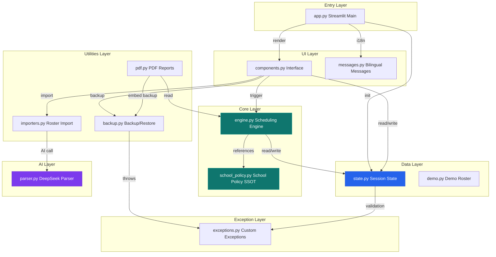
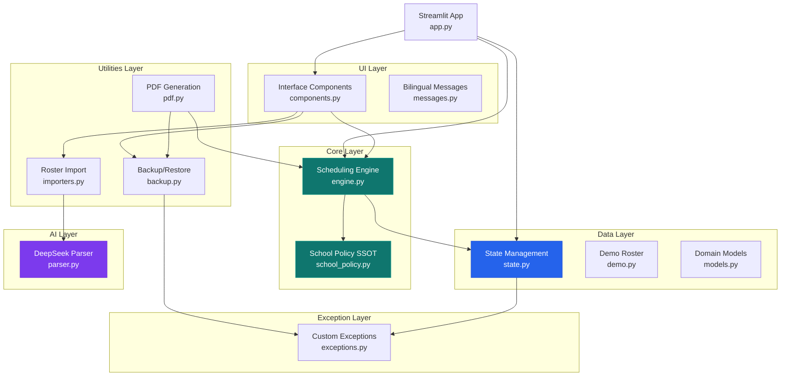
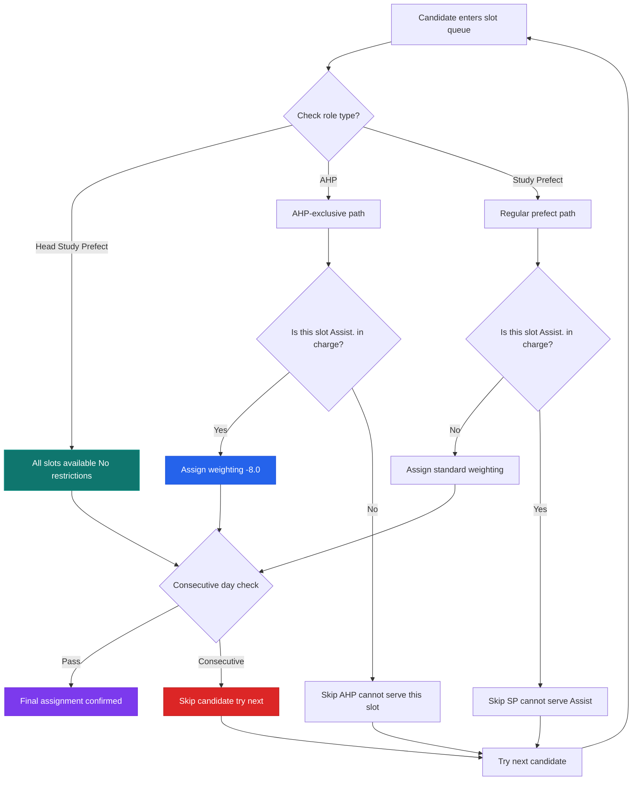
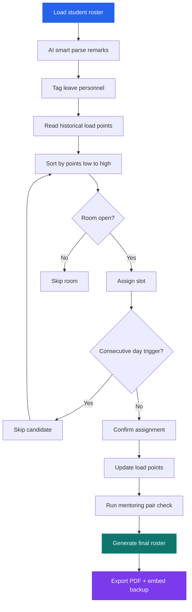
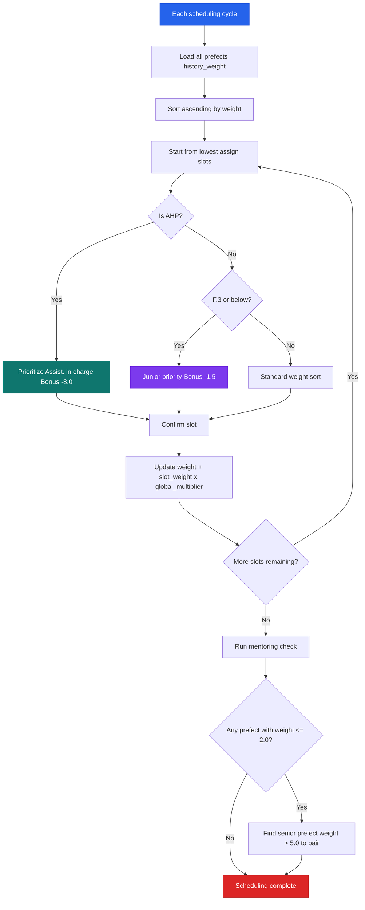
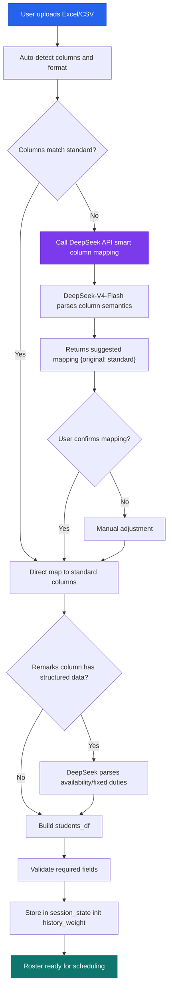
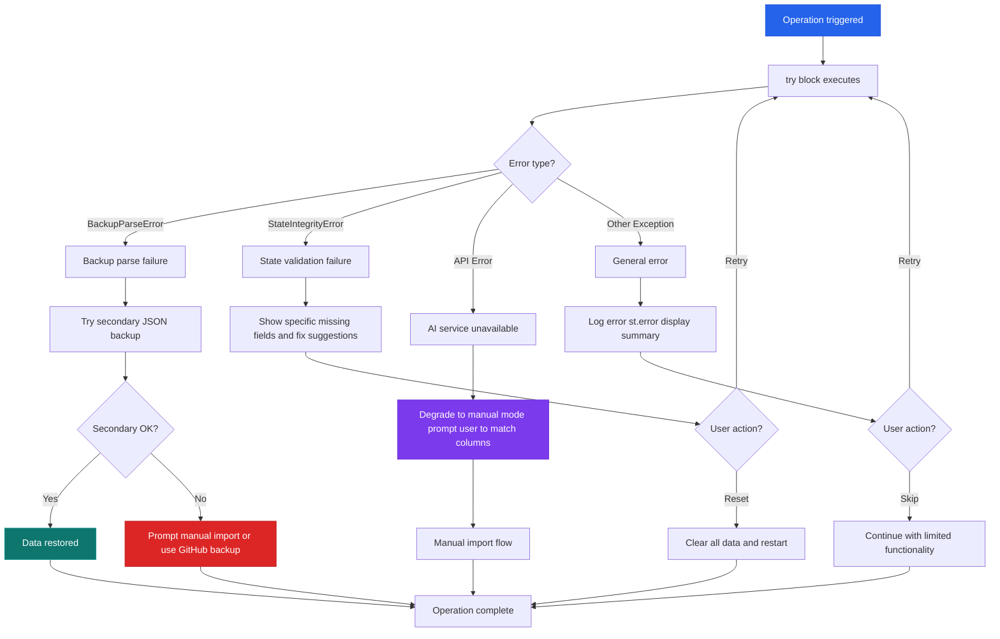
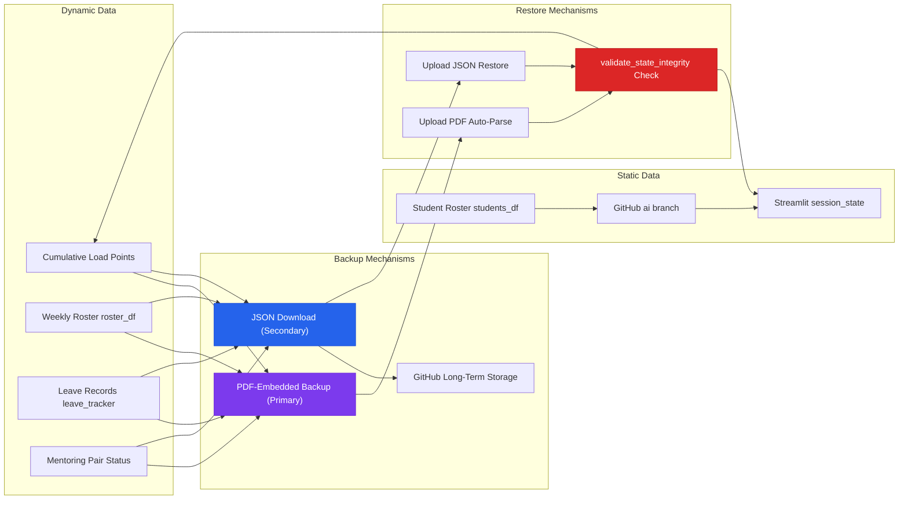
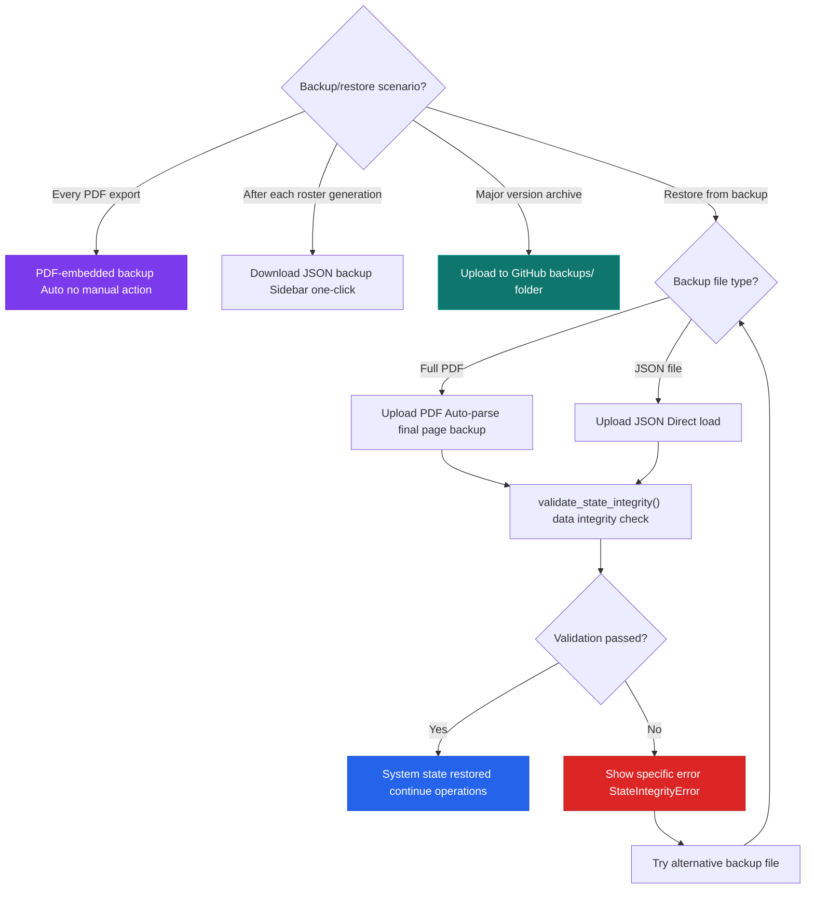
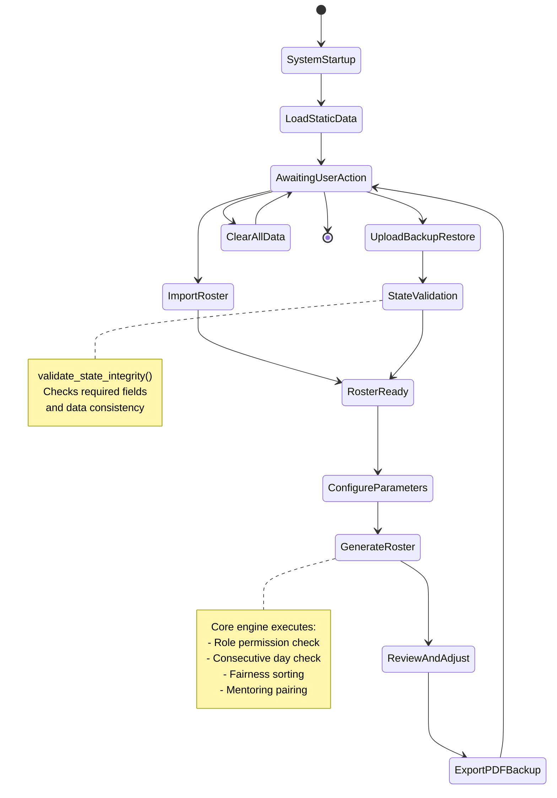

[中文]
### Module Dependency Graph

Call relationships and data flow between all 7 layers:



**Key insight:** `school_policy.py` has no reverse dependencies — it is the true Single Source of Truth. The AI layer is only called by `importers.py`, fully decoupled from the scheduling engine.
(README.md) | **English**

<div align="center">

# Sing Yin Study Prefect Duty Roster System

**聖言中學導學風紀當值排班平台 · v2.4**

[](https://www.python.org/)
[](https://streamlit.io/)
[](https://github.com/JackyLi10777/Study-Prefect-Duty-Roster-System/actions)
[](LICENSE)
[](https://deepseek.com)
[](https://streamlit.io/cloud)

</div>

---

> A **professional-grade intelligent fair-duty scheduling platform** built from the ground up for the Study Prefect Team of Sing Yin Secondary School, Hong Kong.
> Integrates AI-assisted parsing, fairness algorithms, mentoring pair matching, PDF report generation, and dual-channel backup/restore — all running on **Streamlit Cloud**.
> Architected through 5 rounds of structural refactoring, guarded by **62 automated tests**.

---

## Table of Contents

- [Quick Start](#quick-start)
- [Daily Workflow](#daily-workflow)
- [FAQ](#faq)
- [System Architecture & Core Logic](#system-architecture--core-logic) (Advanced)
- [Project Structure](#project-structure)
- [Tech Stack](#tech-stack)
- [Backup & Data Persistence](#backup--data-persistence)
- [Author & License](#author--license)

---

## Quick Start

```bash
pip install -r requirements.txt
streamlit run app.py
```

For Streamlit Cloud deployment, configure the following Secret: `DEEPSEEK_API_KEY` (AI parsing feature).

---

## Daily Workflow

### 1. Import Roster
- **Recommended: AI Smart Auto-Match** — supports arbitrary Excel/CSV formats. DeepSeek automatically identifies and maps columns.
- Manual mode also available for standard-format uploads.

### 2. Configure Parameters
- Select prefects on leave this week in the sidebar.
- Mark special closures (exam weeks, event days).
- Adjust the global load slider (0.8× – 2.0×) to tune overall scheduling intensity.

### 3. One-Click Generation
- Click the main "Generate Fair Roster" button.
- The system automatically schedules based on cumulative historical load points, respecting AHP restrictions, room availability rules, and mentoring pair logic.

### 4. Review & Adjust
- **Visual Board**: colour-coded role markers for at-a-glance clarity.
- **Manual Edit Mode**: directly edit names or lock cells in the table.
- **Smart Substitutes**: select a date and role — system recommends candidates by lowest current load.

### 5. Export & Backup
- **Export Chinese PDF**: professional colour roster with embedded backup on the final page — send + backup in one step.
- **Export English PDF**: for external or English-speaking recipients.
- **JSON Backup**: one-click download of dynamic data from the sidebar.
- **Excel / Markdown**: convenient for copying into other documents.

> 💡 **Strongly Recommended**: download PDF or JSON backup immediately after every roster generation. Use "Upload Backup Restore" to recover after Streamlit Cloud hibernation.

---

## FAQ

**Q: PDF export fails after roster generation?**
A: Usually a WeasyPrint dependency issue. `packages.txt` on Streamlit Cloud already includes required system libraries. For local development, ensure GTK dependencies are installed.

**Q: How to recover last week's roster?**
A: Upload the previously exported PDF (no need to split pages). The system auto-parses the embedded backup on the final page. JSON backup files also work.

**Q: Should I push roster updates to GitHub?**
A: Student rosters are static data hosted on the GitHub `ai` branch. Commit and push after modifications to ensure the latest roster is used on next deployment.

**Q: How to switch Dark Mode / language?**
A: Toggle switches at the top of the sidebar for dark/light mode and Chinese/English bilingual instant switching. Settings persist automatically.

**Q: How to handle exam week scheduling?**
A: Raise the global load slider (e.g., 1.5× – 2.0×) to prioritize prefects with lower cumulative load, balancing long-term fairness.

**Q: Can multiple people use the system simultaneously?**
A: Each user's Streamlit Session is independent. For collaboration, the Head Study Prefect should operate centrally and distribute the exported PDF.

**Q: How to reset all data and start fresh?**
A: Use the "Clear All Data" button at the bottom of the sidebar (double-confirmation required; irreversible). Re-import the roster afterward.

**Q: Is mentoring pairing automatic?**
A: Yes. The system automatically identifies prefects needing guidance (cumulative points ≤ 2.0) and pairs them with experienced prefects (points > 5.0) in the same room.

---

## System Architecture & Core Logic

> 🔗 This section is for those interested in the system's design philosophy. Not required for daily operations.

### Architecture Overview

The system uses a **layered modular architecture**, separating school policy, scheduling engine, data management, user interface, utilities, and AI services into independent layers for high cohesion and low coupling.




### Role Permission Enforcement

How the system enforces role constraints during scheduling:



**Hard constraints:**
- AHP can **only** serve "Assist. in charge" — this is non-negotiable.
- Regular prefects **cannot** serve "Assist. in charge" — skipped even if no alternatives exist.
- Consecutive-day check runs after role check; both constraints stack for full compliance.

### Core Scheduling Rules

The system fully implements all duty scheduling rules for Sing Yin's Study Prefect Team, with `school_policy.py` as the **Single Source of Truth (SSOT)**.

#### AHP (Assistant Head Study Prefect) Restrictions
- The "Assist. in charge" slot is **exclusive to AHPs**.
- A -8.0 strong weighting ensures AHPs are always prioritized for this slot.
- Regular Study Prefects cannot serve as "Assist. in charge".

#### Room Availability & Capacity

| Room | Daily Capacity | Weight | Open Days | Notes |
|------|---------------|--------|-----------|-------|
| **Room 302** | 2 | 1.2× | Mon–Fri | No duplicate assignments |
| **Room 303** | 2 | 1.2× | Mon–Fri | No duplicate assignments |
| **Room 202** | 1 | 1.0× | Mon, Wed, Thu | Auto-closed Tue & Fri |
| **Assist. in charge** | 1 | 1.4× | Mon–Fri | AHP-exclusive |

#### No Consecutive Days
- Algorithm-level guarantee: the same prefect will never be scheduled on two consecutive days.
- This rule executes before fairness calculations.


### Roster Generation Flow

End-to-end flow from data loading to PDF export:



#### Fairness Mechanism
- **Cumulative Load Points (`history_weight`)**: updated after each scheduling cycle — the more you serve, the higher your score.
- **Dynamic Weighted Sorting**: in the next cycle, those with the lowest scores get priority rest.
- **F.3 Junior Priority**: younger prefects get scheduling preference on ties, encouraging new member participation.
- **Global Load Scaling**: 0.8× – 2.0× dynamic multiplier; increase during exam weeks to balance long-term load.

### Fairness Algorithm Detail

`history_weight` is the core quantitative metric. Full calculation flow per scheduling cycle:



**Weight formula:**

| Slot | Base Weight | Notes |
|------|------------|-------|
| Assist. in charge | 1.4x | AHP-exclusive, -8.0 priority bonus |
| Room 302 | 1.2x | Dual-occupancy, no duplicates |
| Room 303 | 1.2x | Dual-occupancy, no duplicates |
| Room 202 | 1.0x | Single-occupancy, closed Tue/Fri |
| F.3 junior priority | -1.5 | Tiebreaker for new members |
| Consecutive days | Auto-skip | Hard constraint, non-negotiable |


### AI Import Pipeline

End-to-end flow from raw Excel upload to structured DataFrame:



**Design principles:**
- **Non-intrusive**: AI only activates when columns mismatch or remarks need parsing.
- **Human-in-the-loop**: AI suggests mappings; user confirms before proceeding.
- **Decoupled**: AI layer (roster/ai/) is independent of the scheduling engine.

### Key Design Decisions

- **School Policy as SSOT**: `school_policy.py` defines all school rules. `engine.py`, `pdf.py`, and `components.py` reference the `config` module — never hardcode.
- **Centralized Session State**: `state.py` manages all Streamlit session state with defensive helpers: `get_state`, `set_state`, `validate_state_integrity`.
- **Structured Exception Handling**: `exceptions.py` provides `BackupParseError`, `StateIntegrityError`, and others for clear, traceable error paths.
- **Decoupled AI Layer**: the AI parsing layer is independent of the core scheduling engine, callable via standard interfaces, and swappable at any time.


### Error Handling & Degradation

Per-layer exception handling with graceful fallback:



**Design principles:**
- **Layered capture**: each layer (backup, state, AI, general) has its own exception type and degradation strategy.
- **User-informed**: all errors displayed via st.error / st.warning with clear cause and suggested action.
- **Never give up**: backup restore auto-tries secondary paths; AI failure degrades to manual mode — core flow never blocked.

### Backup Strategy



**Strategy:**
- **Static data** (student roster) hosted on GitHub `ai` branch; auto-loaded on startup.
- **Dynamic data** (scheduling records, load points, mentoring state) protected by PDF-embedded backup (primary) + JSON download (secondary).
- Auto-executes `validate_state_integrity()` on restore for data integrity verification.

---


### Backup Restore Decision Tree

When to use which backup method:



**Core principles:**
- PDF backup is the **most convenient daily method** — happens automatically on every export.
- JSON backup serves as **lightweight secondary** — for dynamic-data-only scenarios.
- GitHub is the **long-term archival solution** — recommended at start/mid/end of term.
- On restore, the system auto-tries all available backup paths to maximize recovery success.


## Development Investment & Technical Depth

> 🔗 This section provides advanced context on the scale of AI-assisted development behind this project.

This is not a simple utility tool — its development process represents a large-scale **AI-assisted software engineering practice**.

### AI Development Investment

| Metric | Data | Notes |
|--------|------|-------|
| **AI Platforms** | Codex · Grok · Grok Build | Multi-model collaborative development |
| **Primary Model** | DeepSeek V4 Pro | Accessed via Codex API for architecture design, code generation, test authoring, and documentation |
| **Token Consumption** | Over **1.2 billion tokens** (consumed) | Codex + DeepSeek V4 Pro portion only |
| **Estimated Total** | Approximately **2 billion tokens** | Including Grok and Grok Build contributions |

### From Investment to Quality

This AI investment is directly reflected in every layer of the project:

- **5 Rounds of Architectural Refactoring**: evolved from a single-file script to a 7-layer modular architecture. School Policy SSOT, centralized Session State management, structured exception hierarchy — each refactoring round was AI-assisted in analysis and implementation.
- **62 Automated Tests**: unit tests, engine logic tests, end-to-end integration tests — AI helped generate test frameworks and edge case coverage.
- **10 Mermaid Architecture Diagrams**: system architecture, module dependencies, scheduling flow, fairness algorithm, AI import pipeline, error handling, backup decision tree, lifecycle state machine — all AI-assisted in generation and iterative refinement.
- **DeepSeek AI Smart Parsing**: the built-in AI features (column mapping, remark parsing) also benefited from deep understanding of the DeepSeek API gained through extensive development and debugging.
- **Bilingual Documentation System**: Chinese and English READMEs with full structural parity, bilingual in-app user manual — AI-assisted translation and polishing ensure professional quality.

### Engineering Philosophy

The development model embodies the **"AI as accelerator, human as decision-maker"** collaboration paradigm:

- AI handles repetitive, large-scale work (code generation, test authoring, documentation drafts).
- Humans own architecture decisions, school rule validation, and user experience design.
- Every line of code is human-reviewed to ensure it meets the real needs of Sing Yin Secondary School.

> Approximately 2 billion tokens of AI investment, ultimately condensed into a **professional-grade system deployed on Streamlit Cloud, guarded by 62 tests, detailed in 10 architecture diagrams, and documented in full bilingual manuals**.


### Leadership & Decision-Making

This system was **initiated, designed, and led throughout development** by **LI Chuangjie Jacky**, the 26-27 Head Study Prefect.

- **Architectural Direction**: from a single-file script to a 7-layer modular architecture — every refactoring decision was made by him based on real team needs.
- **Quality Standards**: 62 automated tests, 10 architecture diagrams, full bilingual documentation — these standards did not emerge from AI automation, but from his insistence on professional-grade quality.
- **Continuous Iteration**: from the initial scheduling script, to AI parsing, mentoring pairs, PDF backup, DeepSeek migration, documentation restructuring — every major upgrade originated from his ongoing reflection and drive for improvement.
- **Human-AI Collaboration Leadership**: across approximately 2 billion tokens of AI-assisted development, he remained the decision-maker — AI provided suggestions and acceleration; he made every critical trade-off.

> Without his vision, leadership, and sustained commitment, this professional-grade intelligent scheduling system would not exist.


## Project Structure

```
Study-Prefect-Duty-Roster-System/
├── app.py                  # Streamlit entry point
├── roster/                 # Core package
│   ├── config/             # School policy SSOT (school_policy.py)
│   ├── core/               # Scheduling engine (fairness, mentoring, leave)
│   ├── data/               # Data layer (Session State, Demo, Domain Model)
│   ├── ui/                 # UI layer (Components, Theme, i18n, Bilingual)
│   ├── utils/              # Utilities (PDF, Backup, Importers)
│   ├── ai/                 # AI layer (DeepSeek parsing & column mapping)
│   └── exceptions.py       # Structured exception hierarchy
├── tests/                  # 62 automated tests
├── docs/                   # ADRs, phase reports
└── resources/              # Static assets
```

---


### System Lifecycle State Machine

State transitions from startup through a complete scheduling cycle:



**Key states:**
- On startup, static data auto-loads from the GitHub ai branch.
- GenerateRoster is the core state — most computation and rule checking happens here.
- After PDF export, the system returns to AwaitingUserAction, ready for a new cycle or backup restore.

## Tech Stack

| Layer | Technology |
|-------|-----------|
| **Frontend Framework** | Streamlit ≥ 1.38.0 |
| **Scheduling Engine** | Python 3.12 · Pandas ≥ 2.2.0 |
| **AI Service** | DeepSeek-V4-Flash (OpenAI-compatible API) |
| **PDF Rendering** | WeasyPrint ≥ 62.3 (CSS layout engine) |
| **Data Visualization** | Plotly ≥ 5.24.0 |
| **Test Framework** | Pytest (62 tests: unit + engine + integration) |
| **Deployment** | Streamlit Cloud (stateless, auto-hibernate recovery) |
| **Version Control** | Git · GitHub (`ai` branch for active development) |
| **File Processing** | OpenPyXL · Tabulate · Pillow |

---

## Backup & Data Persistence

This system runs on Streamlit Cloud (stateless environment). Data may be lost after hibernation or redeployment. **Always back up.**

### Data Classification
- **Static Data**: names, forms, classes, roles, availability, fixed duties → hosted on GitHub
- **Dynamic Data**: cumulative load points, weekly roster, leave records, mentoring status → preserved via backup functions

### Backup Methods

| Method | Type | Description | When to Use |
|--------|------|-------------|-------------|
| **PDF Export (with backup)** | Primary | Full JSON backup auto-embedded on final page | Every PDF export |
| **JSON Download** | Secondary | Sidebar one-click download of dynamic data | After every roster generation |
| **GitHub Long-Term** | Recommended | Upload backups to `backups/` folder | Major versions, mid-term/final |

> ⚠️ **Strongly Recommended**: cultivate the habit of "backup after every operation + upload important versions to GitHub". PDF-embedded backup is the most convenient daily backup method.

---

## Project Leadership & License

### Project Initiator & Lead Developer

**LI Chuangjie Jacky（李創杰）**
26-27 Head Study Prefect, Sing Yin Secondary School
F.5E

This system was conceived, architected, AI-development-directed, and continuously refined entirely under the initiative and leadership of LI Chuangjie Jacky.


### 📜 License

MIT License

Copyright (c) 2026 LI Chuangjie Jacky (李創杰)
26-27 Head Study Prefect, Sing Yin Secondary School Study Prefect Team

---

*This project is primarily for internal use by the Sing Yin Secondary School Study Prefect Team. Please contact the author before commercial use or redistribution.*
