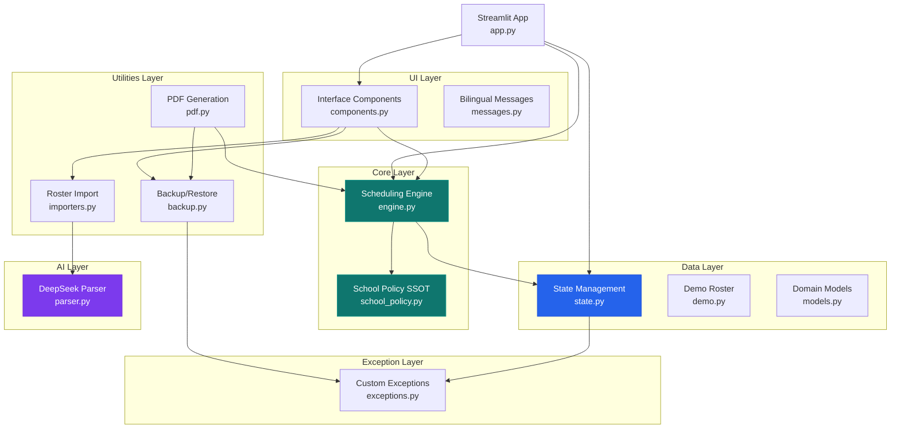
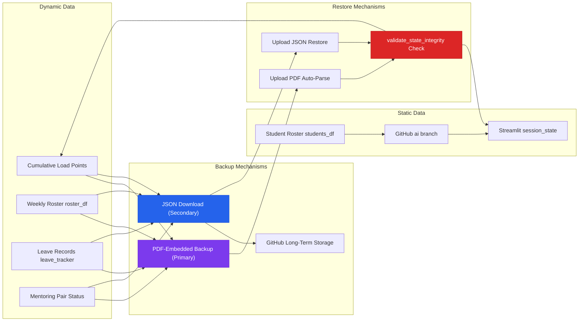

[中文](README.md) | **English**

<div align="center">

# Sing Yin Study Prefect Duty Roster System

**聖言中學導學風紀當值排班平台 · v2.4**

[](https://www.python.org/)
[](https://streamlit.io/)
[](https://github.com/JackyLi10777/Study-Prefect-Duty-Roster-System/actions)
[](LICENSE)
[](https://deepseek.com)
[](https://streamlit.io/cloud)

</div>

---

> A **professional-grade intelligent fair-duty scheduling platform** built from the ground up for the Study Prefect Team of Sing Yin Secondary School, Hong Kong.
> Integrates AI-assisted parsing, fairness algorithms, mentoring pair matching, PDF report generation, and dual-channel backup/restore — all running on **Streamlit Cloud**.
> Architected through 5 rounds of structural refactoring, guarded by **62 automated tests**.

---

## Table of Contents

- [Quick Start](#quick-start)
- [Daily Workflow](#daily-workflow)
- [FAQ](#faq)
- [System Architecture & Core Logic](#system-architecture--core-logic) (Advanced)
- [Project Structure](#project-structure)
- [Tech Stack](#tech-stack)
- [Backup & Data Persistence](#backup--data-persistence)
- [Author & License](#author--license)

---

## Quick Start

```bash
pip install -r requirements.txt
streamlit run app.py
```

For Streamlit Cloud deployment, configure the following Secret: `DEEPSEEK_API_KEY` (AI parsing feature).

---

## Daily Workflow

### 1. Import Roster
- **Recommended: AI Smart Auto-Match** — supports arbitrary Excel/CSV formats. DeepSeek automatically identifies and maps columns.
- Manual mode also available for standard-format uploads.

### 2. Configure Parameters
- Select prefects on leave this week in the sidebar.
- Mark special closures (exam weeks, event days).
- Adjust the global load slider (0.8× – 2.0×) to tune overall scheduling intensity.

### 3. One-Click Generation
- Click the main "Generate Fair Roster" button.
- The system automatically schedules based on cumulative historical load points, respecting AHP restrictions, room availability rules, and mentoring pair logic.

### 4. Review & Adjust
- **Visual Board**: colour-coded role markers for at-a-glance clarity.
- **Manual Edit Mode**: directly edit names or lock cells in the table.
- **Smart Substitutes**: select a date and role — system recommends candidates by lowest current load.

### 5. Export & Backup
- **Export Chinese PDF**: professional colour roster with embedded backup on the final page — send + backup in one step.
- **Export English PDF**: for external or English-speaking recipients.
- **JSON Backup**: one-click download of dynamic data from the sidebar.
- **Excel / Markdown**: convenient for copying into other documents.

> 💡 **Strongly Recommended**: download PDF or JSON backup immediately after every roster generation. Use "Upload Backup Restore" to recover after Streamlit Cloud hibernation.

---

## FAQ

**Q: PDF export fails after roster generation?**
A: Usually a WeasyPrint dependency issue. `packages.txt` on Streamlit Cloud already includes required system libraries. For local development, ensure GTK dependencies are installed.

**Q: How to recover last week's roster?**
A: Upload the previously exported PDF (no need to split pages). The system auto-parses the embedded backup on the final page. JSON backup files also work.

**Q: Should I push roster updates to GitHub?**
A: Student rosters are static data hosted on the GitHub `ai` branch. Commit and push after modifications to ensure the latest roster is used on next deployment.

**Q: How to switch Dark Mode / language?**
A: Toggle switches at the top of the sidebar for dark/light mode and Chinese/English bilingual instant switching. Settings persist automatically.

**Q: How to handle exam week scheduling?**
A: Raise the global load slider (e.g., 1.5× – 2.0×) to prioritize prefects with lower cumulative load, balancing long-term fairness.

**Q: Can multiple people use the system simultaneously?**
A: Each user's Streamlit Session is independent. For collaboration, the Head Study Prefect should operate centrally and distribute the exported PDF.

**Q: How to reset all data and start fresh?**
A: Use the "Clear All Data" button at the bottom of the sidebar (double-confirmation required; irreversible). Re-import the roster afterward.

**Q: Is mentoring pairing automatic?**
A: Yes. The system automatically identifies prefects needing guidance (cumulative points ≤ 2.0) and pairs them with experienced prefects (points > 5.0) in the same room.

---

## System Architecture & Core Logic

> 🔗 This section is for those interested in the system's design philosophy. Not required for daily operations.

### Architecture Overview

The system uses a **layered modular architecture**, separating school policy, scheduling engine, data management, user interface, utilities, and AI services into independent layers for high cohesion and low coupling.



### Core Scheduling Rules

The system fully implements all duty scheduling rules for Sing Yin's Study Prefect Team, with `school_policy.py` as the **Single Source of Truth (SSOT)**.

#### AHP (Assistant Head Study Prefect) Restrictions
- The "Assist. in charge" slot is **exclusive to AHPs**.
- A -8.0 strong weighting ensures AHPs are always prioritized for this slot.
- Regular Study Prefects cannot serve as "Assist. in charge".

#### Room Availability & Capacity

| Room | Daily Capacity | Weight | Open Days | Notes |
|------|---------------|--------|-----------|-------|
| **Room 302** | 2 | 1.2× | Mon–Fri | No duplicate assignments |
| **Room 303** | 2 | 1.2× | Mon–Fri | No duplicate assignments |
| **Room 202** | 1 | 1.0× | Mon, Wed, Thu | Auto-closed Tue & Fri |
| **Assist. in charge** | 1 | 1.4× | Mon–Fri | AHP-exclusive |

#### No Consecutive Days
- Algorithm-level guarantee: the same prefect will never be scheduled on two consecutive days.
- This rule executes before fairness calculations.

#### Fairness Mechanism
- **Cumulative Load Points (`history_weight`)**: updated after each scheduling cycle — the more you serve, the higher your score.
- **Dynamic Weighted Sorting**: in the next cycle, those with the lowest scores get priority rest.
- **F.3 Junior Priority**: younger prefects get scheduling preference on ties, encouraging new member participation.
- **Global Load Scaling**: 0.8× – 2.0× dynamic multiplier; increase during exam weeks to balance long-term load.

### Key Design Decisions

- **School Policy as SSOT**: `school_policy.py` defines all school rules. `engine.py`, `pdf.py`, and `components.py` reference the `config` module — never hardcode.
- **Centralized Session State**: `state.py` manages all Streamlit session state with defensive helpers: `get_state`, `set_state`, `validate_state_integrity`.
- **Structured Exception Handling**: `exceptions.py` provides `BackupParseError`, `StateIntegrityError`, and others for clear, traceable error paths.
- **Decoupled AI Layer**: the AI parsing layer is independent of the core scheduling engine, callable via standard interfaces, and swappable at any time.

### Backup Strategy



**Strategy:**
- **Static data** (student roster) hosted on GitHub `ai` branch; auto-loaded on startup.
- **Dynamic data** (scheduling records, load points, mentoring state) protected by PDF-embedded backup (primary) + JSON download (secondary).
- Auto-executes `validate_state_integrity()` on restore for data integrity verification.

---

## Project Structure

```
Study-Prefect-Duty-Roster-System/
├── app.py                  # Streamlit entry point
├── roster/                 # Core package
│   ├── config/             # School policy SSOT (school_policy.py)
│   ├── core/               # Scheduling engine (fairness, mentoring, leave)
│   ├── data/               # Data layer (Session State, Demo, Domain Model)
│   ├── ui/                 # UI layer (Components, Theme, i18n, Bilingual)
│   ├── utils/              # Utilities (PDF, Backup, Importers)
│   ├── ai/                 # AI layer (DeepSeek parsing & column mapping)
│   └── exceptions.py       # Structured exception hierarchy
├── tests/                  # 62 automated tests
├── docs/                   # ADRs, phase reports
└── resources/              # Static assets
```

---

## Tech Stack

| Layer | Technology |
|-------|-----------|
| **Frontend Framework** | Streamlit ≥ 1.38.0 |
| **Scheduling Engine** | Python 3.12 · Pandas ≥ 2.2.0 |
| **AI Service** | DeepSeek-V4-Flash (OpenAI-compatible API) |
| **PDF Rendering** | WeasyPrint ≥ 62.3 (CSS layout engine) |
| **Data Visualization** | Plotly ≥ 5.24.0 |
| **Test Framework** | Pytest (62 tests: unit + engine + integration) |
| **Deployment** | Streamlit Cloud (stateless, auto-hibernate recovery) |
| **Version Control** | Git · GitHub (`ai` branch for active development) |
| **File Processing** | OpenPyXL · Tabulate · Pillow |

---

## Backup & Data Persistence

This system runs on Streamlit Cloud (stateless environment). Data may be lost after hibernation or redeployment. **Always back up.**

### Data Classification
- **Static Data**: names, forms, classes, roles, availability, fixed duties → hosted on GitHub
- **Dynamic Data**: cumulative load points, weekly roster, leave records, mentoring status → preserved via backup functions

### Backup Methods

| Method | Type | Description | When to Use |
|--------|------|-------------|-------------|
| **PDF Export (with backup)** | Primary | Full JSON backup auto-embedded on final page | Every PDF export |
| **JSON Download** | Secondary | Sidebar one-click download of dynamic data | After every roster generation |
| **GitHub Long-Term** | Recommended | Upload backups to `backups/` folder | Major versions, mid-term/final |

> ⚠️ **Strongly Recommended**: cultivate the habit of "backup after every operation + upload important versions to GitHub". PDF-embedded backup is the most convenient daily backup method.

---

## Author & License

**26-27 Head Study Prefect**
**LI Chuangjie Jacky (李創杰)**
Sing Yin Secondary School (聖言中學)
F.5E

Email: **s10777@syss.edu.hk**

---

### 📜 License

MIT License

Copyright (c) 2026 LI Chuangjie Jacky (李創杰)
26-27 Head Study Prefect, Sing Yin Secondary School Study Prefect Team

---

*This project is primarily for internal use by the Sing Yin Secondary School Study Prefect Team. Please contact the author before commercial use or redistribution.*
