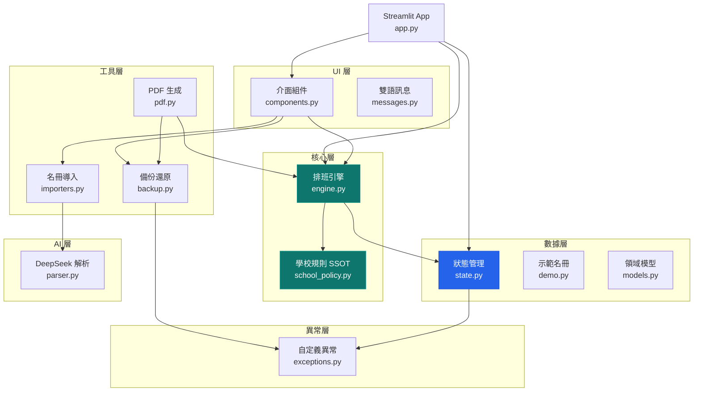
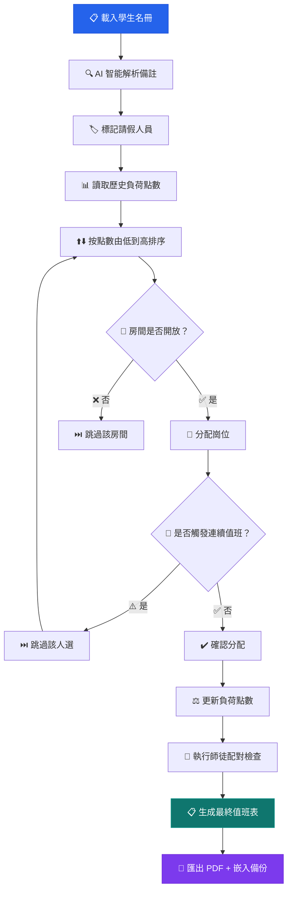
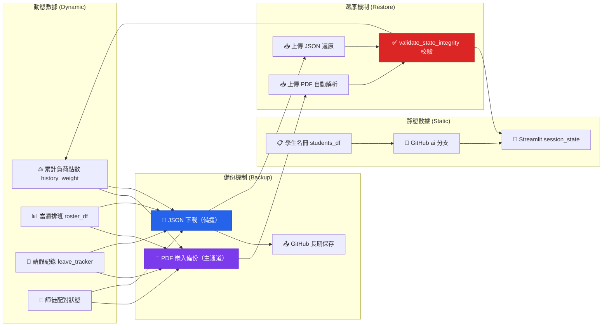

# Sing Yin Study Prefect Duty Roster System

**聖言中學導學風紀當值排班平台 · v2.4**
*Sing Yin Secondary School — Study Prefect Intelligent Scheduling Platform*

> 一套為香港聖言中學導學風紀團隊從零打造的**專業級智能公平排班管理系統**。
> 集 AI 輔助解析、公平性演算法、師徒配對、PDF 報告生成、雙通道備份還原於一體。
> 專為 **Streamlit Cloud** 無狀態環境設計，經歷 5 輪架構重構，**62 項自動化測試**全程護航。

---

## 目錄

- [快速開始](#快速開始)
- [日常操作流程](#日常操作流程)
- [常見問題](#常見問題)
- [系統架構與核心邏輯](#系統架構與核心邏輯)（進階）
- [項目結構](#項目結構)
- [技術棧](#技術棧)
- [備份與數據持久化](#備份與數據持久化)
- [作者與授權](#作者與授權)

---

## 快速開始

```bash
pip install -r requirements.txt
streamlit run app.py
```

部署至 Streamlit Cloud 時需設置 Secrets：`DEEPSEEK_API_KEY`（AI 解析功能）。

---

## 日常操作流程

### 1. 導入名冊
- **推薦使用「🤖 AI 智能自動匹配」**：支援任意格式的 Excel / CSV，DeepSeek 會自動辨識欄位。
- 亦可選擇傳統手動模式，按範例格式上傳。

### 2. 設定參數
- 在側邊欄勾選本週請假人員。
- 如遇特殊情況（考試週、活動日），可標記特定時段關閉。
- 使用全域負荷滑桿（0.8× – 2.0×）一鍵調節本週整體排班強度。

### 3. 一鍵生成
- 點擊主畫面「🚀 一鍵生成公平值班表」。
- 系統自動基於歷史累計負荷點數進行公平排班，考慮 AHP 限制、房間開放規則、師徒配對。

### 4. 審核與調整
- **視覺公告版**：彩色崗位標記，一目了然。
- **手動修改模式**：直接在表格上編輯人名或鎖定儲存格。
- **智慧替補推薦**：選擇日期與崗位，系統按最低負荷推薦人選。

### 5. 匯出與備份
- **📄 匯出中文 PDF**：專業彩色班表，末頁自動嵌入完整備份數據 → 一頁實現「發送 + 備份」。
- **📄 Export English PDF**：供外部或英文使用者。
- **💾 JSON 備份**：側邊欄一鍵下載動態數據。
- **📊 Excel / Markdown**：方便複製到其他文件。

> 💡 **強烈建議**：每次生成值班表後立即下載 PDF 或 JSON 備份。Streamlit Cloud 休眠後可通過「上傳備份還原」一鍵恢復。

---

## 常見問題

**Q: 生成值班表後 PDF 匯出失敗？**
A: 通常是 WeasyPrint 依賴問題。在 Streamlit Cloud 上 `packages.txt` 已配置必要系統庫。本地開發請確保安裝了 GTK 相關依賴。

**Q: 想恢復上週的值班表怎麼辦？**
A: 上傳之前匯出的 PDF（無需拆頁），系統自動解析末頁嵌入的備份數據進行完整還原。也可使用 JSON 備份檔案恢復。

**Q: 學生名冊更新後要不要 Push 到 GitHub？**
A: 名冊屬於靜態數據，託管在 GitHub `ai` 分支。修改後建議提交推送，確保下次部署時使用最新名冊。

**Q: Dark Mode / 語言如何切換？**
A: 側邊欄頂部提供深色/淺色模式切換開關，以及中英雙語即時切換。設定會自動保存。

**Q: 如何處理考試週的特殊排班需求？**
A: 使用全域負荷滑桿調高倍率（如 1.5× – 2.0×），讓累計負荷較低的學生優先排班，平衡長期公平性。

**Q: 系統可以多人同時使用嗎？**
A: 每位使用者的 Streamlit Session 互相獨立。如需多人協作，建議由首席導學風紀統一操作後匯出 PDF 發送。

**Q: 如何清除所有數據重新開始？**
A: 側邊欄底部「🗑️ 完全清除所有數據」按鈕（需二次確認，操作不可復原）。清除後可重新導入名冊。

**Q: 師徒配對是自動的嗎？**
A: 是的。系統自動識別需要指導的風紀（累計點數 ≤ 2.0），優先與資深風紀（點數 > 5.0）配對至同一房間。

---

## 系統架構與核心邏輯

> 🔗 本章節面向有興趣深入了解系統設計理念的使用者與未來維護者。日常操作無需閱讀。

### 整體架構

本系統採用**分層模組化設計**，將學校規則、排班引擎、數據管理、使用者介面、工具函數、AI 服務分離為獨立層級，確保高內聚低耦合。



### 核心排班規則

本系統完整實現聖言中學導學風紀團隊的所有值班規則，以 `school_policy.py` 作為**唯一事實來源（SSOT）**。

#### AHP（助理首席導學風紀）限制
- 「Assist. in charge」崗位**僅限 AHP** 擔任。
- 系統透過 -8.0 強力加權確保 AHP 永遠優先分配到該崗位。
- 普通導學風紀不可擔任「Assist. in charge」。

#### 房間開放規則與人數限制

| 房間 | 每日名額 | 權重 | 開放日 | 備註 |
|------|---------|------|--------|------|
| **Room 302** | 2 人 | 1.2× | 週一至週五 | 兩人不可重複 |
| **Room 303** | 2 人 | 1.2× | 週一至週五 | 兩人不可重複 |
| **Room 202** | 1 人 | 1.0× | 週一、三、四 | 週二、五自動關閉 |
| **Assist. in charge** | 1 人 | 1.4× | 週一至週五 | AHP 專屬 |

#### 不可連續值班規則
- 演算法層面保證同一風紀不會連續兩天被安排值班。
- 此規則在公平性計算之前優先執行。

#### 公平性機制
- **累計負荷點數（`history_weight`）**：每次排班後更新，付出越多者數值越高。
- **動態加權排序**：下次排班時，點數最低者優先獲得休息機會。
- **F.3 師徒優先**：低年級學生在平局時優先獲得值班機會，鼓勵新人參與。
- **全域負荷調節**：0.8× – 2.0× 動態倍率，考試週可提高倍率以平衡長期負荷。

### 排班生成流程



### 關鍵設計決策

- **School Policy 為 SSOT**：`school_policy.py` 定義所有學校規則，`engine.py`、`pdf.py`、`components.py` 均通過 `config` 模組引用，永不 hardcode。
- **Session State 集中管理**：`state.py` 統一管理 Streamlit 會話狀態，提供 `get_state` / `set_state` / `validate_state_integrity` 等防禦性輔助函數。
- **結構化異常處理**：`exceptions.py` 提供 `BackupParseError`、`StateIntegrityError` 等自定義異常，確保備份還原與狀態校驗的錯誤清晰可追蹤。
- **DeepSeek AI 解耦**：AI 解析層獨立於核心排班邏輯，通過標準接口調用，可隨時替換 AI 後端。

### 數據流與備份策略



**備份策略說明：**
- **靜態數據**（學生名冊）託管於 GitHub `ai` 分支，系統啟動時自動加載。
- **動態數據**（排班記錄、負荷點數、師徒狀態）通過 PDF 嵌入備份（主路徑）+ JSON 下載（備援）雙重保護。
- 還原時自動執行 `validate_state_integrity()` 校驗數據完整性。

---

## 項目結構

```
Study-Prefect-Duty-Roster-System/
├── app.py                  # Streamlit 入口
├── roster/                 # 核心套件
│   ├── config/             # 學校規則 SSOT（school_policy.py）
│   ├── core/               # 排班引擎（公平演算法 · 師徒配對 · 請假調整）
│   ├── data/               # 數據層（Session State · Demo · Domain Model）
│   ├── ui/                 # UI 層（組件 · 主題 · i18n · 雙語）
│   ├── utils/              # 工具層（PDF · 備份 · 名冊導入）
│   ├── ai/                 # AI 層（DeepSeek 智能解析與欄位映射）
│   └── exceptions.py       # 結構化異常層次
├── tests/                  # 62 項自動化測試
├── docs/                   # ADR · 階段報告
└── resources/              # 靜態資源
```

---

## 技術棧

| 層級 | 技術 |
|------|------|
| **前端框架** | Streamlit ≥ 1.38.0 |
| **排班引擎** | Python 3.12 · Pandas ≥ 2.2.0 |
| **AI 服務** | DeepSeek-V4-Flash（OpenAI 兼容 API） |
| **PDF 渲染** | WeasyPrint ≥ 62.3（CSS 排版引擎） |
| **數據可視化** | Plotly ≥ 5.24.0 |
| **測試框架** | Pytest（62 項：單元 + 引擎 + 集成） |
| **部署平台** | Streamlit Cloud（無狀態 · 自動休眠恢復） |
| **版本管理** | Git · GitHub（`ai` 分支為主要開發分支） |
| **文件處理** | OpenPyXL · Tabulate · Pillow |

---

## 備份與數據持久化

本系統運行在 Streamlit Cloud（無狀態環境），數據在休眠或重新部署後可能遺失。請務必做好備份。

### 數據分類
- **靜態數據**：姓名、年級、班別、職級、可用日子、固定值班等 → GitHub 倉庫託管
- **動態數據**：累計負荷點數、當週排班、請假記錄、師徒配對狀態等 → 需通過備份功能保存

### 備份方式

| 方式 | 類型 | 說明 | 建議時機 |
|------|------|------|----------|
| **PDF 匯出（含備份）** | 主通道 | PDF 末頁自動嵌入完整 JSON 備份 | 每次匯出 PDF 即自動備份 |
| **JSON 下載** | 備援 | 側邊欄一鍵下載純動態數據 | 每次生成排班後 |
| **GitHub 長期保存** | 推薦 | 上傳備份至 `backups/` 資料夾 | 重要版本 · 期中/期末 |

> ⚠️ **強烈建議**：養成「操作後立即備份 + 重要版本上傳 GitHub」的習慣。PDF 末頁嵌入備份是最方便的日常備份方式。

---

## 作者與授權

**26-27 Head Study Prefect（首席導學風紀）**
**LI Chuangjie Jacky（李創杰）**
Sing Yin Secondary School（聖言中學）
F.5E

Email: **s10777@syss.edu.hk**

---

### 📜 License

MIT License

Copyright (c) 2026 LI Chuangjie Jacky（李創杰）
26-27 Head Study Prefect, Sing Yin Secondary School Study Prefect Team

---

*本專案主要供聖言中學導學風紀團隊內部使用。商業用途或修改發布請先聯繫作者。*
