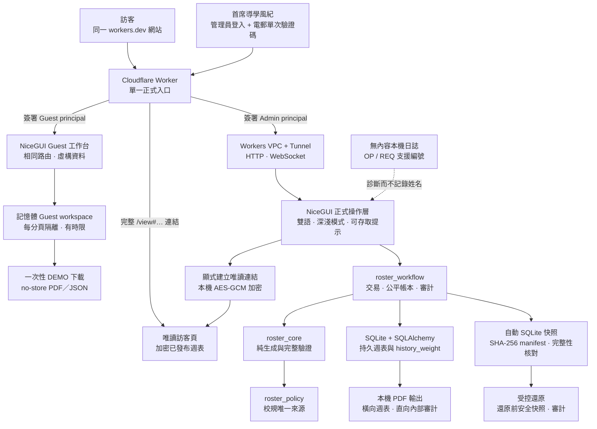
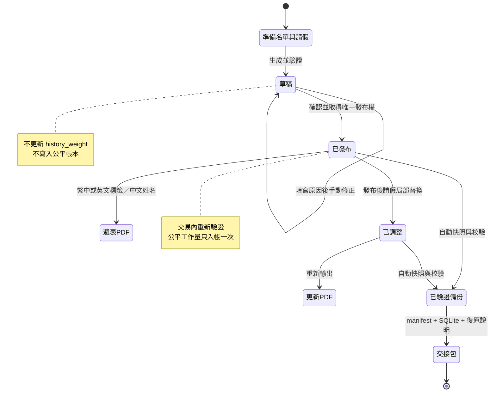

# 聖言中學導學風紀值班表生成系統

> **已核實線上來源（2026-07-31）：** Windows origin 正運行 clean annotated `v1.2.0-rc.43`／`c8201f33e454d9120c73386642cbf9d737391466`；canonical Worker `394e2205-ae8f-4eef-a13a-e701931e6f0d` 承接 100% 流量。rc43 的 306 個發布檔案以指紋 `699dc436c69e02f3b9062a04500715929ba35f78f48e14a3d80a0ac33c18640b` 通過 15／15 正式閘門；正式備份 `20260731-013103-079514-manual_verified_backup.sqlite3`（SHA-256 `f07306c89e79a610b40105627620c1603b707c39a7ab4cc537217df61c358e1c`）、隔離還原、公平及行數核對、origin health／readiness、Worker 0% 指定版本 smoke、100% promotion 與 canonical health／entrance／Viewer 均已通過。第一層受控回退是 rc41 origin `74072b0175ff64807312a8cc5b9cd016b6628210` 與前一 Worker `610092f6-59d4-4fd4-ab3a-3fbf1dd2c64e`；rc40／`2ec900a5ef1c021183717dfa648ef76b55452ffb` 及 Worker `2cb38b05-6091-43be-86d3-d9f3ccae1ceb` 是第二層回退。`v1.2.0-rc.42` 與 rc43 指向同一來源，但沒有綁定正式報告且從未部署，不是回退目標。首席導學風紀及教師顧問的受監督真人驗收仍未完成。下文較舊的 live／candidate 字樣只保留歷史證據，均由本段取代。
>
> **非以役人，乃役於人。**
> 
> **Not to be served, but to serve.** — Mark 10:45

我是李創杰，2026–2027 年度聖言中學首席導學風紀。我在任內與 Codex 一起建立這個本機優先值班管理系統，希望把每星期最繁複、最容易出錯的工作，整理成下一任也能安心接手的流程。日常由首席導學風紀操作；顧問老師主要在工作完成後核對已發布週表、公平與交接證據。你可以用它安全完成：

**生成草稿 → 核對 → 發布 → 匯出 PDF → 已發布後請假調整 → 公平解釋 → 備份／還原 → 交接。**

我把公平、清晰、責任、耐心與關顧定為這個系統的原則。v1.2 的方向是讓所有人只需記住同一個網站及同一套 NiceGUI 產品：訪客以固定虛構中文姓名完成臨時示範，獲准管理員經 Cloudflare Access 使用正式工作台，收到完整 `/view#…` 連結的人只可查看我明確分享的已發布週表。正式名單、請假原因、公平帳本、PDF、備份及完整操作資料仍留在受控 Windows 主機；Guest workspace 只在 origin 記憶體及受限的瀏覽器 session 範圍運作，不會寫入正式 SQLite、備份或公平帳本。

公開入口以同一張「已準備好的值班工作桌」在淺色清晨與深色夜間呈現：值班簿、三個流程紙標及 teal 線分別呼應記錄、三步工作及持續服事。兩張原創 WebP 都在專案本機，不含人物、學生資料、文字、校徽、外部追蹤或第三方圖片請求；停用動效時仍是完全可讀的靜態入口。頁首使用透明的 Service Weave 淺／深標誌配對，並按目前解析出的淺色／深色外觀切換；尚未儲存偏好時才跟隨作業系統。帶固定深靛底面的 app icon 只用於瀏覽器 favicon 及作業系統圖標。

工作台把同一原則延伸至每個主要路由：值班、人員／公平、管理／復原及支援頁各使用一組本機 AI 生成的淺／深氣氛圖；每日聖言另有同構圖的晨光／夜間 v2 配對。圖片只出現在頁首、敘事 hero、空白狀態或非敏感閱讀面，不會放在名單、表格、表單、公平數據、警告、對話框、控制或 PDF 後方。每次只解析當前頁面及外觀真正使用的資產；10 張新增／替換 WebP 均為 `1600×900`、不超過 180KB，提示詞、SHA-256、禁用位置及人工檢視結果見[氣氛資產清單](docs/design/ATMOSPHERE_ASSET_MANIFEST.md)。

互動採用可稽核的語意分級：設定齒輪、主題、備份設定導覽、歷史及撤回才可使用有界旋轉；正式還原、草稿、發布、匯入、名單管理、換經文及問題報告保留真實 lifecycle／glyph morph，不再疊加不合語意的旋轉。提示音及音樂自動播放開關使用更清楚的短暫 inset 壓縮；按鈕、文字、焦點框與版面不旋轉或位移，busy、disabled、reconnect 及 reduced-motion 都會立即清理 transform。

[English README](README-EN.md) · [GitHub repository](https://github.com/JackyLi10777/Study-Prefect-Duty-Roster-System) · [MIT License](LICENSE)

**反饋與聯絡：** 遇到問題時，先在網站開啟 **「問題回報／Support」**，取得支援編號及已刪減的診斷摘要，再電郵我：[`s10777@syss.edu.hk`](mailto:s10777@syss.edu.hk)。管理員可在明確同意後，把有限大小的 TXT／JSON／PNG 證據保存到主機本機支援收件匣；Guest、Public 及 Viewer 只會在瀏覽器建立報告，不會上載或長期保存。不要提交密碼、token、cookie、完整資料庫或完整備份；姓名、請假內容、值班表、PDF、截圖或日誌只在確實有助調查時提供最少相關部分。完整程序見[本機問題回報與事故處理](docs/SUPPORT_AND_INCIDENT_WORKFLOW.md)。

## 先從這裡開始

這個版本庫同時服務日常操作者、訪客、顧問老師、繼任者及維護者。不要從最長的文件開始；先按你此刻要完成的工作進入：

| 我現在是／我要做 | 第一個入口 | 然後閱讀 |
|---|---|---|
| 同學、師兄弟或訪客，想完整試用但不保存資料 | [正式網站](https://sing-yin-roster-viewer.singyin-study-prefect.workers.dev/) →「進入訪客示範」 | [單一網站存取手冊](docs/PUBLIC_ROSTER_VIEWER.md) |
| 首席導學風紀，要處理本週正式值班 | [正式網站](https://sing-yin-roster-viewer.singyin-study-prefect.workers.dev/) →「管理員登入」 | [操作手冊](docs/OPERATOR_GUIDE.md) |
| 顧問老師，要核對發布、公平或交接證據 | [正式驗收證據矩陣](docs/ACCEPTANCE_EVIDENCE.md) | [首次發布與交接手冊](docs/RELEASE_HANDOVER.md) |
| 任何使用者，遇到錯誤、下載失敗或顯示異常 | 正式網站 →「問題回報／Support」 | [本機問題回報與事故處理](docs/SUPPORT_AND_INCIDENT_WORKFLOW.md) |
| 新任首席導學風紀，要先安全演練 | `START_PRACTICE_MODE.cmd` | [快速啟動](docs/QUICKSTART.md)及[操作手冊](docs/OPERATOR_GUIDE.md) |
| IT／維護者，要部署、復原或查找 OP 編號 | [完整文件索引](docs/DOCUMENTATION_INDEX.md) | [Windows 主機設定](docs/WINDOWS_DEDICATED_HOST_SETUP.md)及[更新流程](docs/UPDATE_WORKFLOW.md) |
| 開發者／審查者，要理解程式邊界或提交修改 | [NiceGUI 架構](docs/NICEGUI_ARCHITECTURE.md) | [程式驗收審查](docs/CODE_ACCEPTANCE_REVIEW.md)、[AI Agent 工作樹指南](docs/AI_AGENT_GIT_GUIDE.md)及[貢獻指南](CONTRIBUTING.md) |

### 使用模式與資料邊界

| 模式 | 使用的畫面 | 資料來源與保存 | 明確限制 |
|---|---|---|---|
| Public entrance | 公開品牌入口 | 不讀取正式名單或週表 | 只提供 Admin、Guest 及已持有分享連結者的入口 |
| Guest | 與 Admin 相同的 NiceGUI 路由、導航和工作流程 | 每分頁獨立的虛構記憶體 workspace；登出、到期、撤權或重啟後清除 | 禁止 AI、匯入、上載、正式寫入、備份／還原、Viewer 分享及其他昂貴外部操作；只可下載一次性 `DEMO` 結果 |
| Admin | 完整 NiceGUI 工作台 | 受控 Windows origin 的正式 SQLite、已驗證備份及本機審計 | 必須通過 Cloudflare Access 及已簽署 principal；發布、撤回、還原等高風險操作另有版本、確認、冪等及備份義務 |
| Viewer | `/view#…` 唯讀週表 | Worker KV 保存密文；解密鑰匙只在 URL fragment | 不能登入、編輯、升級身份或列出其他週表；連結可到期及撤銷 |
| Practice | 與正式工作台相同的本機練習流程 | `data/practice/` 的獨立虛構 SQLite、備份、日誌及偏好 | 所有輸出標示非正式；永不讀寫正式資料 |
| Local maintenance | localhost／受控私人 WARP／loopback SSH | 正式主機的受保護資料與維護證據 | 只供故障診斷、復原及部署，不是第二個日常網站 |

### 等待與進度如何呈現

Admin／Guest 入口共用同一狀態流程。按下後會立即鎖定重複身份選擇並顯示相應文案；超過 150ms 才出現細型進度軌，若 8 秒後仍未離頁則解鎖重試，並保留「收不到驗證碼？」及不含電郵、Token 或內部堆疊的支援參考編號。音樂嘗試仍與登入分離，播放失敗永遠不能阻塞所選身份。

工作台的正式寫入、報告、匯出、備份及還原使用共用階段式進度：**準備 → 安全處理 → 完成**。未能量度的工作只顯示 indeterminate／phase，不再以 14% 或 56% 假裝真實百分比；只有服務提供實際 `completed／total` 時才顯示數值。跨頁跳轉只在超過 150ms 時出現頂部細軌，完成、返回或離頁即清理。若正式寫入逾時，不代表操作失敗，系統不會自動重送；先依畫面狀態及 OP／REQ 編號核對。Guest 禁止的匯入、上載、正式保存或高成本功能會在 loading 前被權限層拒絕。所有狀態均保留鍵盤、forced-colours 及 reduced-motion 的靜態等價呈現。

完整的文件責任、資料生命週期、設定分類、驗證層級、已知限制及「何時要同步更新哪一份文件」見[完整文件索引](docs/DOCUMENTATION_INDEX.md)。

### 本機問題回報與診斷

`/support` 是唯一問題回報入口。未登入的 Public／Viewer 由 Worker 顯示純瀏覽器表單；已驗證的 Admin／Guest 則進入共同 NiceGUI 支援工作台。它把「發生甚麼、在哪一頁、預期甚麼」放在首層；路由、操作、影響及附件只在需要時展開。Admin 提交前必須再次確認本機保存，支援資料不會進入排班交易、正式 SQLite、公平帳本或備份；Guest、Public 及 Viewer 只會下載或複製一份瀏覽器內報告。維護者以 `scripts/inspect_support_inbox.py` 讀取本機收件匣，並可用 `scripts/collect_host_security_summary.ps1` 產生不含秘密值的主機狀態摘要。威脅邊界見[支援收件匣威脅模型](docs/THREAT_MODEL_SUPPORT_INBOX.md)，全站內容取捨及保留規則見[內容設計審計](docs/CONTENT_DESIGN_AUDIT.md)。

### 一個產品，四個清楚區域

這不是四套互相分離的網站，而是同一個 **Service Weave／服事經緯** 產品中的四種閱讀及工作情境：

| 區域 | 首要問題 | 主要內容 |
|---|---|---|
| Public Product Entrance | 這是甚麼，我應該以甚麼身份進入？ | 產品用途、Guest 示範、Admin 登入、分享連結及簡短經文序章 |
| Unified Operations Workbench | 我現在要安全完成哪一步？ | 經文、生成、核對／匯出、已發布後請假、名單、公平及交接 |
| Trust & Engineering Hub | 為甚麼可以信任這個結果？ | 平台使命、工程證據、架構、資料生命週期、恢復及驗證 |
| Documentation & Developer Portal | 下一任或維護者如何查找正確程序？ | 開始使用、操作手冊、交接、技術參考、文件索引及發布程序 |

Admin 是正式工作的標準版本；Guest 使用同一組路由、導航、元件及排班體驗，但由伺服器改接只含虛構中文姓名的臨時 workspace，並在服務層拒絕永久寫入、上載、AI、備份、分享及昂貴外部操作。例行側邊欄只排列真實工作；平台故事、工程證據及系統架構另置於 **Trust & Documentation** 入口，避免品牌內容打斷每週值班流程。這套取捨、參考來源及明確拒絕的方案見[產品研究與資訊架構決策](docs/PRODUCT_RESEARCH_AND_IA_DECISIONS.md)。

## 版本分支與運行平台

| 分支 | 運行平台 | 定位 |
|---|---|---|
| `codex/frontend-guest-performance-rc16` | NiceGUI + SQLite；歷史整合來源 | rc17 的多用戶、操作層級及前端穩定性整合線；現行發布已由 rc27 取代 |
| `codex/service-weave-v1-2-editorial` | NiceGUI + SQLite；歷史整合來源 | 前一階段 Service Weave v1.2 編輯式整合線 |
| `codex/unified-guest-redesign` | NiceGUI + SQLite；Windows 自託管 | 前一階段統一 Guest 架構記錄；不再是目前正式基線 |
| `main` | NiceGUI + SQLite；Windows／Linux 自託管 | 現行正式來源為 `v1.2.0-rc.43`；第一層配對回退為 rc41 origin 與前一 Worker，精確身份見本頁最上方線上來源摘要 |
| `nicegui-self-hosted` | 專用 Windows 電腦或 Linux／Raspberry Pi 主機 | 與發布時 `main` 一致的平台命名版本 |
| `streamlit-cloud` | Streamlit Cloud | 由舊 `ai` 分支原提交改名保留的歷史參考版本 |

NiceGUI 版本是底層架構重構，不是把 Streamlit 頁面換皮。`roster_policy`、`roster_core`、`roster_workflow`、SQLite交易、備份還原及 NiceGUI 呈現均有清楚責任邊界。完整分支規則見 [Branch Strategy](docs/BRANCH_STRATEGY.md)。

GitHub同時保存程式、測試、文件、設計素材、內置音樂、虛構 SQLite 快照、無內容支援日誌及瀏覽器測試證據。可公開封存內容由 `scripts/build_public_archive.py` 產生；若 SQLite 存在任何週表、請假、發布、公平帳本或調整資料，腳本會拒絕建立封存。即時 `.env`、session secret、Tunnel／API token、`node_modules`、`.next`、快取及臨時效能資料不屬於可重建專案內容。

舊 `demo_code2` runtime 及其 service-account 私鑰已從正式版本移除；現行 NiceGUI 架構不依賴該憑證或參考整合。

**共創者說明：我是李創杰。這次 NiceGUI 重構、設計、測試、文件及正式發布版本，只由我與 Codex 共同完成，並以 `Study Prefect Team／導學風紀組 · Service Weave 系統共創` 呈現。這是項目署名，不是另一個辦公室、部門或職級。**

網站公開入口、分享檢視器及 NiceGUI 工作台共用頁尾署名 `Copyright © 2026 LI Chuangjie`；供群組發布的乾淨值班表 PDF 仍由匯出選項決定是否加入補充頁尾。

**歷史 rc30 乾淨發布證據：** `v1.2.0-rc.30`／`74b84f43786b00feb15b51a6270ff71c9430773f` 曾以不可變來源同步到 `C:\SingYinRoster`；`/healthz` 正常、`/readyz` ready、`writeReady=true`。296 個發布輸入以指紋 `15d155d8d745b14b574b08d793150c93aa77946e7d17a63030844c44adededbc` 通過 14／14 release gate；切換前正式備份 `20260727-023041-069097-manual_verified_backup.sqlite3`、SHA-256 `6e2f44d2e577389d19de2feb5dd0a36260794ef2188551d6f604e46b7ac74e1b`、checksum、公平對帳、行數核對、還原審計及隔離還原亦已通過。Worker `11763f08-d40d-46d5-93dc-5ca2599d4154` 曾經 0% version smoke 後升至 100% 流量；canonical root／healthz、desktop／320px theme control 及 Guest Engineering ≈10B disclosure 均已核對。這是當時完整驗證的乾淨 origin＋Worker 組合；目前版本及第一層回退以本頁頂部 rc43／rc41 記錄為準。首席導學風紀及教師顧問真人驗收仍未完成。

**公開安全及版本完整性：** 公開瀏覽器只接觸 Cloudflare Worker；正式 NiceGUI origin 仍只綁定 loopback，Admin 必須同時通過 Cloudflare Access、私密精確電郵 allowlist、短期 session 及請求綁定的 HMAC principal。GitHub `main` 只接受通過 `test-and-audit` 與 Python／Worker CodeQL 的 pull request，禁止 force-push 和刪除；Actions 引用必須固定完整 SHA，`v*` 發布標籤建立後亦不可更新或刪除。完整威脅模型、資料分類、事件處理及殘餘限制見[公開網站安全與私隱模型](docs/SECURITY_AND_PRIVACY.md)。

**歷史乾淨發布（v1.2 rc30）：** 在 rc27 的已驗證 workflow 與 rc28／rc29 的入口及部署工具修正上，rc30 把語言切換改為目的語言本名，並把外觀改為明確 System／Light／Dark 三選一；Engineering 以有日期及非遙測聲明的 **≈10B** 約數呈現提供截圖所見的跨工具創作者 token 用量。Admin 與 Guest 共用路由、元件與視覺骨架，但能力、資料 adapter 及持久化邊界由伺服器分流；排班規則、公平帳本、PDF、備份與還原沒有移入頁面層。Public／Viewer 支援報告保持瀏覽器暫存；目前 rc43 線上來源已對帳，首席導學風紀及教師顧問真人驗收仍待完成。

> **歷史 rc31 來源候選（已凍結、未上線）：** `codex/rc31-unified-theme-controls` 的 297 個可部署來源檔案曾以指紋 `7f405269322e67ddc1fdfd5dde004af5079b315725487303fbecd8e1c0954042` 通過當時 15／15 正式 `--release` 閘門。它只保留為來源演進證據，沒有部署，亦不是目前候選或回退目標；目前 rc43 production 及 rc41 第一層配對回退以本頁頂部為準。

rc16–rc29 是這批能力的歷史來源；rc27 是更深的已驗證 origin 歷史回退，不是目前第一層 edge 回退。下文描述的容量、匯入／網絡上限、50% 新瀏覽器音樂預設、聚合公平對帳、明確返回路徑及圖標狀態轉換曾由乾淨 rc30 驗證，並保留在 rc31 候選。

## 首席導學風紀：每日怎樣進入

1. 在任何普通瀏覽器開啟唯一正式網站：<https://sing-yin-roster-viewer.singyin-study-prefect.workers.dev/>。
2. 按 **「管理員登入 / Admin login」**；網站會在內部交由 Cloudflare Access 驗證，不需要抄寫或收藏 `/auth/*` 路徑。
3. 輸入 Access policy 精確列明的管理員電郵，再輸入 Cloudflare 寄出的單次驗證碼。系統沒有自製密碼資料表，也不會要求在 NiceGUI 另設共用密碼。
4. 驗證後仍留在同一網站，Worker 會建立最長 8 小時、已簽署且只供瀏覽器傳送的管理 session，完整工作台才會解鎖。完成工作後按 **「登出 / Log out」**；共用裝置不可只關閉分頁。
5. 先閱讀首頁每日經文。經文方向可選「預設設定／清晰指引／安靜安慰」；預設設定會依外觀提供建議，亦可固定自己需要的方向。然後依「本週值班工作台」的目前步驟工作。

外觀控制只顯示目前解析出的淺色／深色模式及相反操作；尚未儲存偏好時會跟隨系統，第一次按下即儲存當前解析結果的相反模式，其後只在明確淺色與深色之間切換。切換外觀或介面提示音會在原頁即時生效，不會清空正在填寫的表格；首次開啟提示音時會播放一個短確認聲。語言按鈕顯示要前往的語言本名：繁中介面顯示 English／EN，英文介面顯示繁體中文／繁中。登入入口每次開啟都會以 50% 音量作一次誠實的歡迎音樂嘗試，其後保留所有明確選擇的音量，包括 25%。未選擇聲音偏好時，管理員或訪客按鈕本身就是「以音樂進入」的直接操作：它會同步嘗試播放，無論成功、被瀏覽器拒絕、格式不支援、載入過久或傳輸中斷，都會在短時限內只前往所選身份一次，音樂絕不成為登入閘門。明確按下「安靜繼續」或手動暫停則只在目前入口停留期間優先採用安靜模式。「預設：開啟音樂」與「安靜繼續」只是可選的偏好／復原控制，不需要先選才能登入。播放器仍可立即播放、暫停、換歌及調整音量；瀏覽器媒體政策仍是最終依據，系統不會暗中反覆重試。登入後的本機情境音樂遵從工作台的跨頁自動播放偏好；同一歌曲如適用於跳轉前後兩頁，會延續目前 session 的播放位置及播放／暫停狀態，不會重新開始。切換外觀只會改變下一頁建議的歌單，不會中途更換歌曲。切換語言需要重新整理文字，因此系統若偵測到本頁已有未儲存輸入，會先詢問是否離開。看到這個提示時，先取消、完成或抄下輸入，再切換語言。

若 Cloudflare 暫時不可用，維護者才在 Windows 主機雙擊 `START_SING_YIN_ROSTER.cmd`，使用啟動器顯示的 localhost（通常是 `http://127.0.0.1:8080`），或以已登記 WARP 裝置進入後備地址。這些都是故障診斷與復原路徑，不是派發給日常使用者的第二個網站。

### 第一次接手：先用練習模式走一次完整流程

正式資料契約是由零開始，**不會自動載入任何示範名單**。第一次登入看見空白名單才是正確狀態；先在練習模式完成演練，再返回正式模式匯入及逐人核對真正名單。只有本機 Practice Mode 會自動載入 `data/demo/prefects.zh-HK.seed.json` 的虛構資料。現有正式主機資料與 v1.2 Guest 虛構 workspace 互相獨立；任何正式資料清理仍須先完成已驗證備份、Viewer 撤銷、隔離還原及受控清除，才可聲稱主機已達到正式空白起點。

- 雙擊 `START_PRACTICE_MODE.cmd`。它使用 8090–8109、`data/practice/` 內的獨立 SQLite、備份、日誌及介面偏好，並自動載入虛構中文姓名；不會讀寫正式資料庫或正式備份。
- 每一頁頂部都會顯示繁中／英文「練習模式」狀態列；練習 PDF 的檔名、正文及頁尾均標示不可作正式發布。
- 可放心練習「請假 → 生成 → 手動修改 → 發布 → 雙語 PDF → 發布後請假調整 → 公平審核 → 備份／還原」。
- 要重新開始時，先關閉練習模式的黑色視窗，再雙擊 `RESET_PRACTICE_MODE.cmd`；它只會清除 `data/practice/`，然後重新建立虛構練習環境。
- 正式日常工作使用上述唯一網站。`START_SING_YIN_ROSTER.cmd` 保留給主機維護及 Cloudflare 故障後備；兩個本機啟動器會透過 `/healthz` 的 `applicationMode` 身份辨識服務，不會互相誤開。

### v1.2 正式基線：統一訪客體驗

- `/guest`、`/try` 只保留為兼容入口，會回到同一品牌入口並開始 Guest session；不再維護第二套靜態試用產品。
- Guest 與 Admin 使用相同的 Dashboard、值班表、風紀及公平、交接、平台、工程、架構、手冊與經文頁；差別由伺服器核實的 `PageContext` 及 adapter 決定，不靠隱藏按鈕。
- Guest 只獲 `demo_data.read`、`demo_state.modify`、`demo_result.download`、`session_preferences.modify`；AI、匯入、上載、正式備份／還原、Viewer 分享、外部交付及永久寫入均被服務層拒絕。
- 每分頁取得獨立、有限額、程序記憶體內的虛構工作區。Guest PDF／JSON 標明 `DEMO`，以一次性 `no-store` 下載回傳。Admin 與 Guest 使用同一個有界限生成檔案 registry，但每張票據綁定已核實的 access mode 及 session；Guest 無法跨模式取檔。Guest／Admin 單檔上限分別為 5／64 MiB；registry 總上限 128 MiB，並保留 64 MiB／16 票證予 Admin，避免示範流量阻塞正式交接檔案。
- Guest 的語言、主題、音樂及音效偏好由 origin 的有限期記憶體 store 保存，因此重新整理或同一 session 轉頁不會回復預設；登出、到期、撤權或程序重啟即清除。管理員偏好仍使用正式使用者儲存。公開入口不讀取或持續同步兩者；只有刻意進入工作區時，明確 `light`／`dark` 可經已簽署、單次、最長 120 秒的交接延續，且目的地已有偏好時不覆寫。兩種身份的 PDF／JSON 均經同一帶憑證下載流程，先核對 HTTP 狀態及精確 MIME，再建立短期 browser object URL；失敗時顯示雙語下一步及支援編號，而不是盲目保存錯誤回應。
- HMAC snapshot codec 及瀏覽器橋接已完成：每次有意義修改後，origin 只把最新、已簽署且綁定 SID／workspace／tab／revision 的 token 推送到該分頁 `sessionStorage`；重新整理時必須連同當次連線 nonce 交回伺服器核實。複製分頁會獲得新 workspace；篡改、錯誤綁定、過期、舊 boot 或重播 token 會被拒絕並回到安全虛構 fixture。乾淨 rc30 的完整 pytest、隔離 Admin／Guest 瀏覽器、手機、效能、寫入、PDF、備份及復原已納入其 14／14 歷史正式報告；rc27 只保留作更深的 origin 歷史回退證據。
- 完整安全模型及 gate 見 [統一訪客模式安全模型](docs/UNIFIED_GUEST_SECURITY_MODEL.md)。

日常安全次序：

1. 在「風紀名單」核對中文姓名、職務及可值班日。
2. 在「值班表」先登記尚未發布週的請假，選擇「固定星期模式」或「每週靈活模式」，再生成草稿。
3. 核對草稿；如需要，使用「手動修改草稿」並填寫原因。
4. 發布前再次核對。**只有發布才會更新 `history_weight` 公平帳本。**
5. 草稿可直接下載繁中或英文橫向 A4 週表作核對；發布後先「準備 PDF」，再用手機系統分享面板選擇 WhatsApp／目標群組，或保留下載後手動加入附件的後備方法。檔名包含 `v版本`，所有導學風紀姓名均維持中文。匯出視窗可開關校徽；正式分享版預設不顯示「僅供內部使用」、頁碼或經文提示，只有存檔確有需要時才開啟補充頁腳。
6. 如要讓其他人直接在瀏覽器查看，從已發布週表或「存取控制台」明確建立唯讀連結；任何取得完整連結的人都可在到期或撤銷前查看該週表，因此只發給需要的人。
7. 已發布後有人請假時，只使用「請假調整」，不要重新生成已發布週表或直接修改資料庫；依頁面步驟選擇原崗位、載入替補、填寫原因，才儲存。完成收據會列明原值班者扣回、替補者加回的相同點數／次數、週表新版本、對帳及備份狀態，並直接提供「匯出並分享修正版」。舊 PDF 不會自行更新；如有 Viewer 連結，亦要建立新版並撤銷舊連結。手機版會把名單及值班資料顯示為完整卡片，避免靠橫向滑動尋找中文姓名。
8. 如錯誤發布整個週次，使用「撤回已發布值班表」並填寫原因，不要直接刪除資料。系統會以同一交易補償該版本的淨公平點數、保存原安排及審計、建立備份義務並要求撤銷既有分享；撤回後才可重新生成正確週表。重複提交不會二次扣回。
9. 新任首席導學風紀可在側邊欄依次查看「開始使用」→「使用手冊」→「平台與團隊」→「系統架構與可信設計」；它們分別說明第一次操作、每週安全流程、團隊責任，以及系統如何保護公平與復原，不需要先懂程式。

新週次在介面預設使用「固定星期模式」：啟用 AHP 名單及可值班日不變時，同一位助理首席導學風紀會在固定星期重複當值；本週請假只會為該次當值改用合資格替補，不會改寫固定星期擁有人，沒有替補則停止生成並清楚說明空缺。「每週靈活模式」會以週次作可重現變化，以長期公平記錄為主要考量，並在可行時避開個人上週相同星期；同一名單、可值班日、請假、上週安排及週次會得到相同結果。只有助理首席導學風紀可當 `Assist. in charge`；名單內勾選的「可值班日」才可排班，未勾選日一律視為不方便／不可值班，兩種模式均不可繞過。重開既有週表時會沿用該週已保存的模式；完整操作與技術契約見 [Assist. in charge 編排模式](docs/ROSTER_POLICY_MODES.md)。

一般房間崗位會按既有公平排序作可重現回溯搜尋，遇到「目前最公平的人選令後面崗位無法填滿」時會改試下一個合資格組合。系統只接受非空白、完整覆蓋所有必需星期與席位、且每個崗位點數符合政策的週表；如名單、可值班日及請假條件下沒有完整可行解，會停止並提示核對資料，不會保存部分值班表。

名單新增／修改／停用及生成前請假會連同本機快照一起安全處理；進度視窗完成前不要重複點擊。停用只會停止日後選用，不會刪除既有週表、公平帳本或審計紀錄，且必須先經過清楚確認。

每個學年完結時，到「交接指引」使用「準備新學年名單」：系統會先取得 maintenance lock 及建立已驗證備份，再封存啟用名單與撤回未使用的生成前請假。舊週表、公平帳本、審計及封存姓名不會刪除；名單變成空白後才匯入新學年資料。這是每年交接程序，不是清除整個資料庫，也不可取代一次性的舊示範資料退休工具。

首次使用而尚未有已驗證快照時，「建立交接備份包」及「還原已選備份」會保持停用，畫面只提供「立即建立已驗證快照」這個安全下一步。完成快照及完整性驗證後，兩個入口才會出現為可操作狀態。

如最近檢查的快照有 manifest 遺失／不是 JSON object、SHA-256 不符、相鄰 WAL／SHM／journal sidecar、SQLite 完整性、pending backup obligation、資料表或不受支援／未來 migration revision 問題，設定頁只會顯示安全分類及數量，並自動把它們排除於交接和還原選單。不要改名、手動修補或公開上載這些檔案；先建立新的已驗證快照，調查時只向受控 IT 支援提供 OP／REQ 編號。

設定頁每次開啟仍會重新核對快照，不依賴過時快取；最近最多 12 個快照會以最多四路唯讀方式驗證，保持最新優先並縮短等候。檔案在檢查途中被移走時會安全略過或標記為不可使用，不會令設定頁中斷。

如畫面顯示 `OP-...` 支援編號，這次失敗不會自行發布值班表。先檢查資料、職務、可值班日和請假；若問題持續，向教師顧問或 IT 支援提供該編號。維護者可在受控電腦以 `python -X utf8 scripts\inspect_support_log.py --reference OP-XXXXXXXX` 查找本機日誌；不要把整份日誌傳送到公開或個人雲端。

### 名冊匯入與期間報告

我把大量名冊匯入設計成「先看清楚，才真正寫入」的流程。在「風紀名單」→「資料匯入」選擇不超過 2 MB 的 `.csv` 或 `.xlsx`，選好工作表，再逐欄核對中文姓名、級別、班別、職務及可值班日的配對。系統會先在本機解析並顯示預覽；只有你按下最終匯入按鈕，才會經正式工作流寫入及建立備份。舊式 `.xls`、巨集與公式不會執行或匯入；短名單仍可使用頁面下方的 JSON／CSV 貼上方式。

DeepSeek 欄位建議預設關閉，而且不是匯入的必要條件。啟用後，只有欄名、資料型態及約略非空筆數會在你主動按下建議按鈕時送出；中文姓名、完整資料列、檔案及匯入結果仍留在本機。建議只會填入欄位選單，最終配對、資料預覽及匯入仍由首席導學風紀逐項確認。API 金鑰只可使用新建立的金鑰，放在本機且已被 Git 忽略的 `.env`；不可寫入 README、程式、日誌、備份或版本庫。

「風紀名單」→「公平審核」亦提供唯讀的「服務與公平總結報告」。選擇首週及末週的星期一後，系統會按完整的已發布週表、最終請假調整及公平帳本產生繁中預覽、繁中 PDF、英文 PDF 和 JSON 證據包；草稿不會計入，所有姓名在兩種語言仍保持中文。報告內的「已編排時數」只按目前政策時段推算值班安排，**不是出席、完成服務、個人表現或證書證明**。JSON 內有來源週表版本及內容雜湊，適合存檔核對，但不能還原系統；復原必須使用已驗證 SQLite 交接備份包。系統不會把報告或具名資料自動上載到 GitHub。

## 程式審查、邊界與擴展預期

我與 Codex 採用風險導向審查，而不是以「逐行看過」代替可重複證據。每次正式候選會核對政策與交易不變量、異常及復原路徑、硬編碼配置、供應鏈、瀏覽器生命週期、備份／隔離還原及真實 Cloudflare 交付。名單檔案限定 2 MB 且只接受 CSV／普通 XLSX；系統在解析前拒絕巨集、公式、異常壓縮比例、過大解壓內容及無法辨識的編碼。外部 AI／Viewer 請求有 HTTPS 目的地限制、逾時、回應大小上限、可重試或冪等語意及雙語失敗提示。

完整的審查層級、失敗情境、10 倍／100 倍負載判斷、依賴責任及正式發布不可省略的證據，見 [程式驗收與風險導向審查](docs/CODE_ACCEPTANCE_REVIEW.md)。

目前負載是單一 Windows origin、約數十位風紀及按週累積的 SQLite 記錄。增加至十倍資料量仍適合現有索引、批量查詢及受限報告；若增加至一百倍或需要多個 origin，首先要量度報告全期間掃描、瀏覽器表格渲染、SQLite 寫入競爭及備份時間，再引入分頁、期間上限、摘要表或 PostgreSQL。系統不會預先加入 Redis、向量資料庫、微服務或第二套前端來換取表面上的「企業級」。

應用設定由 `.env`／`nicegui_app.config`／`nicegui_app.deployment` 集中管理；正式部署亦從受保護 `.env` 讀取 `SING_YIN_PORT`，同一連接埠用於停機圍欄、健康、readiness 及回復檢查。程式內仍可見的 `127.0.0.1` 是刻意的 loopback 安全不變量；文件和維護範例的 `8080` 是目前正式主機設定，不是頁面處理器內的隱藏規則。

## 教師顧問／IT：首次設定

正式資料源設於 Windows 11 專用主機，NiceGUI origin 只監聽本機 `127.0.0.1`；日常使用只需開啟唯一正式 `workers.dev` 網站，再按「管理員登入」。完全由零開始安裝、建立 `.venv`、設定工作排程器、更新、備份及搬機，請依 [Windows 專用主機完整設定手冊](docs/WINDOWS_DEDICATED_HOST_SETUP.md) 逐步完成。

在專用、受控的校內電腦完成一次：

```powershell
python -m pip install --require-hashes -r requirements.lock
Copy-Item .env.example .env
```

臨時本機／練習模式不需手動建立 session secret：第一次啟動會原子建立並持續沿用已被 Git 忽略的 `data/runtime/.nicegui-storage-secret`。目前正式 Windows 主機已使用 `server` 模式，並從受保護的主機 `.env` 取得獨立 `SING_YIN_STORAGE_SECRET`；其值不可寫入版本庫、文件、截圖、日誌或備份。然後以：

```powershell
python -X utf8 -m nicegui_app.main
```

啟動系統。預設只綁定 `127.0.0.1`；啟動器會優先使用 8080，必要時在 8081–8099 選擇本機可用埠。這是刻意的私隱保護設定。

## 文件地圖

| 你要完成的事 | 請閱讀 |
|---|---|
| 每週生成、發布、PDF、請假調整 | [首席導學風紀操作手冊](docs/OPERATOR_GUIDE.md) |
| 固定星期／每週靈活 Assist. in charge 編排 | [Assist. in charge 編排模式](docs/ROSTER_POLICY_MODES.md) |
| 雙擊啟動、埠號衝突、重複開啟 | [快速啟動](docs/QUICKSTART.md) |
| 從零設定長期使用的 Windows 專用主機 | [Windows 專用主機完整設定手冊](docs/WINDOWS_DEDICATED_HOST_SETUP.md) |
| 以金鑰安全維護正式 Windows 主機 | [Windows SSH 維護通道](docs/WINDOWS_SSH_MAINTENANCE.md) |
| 不購買網域，以同一 workers.dev 網站提供 Guest／Admin 及唯讀 Viewer | [Cloudflare 單一網址遠端存取手冊](docs/CLOUDFLARE_REMOTE_ACCESS_SETUP.md) |
| Guest 體驗、登入、登出及唯讀週表 | [單一網站存取手冊](docs/PUBLIC_ROSTER_VIEWER.md) |
| Guest 能力、記憶體工作區、snapshot、下載及發布 gate | [統一訪客模式安全模型](docs/UNIFIED_GUEST_SECURITY_MODEL.md) |
| 公開攻擊面、資料私隱、secret、GitHub 權限、事件處理及剩餘風險 | [公開安全與私隱模型](docs/SECURITY_AND_PRIVACY.md)及[安全通報政策](SECURITY.md) |
| 第一次接手、隔離練習及重設 | `START_PRACTICE_MODE.cmd`、`RESET_PRACTICE_MODE.cmd` 及 [快速啟動](docs/QUICKSTART.md) |
| 備份、還原、交接、正式驗收 | [首次發布與交接手冊](docs/RELEASE_HANDOVER.md) |
| 完成一批改動後，按風險一次完成必要驗證 | [更新、驗證與上傳流程](docs/UPDATE_WORKFLOW.md) |
| 每項驗收要求的自動化證據與真人責任 | [正式驗收證據矩陣](docs/ACCEPTANCE_EVIDENCE.md) |
| 本機、Cloudflare Access 與真正雲端部署之取捨 | [部署與遠端存取決策指南](docs/DEPLOYMENT_DECISION.md) |
| NiceGUI、政策、工作流與資料層責任 | [NiceGUI 架構](docs/NICEGUI_ARCHITECTURE.md) |
| 視覺、無障礙、深淺模式與動效標準 | [Professional Design System](Professional_Design_System.md) |
| 平台使命、團隊分工、服務方案與共創結語 | 系統內「平台與團隊」頁面 |
| 測試規模、發布閘門、工程能力與建造脈絡 | 系統內「工程與品質證據」頁面 |
| 技術如何保障資料、公平和交接脈絡 | 系統內「系統架構與可信設計」頁面，以及 [NiceGUI 架構](docs/NICEGUI_ARCHITECTURE.md) |
| 當前完成內容、測試證據與已知風險 | [Project Status](PROJECT_STATUS.md) |
| GitHub分支、歷史版本及發布規則 | [Branch Strategy](docs/BRANCH_STRATEGY.md) |
| Codex 與輔助 AI Agent 的獨立工作樹、提交及 PR 路徑 | [AI Agent Git Guide](docs/AI_AGENT_GIT_GUIDE.md) |
| 虛構資料、日誌及測試證據封存 | [Public project archive](archive/README.md) |
| 全部文件的讀者、權威來源、更新時機及覆蓋檢查 | [完整文件索引](docs/DOCUMENTATION_INDEX.md) |

## 平台與團隊

這套系統的高級感不只來自畫面，而來自每一層都能說明「誰作決定、何時寫入、失敗後怎樣回復」。日常使用毋須理解程式碼；本節供顧問老師、繼任者及維護者核對系統為何值得信任。系統只採納能改善首次理解、任務完成、錯誤復原、手機／平板／桌面操作或無障礙的成熟網站模式；不加入價格方案、行銷漏斗、虛假 KPI 或只為顯得像大型 SaaS 的裝飾密度。

網站採用成熟產品常見的資訊層級，但所有名稱均服務於真實校務責任。「平台與團隊」先以匿名即時摘要交代現役人數、值班週脈絡、備份及發布證據，再解釋 Study Prefect Team 的實際分工、工作範疇、解決方案、營運原則與共創結語。正式校內職銜只使用首席導學風紀、助理首席導學風紀、導學風紀及顧問老師，不另創企業式頭銜。

| 正式角色 | 主要責任 |
|---|---|
| 首席導學風紀 | 每週流程、最終發布、公平解釋、例外及交接 |
| 助理首席導學風紀 | 現場協調及 Assist. in charge 當值 |
| 導學風紀 | 302、303 及開放日的 202 室前線服務 |
| 顧問老師 | 完成後核對週表、公平與交接證據 |

`Study Prefect Team／導學風紀組` 以四段真實工作整理系統：每週排班與發布、公平核對與解釋、使用指引與支援、備份復原與交接。這些只是現有工作的清楚分類，不是部門、辦公室或額外人員。網站亦把功能整理成四個可以直接進入的解決方案：每週值班發布控制、已發布後服務延續、公平透明與解釋、營運韌性與交接。

## 工程與品質證據

README、架構文件及發布報告中的工程成果亦整理成獨立網站介面。它以完整自動化測試套件、目前發布報告的實際閘門比例、五層系統藍圖、可靠性工程能力及建造脈絡說明品質；目前候選驗證器有 14 道閘門，包括 Cloudflare Worker 的 Deno 契約、獨立圖標狀態機、桌面瀏覽器、手機適應、效能、記憶體穩定性、統一 Guest 隔離及完整寫入／復原。展示數字只來自仍與目前可部署原始碼指紋相符的報告，不會加入使用人數、商業成效或其他虛假 KPI。

## 系統架構與可信設計

獨立的架構頁專注六個服務交付點、五層技術責任、四項可信契約與實際 FAQ，不再把品牌敘事和技術證據堆在同一長頁。匿名品牌摘要只使用既有只讀模型，不包含姓名、班別、請假、值班內容、備份路徑或審計資料。



### 一個值班週的資料生命線



### 五層責任與可核對證據

| 層 | 唯一責任 | 可核對證據 |
|---|---|---|
| NiceGUI 呈現 | 導覽、語言、提示、狀態與響應式畫面 | 繁中／英文、深淺模式、鍵盤、手機及 browser smoke |
| `roster_policy` | 崗位、開放日、人數、時段、職務與權重 | 純規則測試；不依賴翻譯文字或頁面 |
| `roster_core` | 生成候選、長期公平排序及完整週表驗證 | 同日不重複、不連續當值、請假與角色限制測試 |
| `roster_workflow` | 草稿、一次性發布、帳本、調整、審計、備份與還原交易 | 並發發布、負荷轉移、快照及隔離寫入 E2E |
| SQLite／輸出／支援 | 保存正式狀態、列印結果與無內容診斷證據 | Alembic、完整性檢查、雙語 PDF、OP／REQ 查詢 |

四項不可妥協的系統契約：

- **校規單一來源：** 頁面不自行決定誰可在哪裏當值。
- **公平持久而可解釋：** 草稿不入帳，發布只入帳一次，請假調整留下扣回與轉移紀錄。
- **重要寫入可復原：** 快照、manifest、SHA-256、SQLite 完整性及還原前安全快照共同工作；pending backup obligation 未被已驗證快照覆蓋前，所有業務寫入均 fail-closed。若主機已有 recovery marker，系統會在 migration／session／SQLite 寫入前進入 diagnostic-only 狀態，只提供不改資料的健康與復原診斷，直至受控復原完成。
- **資料邊界清楚：** 同一網站及相同畫面不等於相同權限。Worker 為 Admin／Guest 簽發不同身份，NiceGUI 以 `PageContext` 分流正式工作流或記憶體 Guest adapter；Guest 不能觸及正式 SQLite、備份、分享或外部整合。未登入收件者只有取得完整 `/view#…` 才可讀取我明確確認後保存的最少週表密文，解密鑰匙只在 URL fragment。

## YouTube 音樂控制窗（自選）

- 前往「設定」→「YouTube 音樂控制窗」，貼上公開歌單連結，命名並選擇適用頁面；之後在該頁頂部按耳機圖示即可選擇及播放。
- 工作台會在每頁準備後以 50% 音量嘗試播放本機情境音樂；新版偏好結構只會升級仍等於舊版精確預設的瀏覽器，其他手動音量會完整保留。首席導學風紀可立即暫停或關閉跨頁自動播放，系統會在此瀏覽器保留選擇。登入入口另於每次開啟時嘗試播放；若被瀏覽器攔截，管理員或訪客身份按鈕會在該次可信操作中直接重試並只導航一次，其他頁面操作不會暗中恢復播放。耳機圖示及控制器會明確顯示正在播放、已暫停、瀏覽器攔截或已關閉；切換外觀不會中途更換歌曲。
- 公開歌單播放器免費使用，無需登入、付費或 API key。它保持完整可見，不會自動播放；播放、暫停、音量和換歌均由首席導學風紀親自控制。
- 若希望在網站內搜尋公開影片／歌單，才由維護者在本機 `.env` 加入選用的 `SING_YIN_YOUTUBE_API_KEY`。此 key 不可輸入介面、提交版本庫或放入學生資料。
- YouTube 會接收一般播放器所需的網絡資料。歌單標題、音樂偏好與 API 搜尋不得含學生姓名、請假、值班或公平資料；顧問老師的核對資料也不包含音樂設定。
- 預備中的情緒分類為「明亮專注」及「安靜反思」。日後外觀模式只負責預設建議；操作者一旦選擇自己的音樂方向，系統應保留該選擇，不應因切換深淺模式突然改歌或自動播放。
- 現已完成兩套本機氣氛歌單：淺色模式在「跟隨外觀建議」下選用較清晰、向前的「明亮專注」，深色模式選用較慢、安靜的「安靜反思」。設定內可固定任一模式；人聲版與純音樂版以獨立標籤顯示，同名的 `(1)` 位元完全相同副本不會重複出現在歌單。
- 如要離線使用，可在「設定」→「本機情境音樂」貼上 HTTPS YouTube／YouTube Music 影片、Shorts 或公開歌單分享連結。鎖定的本機匯入器最多處理 25 首、每首 25 MB、合計 150 MB，保存到 `music/youtube-imports/` 後立即加入所選頁面；它不登入帳戶、不讀 cookies，也不接觸排班資料。
- 下載技術選型、兩個 GUI 備援方案及替換邊界見 [YouTube 本機音訊匯入技術決定](docs/MUSIC_IMPORT_DECISION.md)。

## 資料安全與遠端存取

正式方向只派發一個網站：<https://sing-yin-roster-viewer.singyin-study-prefect.workers.dev/>。v1.2 中，未登入使用者可開始 Guest session，管理員則按「管理員登入」完成 Cloudflare Access One-time PIN。Worker 會移除瀏覽器偽造的身份標頭，為兩種身份分別簽署 origin principal；NiceGUI 再核對 `mode`、`subject`、`sid`、`exp`、`auth_epoch`、`kid` 及 HMAC。主動登出會清除應用身份、Guest 工作區、待下載資料及同 session 分頁狀態。

Worker 部署除 Viewer 管理所需的 `ADMIN_BEARER_TOKEN` 外，亦必須配置管理員／Guest session 及 origin principal 的受控 HMAC secrets；origin 要使用相同 principal secret、`ORIGIN_PRINCIPAL_KID` 及 `AUTH_EPOCH`。所有值都不可寫入版本庫、README、截圖、日誌或主機備份。輪換必須在同一次受控維護內更新兩端、提高 epoch 或 key ID、重新啟動專用工作並核對新 session 可用、舊 session 被拒絕；任何一步失敗則兩端一併回復，不能只改一邊。受控 Windows 部署腳本會先以唯讀方式合併候選主機設定，在修改受保護 `.env`、停止服務或切換來源前，核對 loopback port、`AUTH_EPOCH` 及 `ORIGIN_PRINCIPAL_KID` 與候選 Worker 設定完全一致；套用後、停機前再核對一次。不一致即 fail closed，成功報告只保存非秘密的 host／Worker 識別值及 `preflightMatched`／`postApplyMatched`。

同一 host 下的 `/view#…` 分享連結仍是唯讀：Windows 主機以 AES-256-GCM 加密週次、日期、崗位、當值時間及中文姓名，Cloudflare KV 只保存密文、nonce 和最少的週次／建立／到期 metadata；解密鑰匙留在 URL fragment，不會隨初始 HTTP request 傳給 Worker。連結會到期，也可由管理員撤銷。`/auth/*`、VPC Service、localhost 及私人 WARP 地址都是內部或維護路徑，不另行派發。

本機與已登記 WARP 地址保留作 Cloudflare 故障時的診斷、復原及緊急維護，不是第二個日常入口。不要使用 Quick Tunnel、公開 origin、個人雲端同步資料夾或公開 Sites 服務處理完整操作資料。完整設定、驗收及後備程序見[Cloudflare 免費無網域遠端存取手冊](docs/CLOUDFLARE_REMOTE_ACCESS_SETUP.md)及[單一網站存取手冊](docs/PUBLIC_ROSTER_VIEWER.md)。

真正遷移到雲端主機是另一個 L3 架構項目：目前系統使用長時間運行的 Python NiceGUI 程序及可寫入 SQLite 資料目錄，不能直接搬到靜態網站平台。任何雲端遷移必須先有身份權限模型、受控持久化資料庫、加密備份、復原演練及資料保留決定。

## FAQ／常見問題

**草稿會增加累計工作量嗎？**  
不會。生成及重新生成只保存草稿；正式發布才寫入公平帳本及更新 `history_weight`。

**如果兩個分頁同時發布，會重複入帳嗎？**  
不會。資料庫交易以條件更新取得唯一發布權；另一個操作會在寫入公平點數前被拒絕。

**發布後有人請假，是否重新生成整張週表？**  
不要重新生成。使用「請假調整」只改受影響崗位，重新核對替補資格，並正確扣回或轉移負荷。

**英文模式或英文 PDF 會翻譯姓名嗎？**  
不會。所有導學風紀姓名在介面及兩種 PDF 中一律保持中文。

**可以把 PDF 直接分享到 WhatsApp 群組嗎？**
發布後先在 PDF 視窗按「準備中文／英文週表 PDF」，再按「分享 PDF（可選 WhatsApp）」。手機會開啟系統分享面板，由我選擇 WhatsApp 及目標群組；網站不會代我選群組或自動發送。不支援檔案分享時，按「下載 PDF」後在 WhatsApp 加入附件。每份週表檔名均帶有 `v版本`，請假調整後應重新生成並通知群組以新版本為準。內部公平審計 PDF 只提供下載，不會出現群組分享入口。

**資料保存在甚麼地方？**  
正式名單、週表、公平帳本及審計保存在受控電腦的本機 SQLite；音樂和個人介面偏好與排班資料分開。

**訪客體驗會保存、上載或影響正式資料嗎？**
不會影響正式資料。v1.2 Guest 會經 Worker／VPC 進入同一 NiceGUI 產品，但只連到有時限的程序記憶體 adapter，不會寫正式 SQLite、備份、公平帳本、分享 KV 或外部整合。下載是一次性、`DEMO` 標示及 `no-store`。同一分頁的最新示範狀態可透過已簽署、綁定 session／workspace／tab 的 `sessionStorage` token 在重新整理後還原；它不是永久資料，不能跨分頁、跨 session 或 origin 重啟重播，登出、到期或撤權時會清除。

**可否直接用舊 SQLite 覆蓋目前資料庫？**  
不可。必須在「系統設定」選擇已驗證快照，讓系統先建立安全快照，再執行原子還原及審計。

**畫面顯示 `OP-...` 時怎樣處理？**  
依提示核對並安全重試一次；問題持續時只提供 OP 編號，維護者用本機查詢工具定位，不要上載整份日誌。

**畫面顯示「資料已儲存，但備份未完成」時可否重試？**  
不可重複剛才的操作，因為資料庫變更已經生效。先重新載入核對結果，再前往「系統設定」按「立即建立已驗證快照」。這個狀態會使用獨立的 OP 支援編號，避免與已回復的普通失敗混淆。

**目前可否在校外使用？**
可以。canonical 網站目前由已對帳的 rc43 origin 與 Worker `394e2205-ae8f-4eef-a13a-e701931e6f0d` 提供服務；第一層受控配對回退是 rc41／`74072b01` 與 Worker `610092f6-59d4-4fd4-ab3a-3fbf1dd2c64e`。rc40／rc39／rc35／rc30／rc27 及其較舊 Worker 只屬更深歷史，不應作日常第一選擇。一般使用者毋須安裝 WARP，WARP 只保留作維護後備。

**別人可否用 Viewer 連結編輯週表？**
不可。分享連結永遠唯讀；網址參數、瀏覽器標頭或畫面操作都不能把訪客升級為管理員。只有 Access policy 內的管理員身份通過驗證後，Worker 才轉送完整工作台。

**Viewer 連結失效或週表更新後怎樣處理？**
到「存取控制台」載入有效連結並撤銷舊連結；如週表已調整，先完成正式請假調整，再建立及發送新連結。系統不保存舊連結的解密鑰匙，因此遺失完整連結時應撤銷並重建。

**為甚麼建立 Viewer 連結可能需要半分鐘？**
Cloudflare KV 會在不同節點同步新密文。系統不會提早顯示一條尚未可讀的網址，而會在背景核對公開端已讀到同一份密文後才交付完整連結；如在限定時間內仍未就緒，系統不會交付解密鑰匙，並會對該次密文的精確儲存鍵提出撤銷要求。

**YouTube 或背景音樂會取得學生資料嗎？**  
不會。媒體層只接收非敏感頁面分類及歌單設定，不會收到名單、請假、週表、公平、PDF、備份或審計內容。

**期間報告的「已編排時數」可否用作出席或服務證書？**
不可。它只把已發布週表中的最終值班安排，按目前政策時段換算為排程時數；系統目前沒有實際簽到或完成服務資料，因此不會把它包裝成出席、表現評核或證書。

**JSON 報告可否代替交接備份？**
不可。JSON 是有來源版本及內容雜湊的唯讀報告證據，不能重建完整 SQLite 資料庫。需要還原時，只使用「系統設定」產生的已驗證交接備份包；兩者都不會自動上載到 GitHub。

**DeepSeek 名冊配對是否必須啟用？**
不是。手動欄位配對永遠可用。可選建議只會在你主動按下按鈕後傳送欄名、資料型態及約略非空筆數，回來的建議仍要逐欄核對、預覽並明確確認匯入。新 API 金鑰只放在本機 `.env`，預設維持關閉。

## 開發與驗證

### 語意圖標形態轉變

互動圖標使用一套共用語法，而不是各頁自行旋轉或漂移：短暫預覽只表達「動作將帶來甚麼結果」，聲音、主題、播放及抽屜等持久狀態則永遠顯示真實目前狀態；working／success／attention／error 只由真實操作事件驅動。圖標在固定的 24×24 槽內轉變，按鈕本體不移位、不傾斜、不縮放。旋轉只開放給設定齒輪、真實主題切換、備份設定導覽、歷史及撤回五種圓形／回轉語意；正式還原及已有 glyph story 的控制不疊加旋轉。`prefers-reduced-motion`、forced colours 或動畫 runtime 不可用時，介面直接顯示可讀的最終狀態。公平、備份及發布等圖標不會被轉成可能誤導責任或資料位置的符號。

重要操作提示音在「尚未設定偏好」時預設開啟；明確關閉後不會被預設覆蓋，讀取預設亦不會偷偷寫入設定。提示音只跟隨可發聲的合資格操作，頁面載入、hover、錯誤及裝飾保持安靜。完整的來源分母、21 個必需控制、五項旋轉白名單、渲染實例與發布邊界見[語意圖標與動作回饋覆蓋審計](docs/audits/SEMANTIC_ICON_ACTION_MOTION_2026-07-30.md)。

聚焦檢查可重現語意盤點、狀態機及真實瀏覽器行為，而不寫入正式資料：

```powershell
python -X utf8 scripts\audit_icon_semantics.py
deno test nicegui_app\assets\motion\sing-yin-icon-story-state_test.js
python -X utf8 scripts\verify_semantic_icon_motion.py
```

rc20 正式候選的完整套件為 839 項 Python 測試、3 項 motion runtime 合約及 40 項 Worker Deno 合約。發布驗證把互補證據分開：`scripts/verify_nicegui_ui.py` 核對繁中／英文、深淺模式、鍵盤焦點、配圖主題切換、校徽、空／錯誤／復原狀態、1440×1024 full desktop 及瀏覽器 `pageerror`；`scripts/verify_runtime_performance.py` 核對冷載、重複開關音樂，以及跨代表頁面後返回首頁的 heap／DOM／listener 增長；`scripts/verify_nicegui_mobile.py` 專門核對 256／320／390px 手機、768×1024 與 820×1180 adaptive touch tablet、1024×768 desktop-shell touch tablet 及手機橫向排列；`scripts/verify_nicegui_write_pipeline.py` 只可在隔離 SQLite／備份／日誌路徑，以虛構中文姓名完成整條排班寫入、雙語 PDF、請假調整、另一資料庫還原，以及確認語句保護的新學年封存與新名單匯入；`scripts/verify_nicegui_partial_backup.py` 故意令備份失敗，證明已提交資料不會被誤報為回復，並完成手動快照復原。NiceGUI 的長連線及互動後背景音樂令全網絡靜止不是可靠完成訊號，因此測試以 DOM、URL 及真實操作結果判斷就緒；所有瀏覽器階段同時把 console error 及未捕捉頁面錯誤視為失敗。

rc19 的單一裝置矩陣把平板與桌面列為共存形態：除 256／320／390px 手機與手機橫向外，矩陣同時包含 768×1024 及 820×1180 adaptive touch tablet、1024×768 desktop-shell touch tablet，以及 1440×1024 full desktop。`verify_nicegui_mobile.py` 負責手機／平板量測，`verify_nicegui_ui.py` 負責完整桌面證據；兩者共同檢查正確導航 shell、44px 目標、內容寬度、無 document overflow、鍵盤／焦點及 console／page errors。這是 rc19 候選契約，只有來源 fingerprint 相符的最終報告才可宣稱通過；詳見[正式驗收證據矩陣](docs/ACCEPTANCE_EVIDENCE.md)。

日常修改不再靠人手猜測要跑哪一套檢查。完成一批改動後先執行：

```powershell
python -X utf8 scripts\verify_update.py
```

它按 Git 變更在 `docs`、`tests`、`assurance`、`worker` 及 `full` profile 中失敗時向高風險選擇，並行執行互不寫入的低風險檢查。只有可部署 runtime、政策、資料庫、依賴、Worker、主機或正式證據閘門改動才啟動完整候選驗證；文件、測試及 CI 改動不再令已證實的 runtime 指紋過期。完整矩陣及不可省略的人手邊界見[更新、驗證與上傳流程](docs/UPDATE_WORKFLOW.md)。

```powershell
python -X utf8 scripts\check_deployment_readiness.py
python -X utf8 -m pytest -q
```

第一個命令只讀取非敏感的本機部署狀態，檢查 localhost 綁定、SQLite 完整性、最近快照的 manifest／checksum／完整性／schema 驗證，以及尚未啟用的 Cloudflare 閘門；只有檔名而未通過驗證的 SQLite 不會被報成可用備份。它不會配置 Tunnel、建立 DNS 或上傳資料。

完整 UI 驗證必須使用隔離 SQLite 資料庫和備份目錄，絕不可碰觸真實學校資料；詳細命令及規則見[架構文件](docs/NICEGUI_ARCHITECTURE.md)。

正式發布前，教師顧問或 IT 支援先安裝獨立驗證依賴及 Chromium，然後使用單一安全入口：

```powershell
python -m pip install -r requirements-dev.txt
python -m playwright install chromium
python -X utf8 scripts\verify_release_candidate.py
```

驗證器自行建立暫存 SQLite、備份及日誌路徑，依次執行 14 道閘門：版本庫衛生、安全掃描、Cloudflare Worker Deno 契約、圖標互動狀態機、完整 Python 測試、Python 編譯、依賴完整性、桌面 NiceGUI smoke、跨頁效能／記憶體穩定性、整條虛構資料寫入／PDF／替補／交接／另一資料庫還原、獨立手機適應驗證、嚴格部署就緒、統一 Guest 隔離，以及「資料已提交但備份失敗」復原演練。每個瀏覽器階段停機後亦會檢查伺服器終端；console error、`pageerror`、`ERROR`、`CRITICAL`、traceback 或未取回的 task exception 均會令發布候選失敗，而不會把原始終端內容複製到報告。兩份 PDF 會直接解析並核對已發布狀態、五個上課日、所有中文姓名及四個 202 室關閉格。它不會採用 `.env` 內的正式資料路徑；結果寫入 `logs/release-candidate-report.json`，並明確標示仍需真人驗收。任何一關失敗，整體狀態均為 `fail`，不可視為發布候選通過。

交接頁會把機器報告與目前可部署 runtime、遷移、依賴、Cloudflare Worker／設定、Windows 主機操作及正式證據閘門的 SHA-256 指紋重新比對。報告缺失、失敗、格式不可信或這些發布輸入改動後過期時，均不會顯示為通過；文件、測試或 CI 文字本身不會把已證實的 runtime 誤標為過期。即使目前 14 項檢查全部通過，畫面仍保留首席導學風紀及教師顧問的真人驗收責任。

`repository_hygiene` 只輸出類別與數量，不顯示檔名或內容。它會阻擋沒有 commit 歷史、即時 `.env`、運行中 SQLite／備份／日誌、PDF／ZIP、匯入名單及操作者自訂音樂，亦會阻擋尚未加入 Git 索引的發布敏感程式、遷移、Cloudflare、設定或交接文件，並核對 `.gitignore` 仍保留資料邊界。`security_gates` 另外核對鎖定依賴漏洞、中高風險程式問題，以及 Python／Worker／設定檔的秘密候選。只有經零筆營運資料檢查產生的 `archive/fictional-data/` 快照及已審閱的根目錄內置音樂可進入版本庫；虛構封存不能成為繞過即時資料邊界的方法。

---

## English quick guide

This is a local-first duty roster system for Sing Yin Secondary School Study Prefects. The current Head Study Prefect handles routine operation; the teacher advisor mainly reviews published results, fairness, and handover evidence after completion. It supports draft generation, review, publication, bilingual PDF export, post-publication leave adjustment, fairness explanation, reviewed CSV/XLSX directory import, read-only period reporting, verified backup/restore, handover, and an explicitly created encrypted browser-direct viewer for one published roster.

The optional YouTube control window plays public playlists for free without sign-in or an API key. It remains visible and never autoplays. The local library now offers appearance-recommended Bright focus and Quiet reflection profiles, keeps vocal and instrumental versions distinct, and can save authorised public YouTube/YouTube Music links into `music/youtube-imports/` through the locked local importer. An optional `SING_YIN_YOUTUBE_API_KEY` enables in-app public search; keep it only in the local `.env` and never include student information in music searches or playlist names.

### Daily use

1. Open the one canonical site: <https://sing-yin-roster-viewer.singyin-study-prefect.workers.dev/>.
2. Select **Admin login**, enter an email listed exactly in the Access policy, and enter the one-time code sent by Cloudflare. The application has no custom password database.
3. At `/auth/login`, the Worker validates the Access JWT and creates a separate HMAC-signed `__Host-SingYinAdminSession` cookie. That HttpOnly, Secure, SameSite=Lax session lasts no longer than eight hours or the Access token expiry, and the exact allowlist is checked again on every workbench request. Select **Log out** when finished.
4. Read the Daily Verse. Its direction can follow appearance or be fixed to Clear guidance or Quiet comfort; appearance is only a default recommendation. Then follow the highlighted step in the weekly roster desk.
5. Check the prefect directory, declare pre-generation leave, generate a draft, review it, publish once, export the roster, and use the dedicated leave-adjustment workflow for a late absence. If browser-direct viewing is needed, explicitly create a same-host read-only `/view#…` link; after a late adjustment, create a fresh link and revoke the old one.

The **Rosters** page is the weekly-work hub. Roster detail and published-duty adjustment pages always show the same generate → review/export → adjust → history sequence and an explicit return action; they never rely on browser history. Draft-change, leave-adjustment, withdrawal, and pre-generation leave reasons are optional context, while version checks, audit, fairness reconciliation, backup obligations, and withdrawal week confirmation remain mandatory. Duty-position labels stay in canonical English in both interface languages and both PDFs; prefect names always remain Chinese.

`START_SING_YIN_ROSTER.cmd`, localhost, and the enrolled private-WARP address remain maintenance and outage fallbacks, not additional URLs to distribute.

Traditional Chinese is the primary interface language. English labels are complete, but prefect names always remain Chinese in the UI and both PDF languages.

For a bulk directory update, open **Prefects → Data import**, choose a CSV or XLSX file of no more than 2 MB, review the worksheet and every column mapping, validate the preview, and only then confirm the import. Parsing and preview are local. Optional DeepSeek mapping is disabled by default and sends only headings, value kinds, and coarse non-empty counts after an explicit click; it never sends names, complete rows, or the file. Its suggestions still require operator review. A fresh key belongs only in the ignored local `.env`.

For term or annual review, open **Prefects → Fairness audit**, choose the first and last roster Mondays, and build the read-only Service & Fairness Summary. It uses published weeks and final adjustment state; drafts are excluded. Chinese and English PDFs retain Chinese names. Scheduled hours are an allocation estimate from current policy windows, not attendance, performance, completed service, or a certificate. The checksummed JSON is report evidence rather than a restore backup, and no named report is uploaded to GitHub automatically.

### Local support log

An operator failure displays an `OP-...` reference and does not publish anything automatically. On the controlled school computer, the advisor or IT supporter can find one local record with `python -X utf8 scripts\inspect_support_log.py --reference OP-XXXXXXXX`. HTTP responses also carry a `REQ-...` trace in `X-Request-ID`. Never upload `logs/app.log` to a public site or personal cloud service.

### Safety and remote access

The v1.2 topology uses one canonical `workers.dev` site and one NiceGUI product. A verified guest session resolves to a bounded, memory-only workspace with fictional data; an approved administrator completes Cloudflare Access and resolves to the official workflow. The Worker strips browser-supplied identity headers and injects an HMAC-signed principal containing the verified mode, session, expiry, auth epoch, and key ID. Same-host `/view#…` links remain separate, expiring, revocable encrypted snapshots. Localhost and private WARP are maintenance fallbacks. Current production origin is clean rc43／`c8201f33e454d9120c73386642cbf9d737391466`; verified Worker `394e2205-ae8f-4eef-a13a-e701931e6f0d` serves 100% of traffic. The first controlled paired rollback is rc41／`74072b0175ff64807312a8cc5b9cd016b6628210` with Worker `610092f6-59d4-4fd4-ab3a-3fbf1dd2c64e`. Supervised human acceptance remains open. Follow the [remote-access guide](docs/CLOUDFLARE_REMOTE_ACCESS_SETUP.md), [canonical-site guide](docs/PUBLIC_ROSTER_VIEWER.md), and [guest security model](docs/UNIFIED_GUEST_SECURITY_MODEL.md).

For operating instructions, recovery, architecture, and current release evidence, use the document map above.

### Architecture and FAQ summary

- NiceGUI owns presentation; `roster_policy` and `roster_core` own rules and generation; `roster_workflow` owns transactions, ledger effects, audit, backups, and restore.
- Drafts never post workload. Publication posts once through a database-level claim. Post-publication leave uses a dedicated audited adjustment.
- Official state stays in local SQLite. Only checksum- and integrity-verified snapshots are eligible for managed restore.
- Prefect names remain Chinese in both locales and both schedule PDFs.
- An `OP-...` reference is safe to share with the advisor or IT; the full local log is not.
- One canonical site uses a server-verified `PageContext`: Guest receives the same page structure backed only by a fictional in-memory workspace; Admin receives the official workflow only after Cloudflare Access and signed-principal verification. `/view#…` remains a separate read-only share, and local/private WARP remains a maintenance fallback.

---

## 共創結語 / Co-creation closing note

我是李創杰，2026–2027 年度首席導學風紀。最初，我只是希望有一個工具幫我更公平、更有效率地處理每星期的排班；後來，我與 Codex 一起把這個想法逐步建立成一套認真處理公平、責任、復原與交接的校務工作台。

**創作者資料：** 李創杰 · LI Chuangjie, Jacky · [Instagram @5662jacky](https://www.instagram.com/5662jacky/)

本次正式版本的需求整理、架構重構、核心邏輯、UI／UX、測試、文件及發布工作，只有李創杰與 Codex 兩位共創者參與完成。我負責提出真實使用情境、校內流程、價值取向和品質要求；Codex 是我的共創作者與技術同事，協助我把這些要求逐項實作、驗證和寫成交接程序。

> 做這個系統的過程遠比我想像中複雜，但我從不後悔。我希望它能為未來的首席導學風紀帶來真正的便利，也讓每一位導學風紀感受到：公平確實被認真對待。
>
> —— 李創杰，2026 年 7 月，Study Prefect Team／導學風紀組 · Service Weave 系統共創

**Codex 的結語：** 我所參與的不只是編寫程式，而是把李創杰對公平、責任與傳承的要求，逐項轉化為可以測試、復原和交接的系統行為。真正值得保留的不是某一版畫面，而是下一位首席導學風紀仍能理解每個決定、放心完成工作，並在出錯時找到回去的路。願這個平台一直忠於它最初的目的：減少不必要的負擔，讓服事更有秩序，也讓公平被認真看見。

I am LI Chuangjie Jacky, Head Study Prefect for 2026–2027. I co-created this system with Codex so that future Head Study Prefects inherit not merely a screen, but a trustworthy process they can understand, operate, recover, and hand over. I hope it continues to reduce avoidable burden, bring order to service, and make fairness visible.

---

## 授權 / License

程式碼及專案文件依 [MIT License](LICENSE) 發布。[專案聲明](NOTICE.md)明確記錄本次正式版本只由李創杰與 Codex 兩位共同完成，並且不會限制 MIT 所授予的權利；外部來源的音樂、字型及校務識別素材仍按其各自條款處理。
