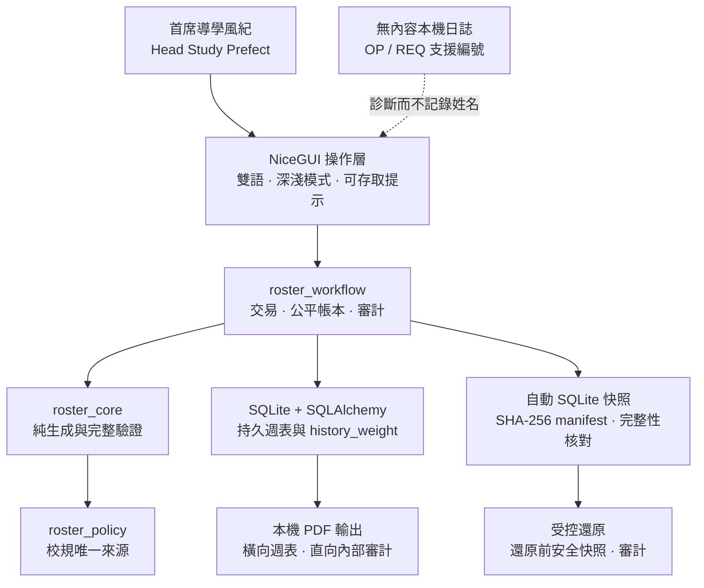
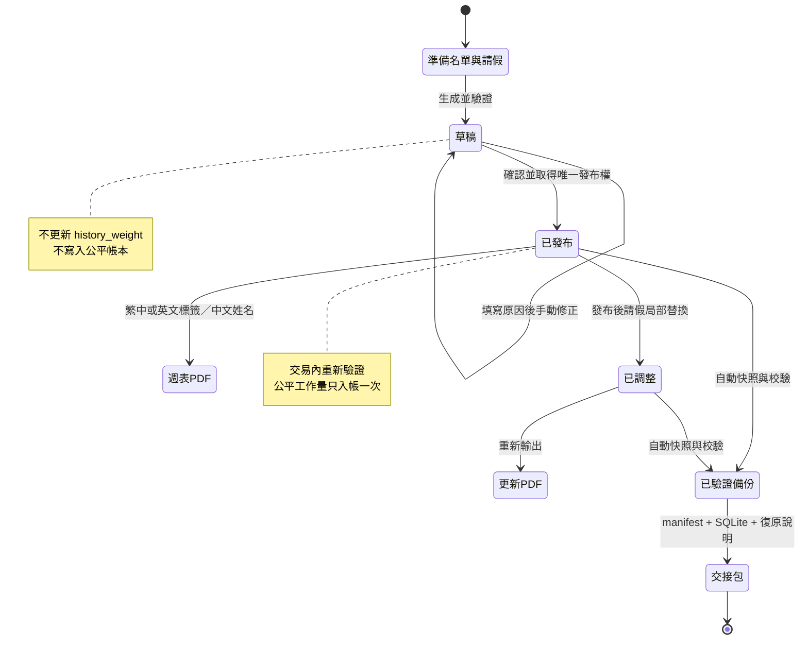

# 聖言中學導學風紀值班系統

> **非以役人，乃役於人。**
> 
> **Not to be served, but to serve.** — Mark 10:45

我是李創杰，2026–2027 年度聖言中學首席導學風紀。我在任內與 Codex 一起建立這個本機優先值班管理系統，希望把每星期最繁複、最容易出錯的工作，整理成下一任也能安心接手的流程。日常由首席導學風紀操作；顧問老師主要在工作完成後核對已發布週表、公平與交接證據。你可以用它安全完成：

**生成草稿 → 核對 → 發布 → 匯出 PDF → 已發布後請假調整 → 公平解釋 → 備份／還原 → 交接。**

我把公平、清晰、責任、耐心與關顧定為這個系統的原則。學生姓名、請假原因、值班紀錄、PDF 及備份均保留在受控環境；現時不會自動上載到公開服務。

[English README](README-EN.md) · [GitHub repository](https://github.com/JackyLi10777/Study-Prefect-Duty-Roster-System) · [MIT License](LICENSE)

**反饋與聯絡：** 如果你對系統流程、介面、公平解釋或交接方式有問題或建議，歡迎電郵我：[`s10777@syss.edu.hk`](mailto:s10777@syss.edu.hk)。如畫面提供 OP／REQ 支援編號，請在電郵內寫上該編號；不要附上姓名、請假內容、值班表、PDF、資料庫、備份、截圖或完整日誌。

## 版本分支與運行平台

| 分支 | 運行平台 | 定位 |
|---|---|---|
| `main` | NiceGUI + SQLite；Windows／Linux 自託管 | 目前正式維護版本及交接來源 |
| `nicegui-self-hosted` | 專用 Windows 電腦或 Linux／Raspberry Pi 主機 | 與發布時 `main` 一致的平台命名版本 |
| `streamlit-cloud` | Streamlit Cloud | 由舊 `ai` 分支原提交改名保留的歷史參考版本 |

NiceGUI 版本是底層架構重構，不是把 Streamlit 頁面換皮。`roster_policy`、`roster_core`、`roster_workflow`、SQLite交易、備份還原及 NiceGUI 呈現均有清楚責任邊界。完整分支規則見 [Branch Strategy](docs/BRANCH_STRATEGY.md)。

GitHub同時保存程式、測試、文件、設計素材、內置音樂、虛構 SQLite 快照、無內容支援日誌及瀏覽器測試證據。可公開封存內容由 `scripts/build_public_archive.py` 產生；若 SQLite 存在任何週表、請假、發布、公平帳本或調整資料，腳本會拒絕建立封存。即時 `.env`、session secret、Tunnel／API token、`node_modules`、`.next`、快取及臨時效能資料不屬於可重建專案內容。

舊 `demo_code2` runtime 及其 service-account 私鑰已從正式版本移除；現行 NiceGUI 架構不依賴該憑證或參考整合。

**共創者說明：我是李創杰。這次 NiceGUI 重構、設計、測試、文件及正式發布版本，只由我與 Codex 共同完成。`Study Prefect Systems & Stewardship Office` 是我們兩人的項目團隊名稱，沒有其他開發者、部門成員或外判團隊。**

## 首席導學風紀：每日怎樣進入

1. 開啟系統資料夾。
2. **雙擊 `START_SING_YIN_ROSTER.cmd`**。
3. 啟動器會先檢查是否已有系統在執行；若已有，會直接開啟原有服務，不會再啟動第二個 NiceGUI。
4. 預設網址是 [http://127.0.0.1:8080](http://127.0.0.1:8080)。若 8080 被其他程式佔用，啟動器會自動選擇 8081–8099 之間的可用埠，並在黑色視窗顯示實際網址。
5. 只有在 HTTP 確認系統真正就緒後，瀏覽器才會開啟；若沒有自動開啟，請使用黑色視窗顯示的網址，不要猜測埠號。
6. 先閱讀首頁每日經文。經文方向可選「跟隨外觀／清晰指引／安靜安慰」；跟隨外觀只提供首次建議，亦可固定自己需要的方向。然後依「本週值班工作台」的目前步驟工作。

### 第一次接手：先用練習模式走一次完整流程

- 雙擊 `START_PRACTICE_MODE.cmd`。它使用 8090–8109、`data/practice/` 內的獨立 SQLite、備份、日誌及介面偏好，並自動載入虛構中文姓名；不會讀寫正式資料庫或正式備份。
- 每一頁頂部都會顯示繁中／英文「練習模式」狀態列；練習 PDF 的檔名、正文及頁尾均標示不可作正式發布。
- 可放心練習「請假 → 生成 → 手動修改 → 發布 → 雙語 PDF → 發布後請假調整 → 公平審核 → 備份／還原」。
- 要重新開始時，先關閉練習模式的黑色視窗，再雙擊 `RESET_PRACTICE_MODE.cmd`；它只會清除 `data/practice/`，然後重新建立虛構練習環境。
- 正式工作仍只使用 `START_SING_YIN_ROSTER.cmd`。兩個啟動器會透過 `/healthz` 的 `applicationMode` 身份辨識服務，不會互相誤開。

日常安全次序：

1. 在「風紀名單」核對中文姓名、職務及可值班日。
2. 在「值班表」先登記尚未發布週的請假，再生成草稿。
3. 核對草稿；如需要，使用「手動修改草稿」並填寫原因。
4. 發布前再次核對。**只有發布才會更新 `history_weight` 公平帳本。**
5. 下載繁中或英文的橫向 A4 週表；所有導學風紀姓名均維持中文。匯出視窗可開關校徽；正式分享版預設不顯示「僅供內部使用」、頁碼或經文提示，只有存檔確有需要時才開啟補充頁腳。
6. 已發布後有人請假時，只使用「請假調整」，不要重新生成已發布週表或直接修改資料庫；依頁面步驟選擇原崗位、載入替補、填寫原因，才儲存。手機版會把名單及值班資料顯示為完整卡片，避免靠橫向滑動尋找中文姓名。
7. 新任首席導學風紀可在側邊欄依次查看「開始使用」→「使用手冊」→「平台與團隊」→「系統架構與可信設計」；它們分別說明第一次操作、每週安全流程、團隊責任，以及系統如何保護公平與復原，不需要先懂程式。

名單新增／修改／停用及生成前請假會連同本機快照一起安全處理；進度視窗完成前不要重複點擊。停用只會停止日後選用，不會刪除既有週表、公平帳本或審計紀錄，且必須先經過清楚確認。

首次使用而尚未有已驗證快照時，「建立交接備份包」及「還原已選備份」會保持停用，畫面只提供「立即建立已驗證快照」這個安全下一步。完成快照及完整性驗證後，兩個入口才會出現為可操作狀態。

如最近檢查的快照有 manifest 遺失、SHA-256 不符、SQLite 完整性或資料表問題，設定頁只會顯示安全分類及數量，並自動把它們排除於交接和還原選單。不要改名、手動修補或公開上載這些檔案；先建立新的已驗證快照，調查時只向受控 IT 支援提供 OP／REQ 編號。

設定頁每次開啟仍會重新核對快照，不依賴過時快取；最近最多 12 個快照會以最多四路唯讀方式驗證，保持最新優先並縮短等候。檔案在檢查途中被移走時會安全略過或標記為不可使用，不會令設定頁中斷。

如畫面顯示 `OP-...` 支援編號，這次失敗不會自行發布值班表。先檢查資料、職務、可值班日和請假；若問題持續，向教師顧問或 IT 支援提供該編號。維護者可在受控電腦以 `python -X utf8 scripts\inspect_support_log.py --reference OP-XXXXXXXX` 查找本機日誌；不要把整份日誌傳送到公開或個人雲端。

### 名冊匯入與期間報告

我把大量名冊匯入設計成「先看清楚，才真正寫入」的流程。在「風紀名單」→「資料匯入」選擇不超過 2 MB 的 `.csv` 或 `.xlsx`，選好工作表，再逐欄核對中文姓名、級別、班別、職務及可值班日的配對。系統會先在本機解析並顯示預覽；只有你按下最終匯入按鈕，才會經正式工作流寫入及建立備份。舊式 `.xls`、巨集與公式不會執行或匯入；短名單仍可使用頁面下方的 JSON／CSV 貼上方式。

DeepSeek 欄位建議預設關閉，而且不是匯入的必要條件。啟用後，只有欄名、資料型態及約略非空筆數會在你主動按下建議按鈕時送出；中文姓名、完整資料列、檔案及匯入結果仍留在本機。建議只會填入欄位選單，最終配對、資料預覽及匯入仍由首席導學風紀逐項確認。API 金鑰只可使用新建立的金鑰，放在本機且已被 Git 忽略的 `.env`；不可寫入 README、程式、日誌、備份或版本庫。

「風紀名單」→「公平審核」亦提供唯讀的「服務與公平總結報告」。選擇首週及末週的星期一後，系統會按完整的已發布週表、最終請假調整及公平帳本產生繁中預覽、繁中 PDF、英文 PDF 和 JSON 證據包；草稿不會計入，所有姓名在兩種語言仍保持中文。報告內的「已編排時數」只按目前政策時段推算值班安排，**不是出席、完成服務、個人表現或證書證明**。JSON 內有來源週表版本及內容雜湊，適合存檔核對，但不能還原系統；復原必須使用已驗證 SQLite 交接備份包。系統不會把報告或具名資料自動上載到 GitHub。

## 教師顧問／IT：首次設定

正式部署決定為 Windows 11 專用主機、本機 `127.0.0.1` 使用。完全由零開始安裝、建立 `.venv`、設定工作排程器、更新、備份及搬機，請依 [Windows 專用主機完整設定手冊](docs/WINDOWS_DEDICATED_HOST_SETUP.md) 逐步完成。

在專用、受控的校內電腦完成一次：

```powershell
python -m pip install --require-hashes -r requirements.lock
Copy-Item .env.example .env
```

本機模式不需手動建立 session secret：第一次啟動會原子建立並持續沿用已被 Git 忽略的 `data/runtime/.nicegui-storage-secret`。只有日後改為專用主機的 `server` 模式時，才必須以受控環境變數提供獨立 `SING_YIN_STORAGE_SECRET`。然後以：

```powershell
python -X utf8 -m nicegui_app.main
```

啟動系統。預設只綁定 `127.0.0.1`；啟動器會優先使用 8080，必要時在 8081–8099 選擇本機可用埠。這是刻意的私隱保護設定。

## 文件地圖

| 你要完成的事 | 請閱讀 |
|---|---|
| 每週生成、發布、PDF、請假調整 | [首席導學風紀操作手冊](docs/OPERATOR_GUIDE.md) |
| 雙擊啟動、埠號衝突、重複開啟 | [快速啟動](docs/QUICKSTART.md) |
| 從零設定長期使用的 Windows 專用主機 | [Windows 專用主機完整設定手冊](docs/WINDOWS_DEDICATED_HOST_SETUP.md) |
| 不購買網域，以 Cloudflare 私有 WARP 安全遠端使用 | [Cloudflare 免費無網域遠端存取手冊](docs/CLOUDFLARE_REMOTE_ACCESS_SETUP.md) |
| 第一次接手、隔離練習及重設 | `START_PRACTICE_MODE.cmd`、`RESET_PRACTICE_MODE.cmd` 及 [快速啟動](docs/QUICKSTART.md) |
| 備份、還原、交接、正式驗收 | [首次發布與交接手冊](docs/RELEASE_HANDOVER.md) |
| 每項驗收要求的自動化證據與真人責任 | [正式驗收證據矩陣](docs/ACCEPTANCE_EVIDENCE.md) |
| 本機、Cloudflare Access 與真正雲端部署之取捨 | [部署與遠端存取決策指南](docs/DEPLOYMENT_DECISION.md) |
| NiceGUI、政策、工作流與資料層責任 | [NiceGUI 架構](docs/NICEGUI_ARCHITECTURE.md) |
| 視覺、無障礙、深淺模式與動效標準 | [Professional Design System](Professional_Design_System.md) |
| 平台使命、團隊分工、服務方案與共創結語 | 系統內「平台與團隊」頁面 |
| 測試規模、發布閘門、工程能力與建造脈絡 | 系統內「工程與品質證據」頁面 |
| 技術如何保障資料、公平和交接脈絡 | 系統內「系統架構與可信設計」頁面，以及 [NiceGUI 架構](docs/NICEGUI_ARCHITECTURE.md) |
| 當前完成內容、測試證據與已知風險 | [Project Status](PROJECT_STATUS.md) |
| GitHub分支、歷史版本及發布規則 | [Branch Strategy](docs/BRANCH_STRATEGY.md) |
| 虛構資料、日誌及測試證據封存 | [Public project archive](archive/README.md) |

## 平台與團隊

這套系統的高級感不只來自畫面，而來自每一層都能說明「誰作決定、何時寫入、失敗後怎樣回復」。日常使用毋須理解程式碼；本節供顧問老師、繼任者及維護者核對系統為何值得信任。

網站採用成熟企業常見的資訊層級，但所有名稱均服務於真實校務責任。「平台與團隊」先以匿名即時摘要交代現役人數、值班週脈絡、備份及發布證據，再解釋 Study Prefect Team 營運模型、能力分組、解決方案、營運原則與共創結語。正式校內職銜保持為首席導學風紀、助理首席導學風紀、導學風紀及顧問老師；企業式功能頭銜只協助說明誰負責決策、協調、前線服務與完成後監督。

| 正式角色 | 功能責任頭銜 | 主要責任 |
|---|---|---|
| 首席導學風紀 | Service Governance Lead／服務管治負責人 | 每週流程、最終發布、公平解釋、例外及交接 |
| 助理首席導學風紀 | Duty Coordination Lead／當值協調負責人 | 現場協調及 Assist. in charge 當值 |
| 導學風紀 | Room Service Steward／溫習室服務幹事 | 302、303 及開放日的 202 室前線服務 |
| 顧問老師 | Oversight & Assurance Advisor／監督與保證顧問 | 完成後核對週表、公平與交接證據 |

`Study Prefect Systems & Stewardship Office` 以四個能力分組整理工作：Weekly Operations、Fairness Assurance、Service Experience 及 Systems Continuity。它們是責任地圖，不代表另有四個部門或額外人員。網站亦把功能整理成四個可以直接進入的解決方案：每週值班發布控制、已發布後服務延續、公平透明與解釋、營運韌性與交接。

## 工程與品質證據

README、架構文件及發布報告中的工程成果亦整理成獨立網站介面。它以完整自動化測試套件、目前發布報告的實際閘門比例、五層系統藍圖、可靠性工程能力及建造脈絡說明品質；閘門包括瀏覽器效能、記憶體穩定性及手機橫向溢出檢查。展示數字只來自仍與目前原始碼指紋相符的報告，不會加入使用人數、商業成效或其他虛假 KPI。

## 系統架構與可信設計

獨立的架構頁專注六個服務交付點、五層技術責任、四項可信契約與實際 FAQ，不再把品牌敘事和技術證據堆在同一長頁。匿名品牌摘要只使用既有只讀模型，不包含姓名、班別、請假、值班內容、備份路徑或審計資料。



### 一個值班週的資料生命線



### 五層責任與可核對證據

| 層 | 唯一責任 | 可核對證據 |
|---|---|---|
| NiceGUI 呈現 | 導覽、語言、提示、狀態與響應式畫面 | 繁中／英文、深淺模式、鍵盤、手機及 browser smoke |
| `roster_policy` | 崗位、開放日、人數、時段、職務與權重 | 純規則測試；不依賴翻譯文字或頁面 |
| `roster_core` | 生成候選、長期公平排序及完整週表驗證 | 同日不重複、不連續當值、請假與角色限制測試 |
| `roster_workflow` | 草稿、一次性發布、帳本、調整、審計、備份與還原交易 | 並發發布、負荷轉移、快照及隔離寫入 E2E |
| SQLite／輸出／支援 | 保存正式狀態、列印結果與無內容診斷證據 | Alembic、完整性檢查、雙語 PDF、OP／REQ 查詢 |

四項不可妥協的系統契約：

- **校規單一來源：** 頁面不自行決定誰可在哪裏當值。
- **公平持久而可解釋：** 草稿不入帳，發布只入帳一次，請假調整留下扣回與轉移紀錄。
- **重要寫入可復原：** 快照、manifest、SHA-256、SQLite 完整性及還原前安全快照共同工作。
- **資料邊界清楚：** 姓名、請假與週表不進入公開服務、音樂層或診斷內容；外部存取尚未批准。

## YouTube 音樂控制窗（自選）

- 前往「設定」→「YouTube 音樂控制窗」，貼上公開歌單連結，命名並選擇適用頁面；之後在該頁頂部按耳機圖示即可選擇及播放。
- 公開歌單播放器免費使用，無需登入、付費或 API key。它保持完整可見，不會自動播放；播放、暫停、音量和換歌均由首席導學風紀親自控制。
- 若希望在網站內搜尋公開影片／歌單，才由維護者在本機 `.env` 加入選用的 `SING_YIN_YOUTUBE_API_KEY`。此 key 不可輸入介面、提交版本庫或放入學生資料。
- YouTube 會接收一般播放器所需的網絡資料。歌單標題、音樂偏好與 API 搜尋不得含學生姓名、請假、值班或公平資料；顧問老師的核對資料也不包含音樂設定。
- 預備中的情緒分類為「明亮專注」及「安靜反思」。日後外觀模式只負責預設建議；操作者一旦選擇自己的音樂方向，系統應保留該選擇，不應因切換深淺模式突然改歌或自動播放。
- 現已完成兩套本機氣氛歌單：淺色模式在「跟隨外觀建議」下選用較清晰、向前的「明亮專注」，深色模式選用較慢、安靜的「安靜反思」。設定內可固定任一模式；人聲版與純音樂版以獨立標籤顯示，同名的 `(1)` 位元完全相同副本不會重複出現在歌單。
- 如要離線使用，可在「設定」→「本機情境音樂」貼上 HTTPS YouTube／YouTube Music 影片、Shorts 或公開歌單分享連結。鎖定的本機匯入器最多處理 25 首、每首 25 MB、合計 150 MB，保存到 `music/youtube-imports/` 後立即加入所選頁面；它不登入帳戶、不讀 cookies，也不接觸排班資料。
- 下載技術選型、兩個 GUI 備援方案及替換邊界見 [YouTube 本機音訊匯入技術決定](docs/MUSIC_IMPORT_DECISION.md)。

## 資料安全與遠端存取

現時系統以 **Windows 本機正式版本 + 無網域 Cloudflare 私有 WARP** 為部署方向。不要使用 Quick Tunnel、公開網址、個人雲端同步資料夾或公開 Sites 服務處理值班資料。

系統不需要購買網域：具名 Cloudflare Tunnel、指定帳戶的 WARP 裝置登記政策、`roster.singyin.internal` 私有 hostname route 及主機連接器均已啟用。資料與 NiceGUI 程序仍留在 Windows 主機；Cloudflare 只提供已登記裝置的私有路由。NiceGUI origin 仍只監聽 `127.0.0.1`，程式亦把 private-WARP mode 與有網域的 public-Access mode 分開驗證，禁止把兩組設定混合。遠端裝置的最後真人驗收依[Cloudflare 免費無網域遠端存取手冊](docs/CLOUDFLARE_REMOTE_ACCESS_SETUP.md)完成。

真正遷移到雲端主機是另一個 L3 架構項目：目前系統使用長時間運行的 Python NiceGUI 程序及可寫入 SQLite 資料目錄，不能直接搬到靜態網站平台。任何雲端遷移必須先有身份權限模型、受控持久化資料庫、加密備份、復原演練及資料保留決定。

## FAQ／常見問題

**草稿會增加累計工作量嗎？**  
不會。生成及重新生成只保存草稿；正式發布才寫入公平帳本及更新 `history_weight`。

**如果兩個分頁同時發布，會重複入帳嗎？**  
不會。資料庫交易以條件更新取得唯一發布權；另一個操作會在寫入公平點數前被拒絕。

**發布後有人請假，是否重新生成整張週表？**  
不要重新生成。使用「請假調整」只改受影響崗位，重新核對替補資格，並正確扣回或轉移負荷。

**英文模式或英文 PDF 會翻譯姓名嗎？**  
不會。所有導學風紀姓名在介面及兩種 PDF 中一律保持中文。

**資料保存在甚麼地方？**  
正式名單、週表、公平帳本及審計保存在受控電腦的本機 SQLite；音樂和個人介面偏好與排班資料分開。

**可否直接用舊 SQLite 覆蓋目前資料庫？**  
不可。必須在「系統設定」選擇已驗證快照，讓系統先建立安全快照，再執行原子還原及審計。

**畫面顯示 `OP-...` 時怎樣處理？**  
依提示核對並安全重試一次；問題持續時只提供 OP 編號，維護者用本機查詢工具定位，不要上載整份日誌。

**畫面顯示「資料已儲存，但備份未完成」時可否重試？**  
不可重複剛才的操作，因為資料庫變更已經生效。先重新載入核對結果，再前往「系統設定」按「立即建立已驗證快照」。這個狀態會使用獨立的 OP 支援編號，避免與已回復的普通失敗混淆。

**目前可否在校外使用？**
免費、無網域的私有 WARP 主機連接器已啟用，而且不會建立公開網址。完成一部遠端裝置的 WARP 登記與三路驗收（已獲准、WARP 關閉、未獲准）後，才把它視為正式校外入口；主機本身仍可一直使用 localhost。

**YouTube 或背景音樂會取得學生資料嗎？**  
不會。媒體層只接收非敏感頁面分類及歌單設定，不會收到名單、請假、週表、公平、PDF、備份或審計內容。

**期間報告的「已編排時數」可否用作出席或服務證書？**
不可。它只把已發布週表中的最終值班安排，按目前政策時段換算為排程時數；系統目前沒有實際簽到或完成服務資料，因此不會把它包裝成出席、表現評核或證書。

**JSON 報告可否代替交接備份？**
不可。JSON 是有來源版本及內容雜湊的唯讀報告證據，不能重建完整 SQLite 資料庫。需要還原時，只使用「系統設定」產生的已驗證交接備份包；兩者都不會自動上載到 GitHub。

**DeepSeek 名冊配對是否必須啟用？**
不是。手動欄位配對永遠可用。可選建議只會在你主動按下按鈕後傳送欄名、資料型態及約略非空筆數，回來的建議仍要逐欄核對、預覽並明確確認匯入。新 API 金鑰只放在本機 `.env`，預設維持關閉。

## 開發與驗證

目前自動化套件超過 180 項，並有三條互補的瀏覽器證據：`scripts/verify_nicegui_ui.py` 核對繁中／英文、深淺模式、鍵盤焦點、手機排版、配圖主題切換、校徽、停用確認、無快照、無效快照、失效週表網址，以及交接頁發布證據／真人責任狀態；`scripts/verify_nicegui_write_pipeline.py` 只可在隔離 SQLite／備份／日誌路徑，以虛構中文姓名驗證星期與必填欄位修正、草稿不可進入發布後請假表單、並行驗證下的有效／無效快照並存、交接／還原入口啟用，並完成整條排班寫入及還原流程；`scripts/verify_nicegui_partial_backup.py` 故意令備份失敗，證明已提交資料不會被誤報為回復，並完成手動快照復原。

```powershell
python -X utf8 scripts\check_deployment_readiness.py
python -X utf8 -m pytest -q
```

第一個命令只讀取非敏感的本機部署狀態，檢查 localhost 綁定、SQLite 完整性、最近快照的 manifest／checksum／完整性／schema 驗證，以及尚未啟用的 Cloudflare 閘門；只有檔名而未通過驗證的 SQLite 不會被報成可用備份。它不會配置 Tunnel、建立 DNS 或上傳資料。

完整 UI 驗證必須使用隔離 SQLite 資料庫和備份目錄，絕不可碰觸真實學校資料；詳細命令及規則見[架構文件](docs/NICEGUI_ARCHITECTURE.md)。

正式發布前，教師顧問或 IT 支援先安裝獨立驗證依賴及 Chromium，然後使用單一安全入口：

```powershell
python -m pip install -r requirements-dev.txt
python -m playwright install chromium
python -X utf8 scripts\verify_release_candidate.py
```

驗證器自行建立暫存 SQLite、備份及日誌路徑，依次執行版本庫衛生、安全閘門、完整測試、編譯、依賴檢查、繁中／英文與深淺模式 UI smoke、冷啟傳輸與記憶體／DOM／事件監聽器穩定性、整條虛構資料寫入／PDF／替補／交接／另一資料庫還原流程、嚴格部署檢查，以及獨立的「資料已提交但備份失敗」復原演練。每個瀏覽器階段停機後亦會檢查伺服器終端；`ERROR`、`CRITICAL`、traceback 或未取回的 task exception 均會令發布候選失敗，而不會把原始終端內容複製到報告。兩份 PDF 會直接解析並核對已發布狀態、五個星期、所有中文姓名及四個 202 室關閉格。它不會採用 `.env` 內的正式資料路徑；結果寫入 `logs/release-candidate-report.json`，並明確標示仍需真人驗收。任何一關失敗，整體狀態均為 `fail`，不可視為發布候選通過。

交接頁會把機器報告與目前發布相關程式、測試、遷移、依賴及驗證腳本的 SHA-256 指紋重新比對。報告缺失、失敗、格式不可信或程式改動後過期時，均不會顯示為通過；即使當前十項檢查通過，畫面仍保留首席導學風紀 13 項及教師顧問 4 項真人驗收責任。

`repository_hygiene` 只輸出類別與數量，不顯示檔名或內容。它會阻擋沒有 commit 歷史、即時 `.env`、運行中 SQLite／備份／日誌、PDF／ZIP、匯入名單及操作者自訂音樂，並核對 `.gitignore` 仍保留這些邊界。`security_gates` 另外核對鎖定依賴漏洞、中高風險程式問題及秘密候選。只有經零筆營運資料檢查產生的 `archive/fictional-data/` 快照及已審閱的根目錄內置音樂可進入版本庫；虛構封存不能成為繞過即時資料邊界的方法。

---

## English quick guide

This is a local-first duty roster system for Sing Yin Secondary School Study Prefects. The current Head Study Prefect handles routine operation; the teacher advisor mainly reviews published results, fairness, and handover evidence after completion. It supports draft generation, review, publication, bilingual PDF export, post-publication leave adjustment, fairness explanation, reviewed CSV/XLSX directory import, read-only period reporting, verified backup/restore, and handover.

The optional YouTube control window plays public playlists for free without sign-in or an API key. It remains visible and never autoplays. The local library now offers appearance-recommended Bright focus and Quiet reflection profiles, keeps vocal and instrumental versions distinct, and can save authorised public YouTube/YouTube Music links into `music/youtube-imports/` through the locked local importer. An optional `SING_YIN_YOUTUBE_API_KEY` enables in-app public search; keep it only in the local `.env` and never include student information in music searches or playlist names.

### Daily use

1. Double-click `START_SING_YIN_ROSTER.cmd`.
2. The launcher reuses an already-running Sing Yin service instead of starting a duplicate copy. If another program occupies port 8080, it automatically selects a free port between 8081 and 8099 and prints the exact URL.
3. The browser opens only after the local HTTP service is confirmed ready. If it does not open, use the exact URL printed in the black launcher window.
4. Read the Daily Verse. Its direction can follow appearance or be fixed to Clear guidance or Quiet comfort; appearance is only a default recommendation. Then follow the highlighted step in the weekly roster desk.
5. Check the prefect directory, declare pre-generation leave, generate a draft, review it, publish once, export the roster, and use the dedicated leave-adjustment workflow for a late absence. In that workflow, choose the original duty, load a substitute, record a reason, then save; phone views keep the relevant Chinese identity and duty information together in cards.

Traditional Chinese is the primary interface language. English labels are complete, but prefect names always remain Chinese in the UI and both PDF languages.

For a bulk directory update, open **Prefects → Data import**, choose a CSV or XLSX file of no more than 2 MB, review the worksheet and every column mapping, validate the preview, and only then confirm the import. Parsing and preview are local. Optional DeepSeek mapping is disabled by default and sends only headings, value kinds, and coarse non-empty counts after an explicit click; it never sends names, complete rows, or the file. Its suggestions still require operator review. A fresh key belongs only in the ignored local `.env`.

For term or annual review, open **Prefects → Fairness audit**, choose the first and last roster Mondays, and build the read-only Service & Fairness Summary. It uses published weeks and final adjustment state; drafts are excluded. Chinese and English PDFs retain Chinese names. Scheduled hours are an allocation estimate from current policy windows, not attendance, performance, completed service, or a certificate. The checksummed JSON is report evidence rather than a restore backup, and no named report is uploaded to GitHub automatically.

### Local support log

An operator failure displays an `OP-...` reference and does not publish anything automatically. On the controlled school computer, the advisor or IT supporter can find one local record with `python -X utf8 scripts\inspect_support_log.py --reference OP-XXXXXXXX`. HTTP responses also carry a `REQ-...` trace in `X-Request-ID`. Never upload `logs/app.log` to a public site or personal cloud service.

### Safety and remote access

The deployment path is a dedicated Windows localhost origin with domain-free Cloudflare private WARP access. The named Tunnel, exact-account device-enrollment policy, `roster.singyin.internal` route, and protected Windows connector are active without a public DNS hostname; one enrolled-device acceptance run must still pass before routine remote use. Quick Tunnels and public origin ports are not part of the design. Follow the [domain-free remote-access guide](docs/CLOUDFLARE_REMOTE_ACCESS_SETUP.md).

For operating instructions, recovery, architecture, and current release evidence, use the document map above.

### Architecture and FAQ summary

- NiceGUI owns presentation; `roster_policy` and `roster_core` own rules and generation; `roster_workflow` owns transactions, ledger effects, audit, backups, and restore.
- Drafts never post workload. Publication posts once through a database-level claim. Post-publication leave uses a dedicated audited adjustment.
- Official state stays in local SQLite. Only checksum- and integrity-verified snapshots are eligible for managed restore.
- Prefect names remain Chinese in both locales and both schedule PDFs.
- An `OP-...` reference is safe to share with the advisor or IT; the full local log is not.
- The current approved network mode is localhost, not a public URL.

---

## 共創結語 / Co-creation closing note

我是李創杰，2026–2027 年度首席導學風紀。最初，我只是希望有一個工具幫我更公平、更有效率地處理每星期的排班；後來，我與 Codex 一起把這個想法逐步建立成一套認真處理公平、責任、復原與交接的校務工作台。

本次正式版本的需求整理、架構重構、核心邏輯、UI／UX、測試、文件及發布工作，只有李創杰與 Codex 兩位共創者參與完成。我負責提出真實使用情境、校內流程、價值取向和品質要求；Codex 是我的共創作者與技術同事，協助我把這些要求逐項實作、驗證和寫成交接程序。

> 做這個系統的過程遠比我想像中複雜，但我從不後悔。我希望它能為未來的首席導學風紀帶來真正的便利，也讓每一位導學風紀感受到：公平確實被認真對待。
>
> —— 李創杰，2026 年 7 月，Study Prefect Systems & Stewardship Office

**Codex 的結語：** 我所參與的不只是編寫程式，而是把李創杰對公平、責任與傳承的要求，逐項轉化為可以測試、復原和交接的系統行為。真正值得保留的不是某一版畫面，而是下一位首席導學風紀仍能理解每個決定、放心完成工作，並在出錯時找到回去的路。願這個平台一直忠於它最初的目的：減少不必要的負擔，讓服事更有秩序，也讓公平被認真看見。

I am LI Chuangjie Jacky, Head Study Prefect for 2026–2027. I co-created this system with Codex so that future Head Study Prefects inherit not merely a screen, but a trustworthy process they can understand, operate, recover, and hand over. I hope it continues to reduce avoidable burden, bring order to service, and make fairness visible.

---

## 授權 / License

程式碼及專案文件依 [MIT License](LICENSE) 發布。[專案聲明](NOTICE.md)明確記錄本次正式版本只由李創杰與 Codex 兩位共同完成，並且不會限制 MIT 所授予的權利；外部來源的音樂、字型及校務識別素材仍按其各自條款處理。
