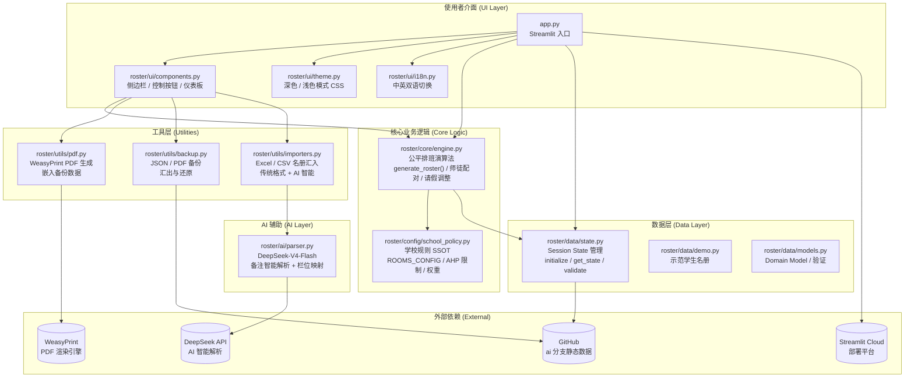
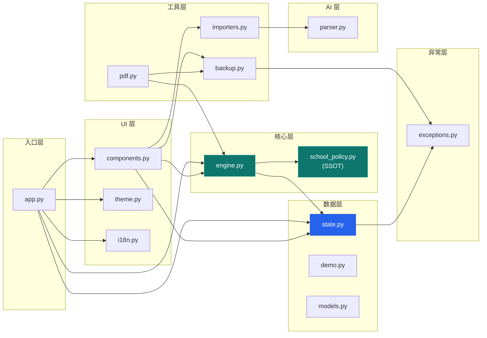
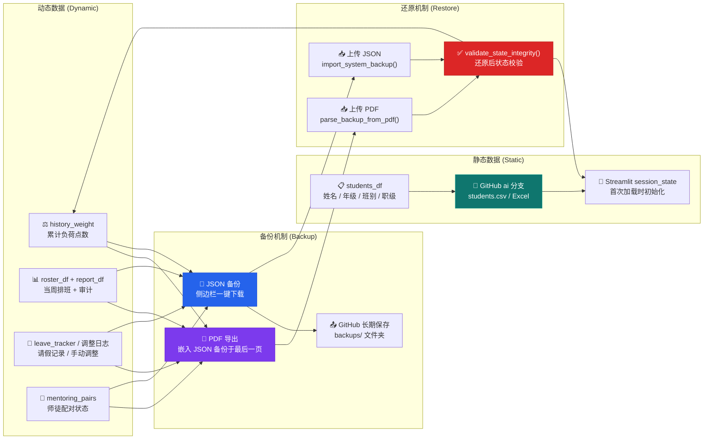

# Sing Yin Study Prefect Duty Roster System

**聖言中學導學風紀當值排班平台 · v2.4**  
*Sing Yin Secondary School — Study Prefect Intelligent Scheduling Platform*

> 为 **30+ 人的导学风纪团队** 打造的专业级智能公平排班管理系统。  
> 集 AI 辅助解析、公平性演算法、师徒配对、PDF 报告生成、双通道备份还原于一体。  
> 专为 **Streamlit Cloud** 无状态环境设计，历经 5 轮架构重构，**62 项自动化测试**全程护航。

---

## 📊 项目规模

| 指标 | 数值 |
|------|------|
| **Python 模块** | 33 个 |
| **代码行数** | 8153+ 行 |
| **自动化测试** | 62 项（4 个测试文件，611+ 行） |
| **Mermaid 架构图** | 4 张 |
| **模块化包** | 1 个主包（`roster/`），含 6 个子模块 |
| **ADRs（架构决策记录）** | 2 份 |
| **文档** | README · AGENTS.md · 使用说明书 · 阶段报告 |
| **AI 后端** | DeepSeek-V4-Flash |
| **PDF 引擎** | WeasyPrint（CSS 排版，专业级） |

---

## 🚀 核心能力

### 🤖 AI 智能导入
DeepSeek-V4-Flash 驱动的智能备注解析与栏位自动映射。支持任意格式的 Excel/CSV 名册上传，无需手动调整栏位顺序。

### ⚖️ 公平性排班引擎
基于累积负荷点数（`history_weight`）的量化公平机制。每次排班自动更新点数权重，确保「付出越多者获更多休息」。完整实现：

- **AHP 领导职优先**：-8.0 强力加权确保「Assist. in charge」岗位始终由 AHP 担任
- **房间智能调度**：Room 202 自动识别周二/五关闭，Room 303 双岗不重复
- **F.3 师徒优先**：低年级在平局时优先，鼓励新人参与
- **全局负荷调节**：0.8×~2.0× 动态倍率，考试周灵活调整
- **不可连续值班**：算法层面避免同一风纪连续两天当值

### 🤝 师徒配对系统
自动识别需要指导的风纪（点数 ≤ 2.0），配对资深风纪（点数 > 5.0）至同一房间。配对岗位可视化标记 🟦，含独立进度追踪面板与基准线快照对比。

### 📄 专业 PDF 报告
WeasyPrint 引擎生成中英文双语彩色值班报告，含校徽、工作量审计表、师徒配对摘要、AHP 规则说明。PDF 末页自动嵌入完整备份数据，一页实现「发送 + 备份」。

### 💾 双通道备份与还原
- **主通道**：PDF 嵌入备份 → 上传完整 PDF 自动还原（无需拆页）
- **备援通道**：JSON 轻量备份 → 侧边栏一键下载/上传
- **长期存储**：GitHub `ai` 分支托管静态学生名册

### 🎨 专业操作体验
深色/浅色模式、中英双语即时切换、历史负荷趋势图、公平性审计仪表板、批量请假/固定值班、智慧替補推荐。Streamlit 原生组件打造，响应式适配平板。

---

## ⚡ 快速开始

```bash
pip install -r requirements.txt
streamlit run app.py
```

部署至 Streamlit Cloud 时需设置 Secrets：`DEEPSEEK_API_KEY`（AI 解析）、`GEMINI_API_KEY`（已废弃，保留兼容）。

---

## 📁 项目结构

```
Study-Prefect-Duty-Roster-System/
├── app.py                  # Streamlit 入口
├── roster/                 # 核心套件
│   ├── config/             # 学校规则 SSOT（school_policy.py）
│   ├── core/               # 排班引擎（公平演算法 · 师徒配对 · 请假调整）
│   ├── data/               # 数据层（Session State · Demo · Domain Model）
│   ├── ui/                 # UI 层（组件 · 主题 · i18n · 多语言）
│   ├── utils/              # 工具层（PDF · 备份 · 名册导入）
│   ├── ai/                 # AI 层（DeepSeek 智能解析与栏位映射）
│   └── exceptions.py       # 结构化异常层次
├── tests/                  # 62 项自动化测试
├── docs/                   # ADR · 阶段报告
└── resources/              # 静态资源
```

---

## 🔧 技术栈

| 层级 | 技术 |
|------|------|
| **前端框架** | Streamlit ≥ 1.38.0 |
| **排班引擎** | Python 3.12 · Pandas ≥ 2.2.0 |
| **AI 服务** | DeepSeek-V4-Flash（OpenAI 兼容 API） |
| **PDF 渲染** | WeasyPrint ≥ 62.3（CSS 排版引擎） |
| **数据可视化** | Plotly ≥ 5.24.0 |
| **测试框架** | Pytest（62 项：单元 + 引擎 + 集成） |
| **部署平台** | Streamlit Cloud（无状态 · 自动休眠恢复） |
| **版本管理** | Git · GitHub（`ai` 分支为主开发分支） |
| **文件处理** | OpenPyXL · Tabulate · Pillow |

---

## 📖 使用说明书（精简版）

### 日常工作流
1. **导入名册** → AI 智能匹配 或 传统格式导入
2. **设定参数** → 请假名单 · 特殊关闭 · 全局负荷倍率
3. **一键生成** → 公平排班演算法自动计算
4. **审核调整** → 手動修改 · 请假撤销 · 智慧替補推荐
5. **导出报告** → 中文/英文 PDF（含备份）· Excel · Markdown
6. **备份保存** → JSON 下载 或 PDF 内置备份 → GitHub 长期存档

> 💡 **完整的使用说明书（11 章节）请在应用内点「📖 使用说明书」展开。**

---

## 🧠 系统架构与核心逻辑

*以下为技术参考内容，面向维护者与下一任 Head Study Prefect。*

### 整体系统概述

本系统是一套为聖言中學導學風紀團隊（Study Prefect Team）设计的**智能公平排班平台**，运行于 Streamlit Cloud。核心目标是在严格遵循学校规则的前提下，自动产生一份尽可能公平的每週值班表。

系统设计原则：**规则即代码（不可绕过）· 公平性可量化（history_weight）· 操作体验专业流畅（生成 → 调整 → 导出一体化）**



> 🔗 系统采用分层模块化设计。`school_policy.py` 是学校规则的**唯一事实来源**，所有排班逻辑通过 `engine.py` 统一调用规则进行公平计算。

---

### 排班核心逻辑

#### 1. AHP（助理首席導學風紀）规则
- 「Assist. in charge」岗位**仅限 AHP**。普通导学风纪不可担任。
- AHP 获 **-8.0 优先加权**（分数越低越优先），确保领导岗位永远由 AHP 填补。
- AHP **不可**担任 Room 302/303/202 等普通岗位。

#### 2. Room 配置表

| 房间 | 每日名额 | 权重 | 开放日 | 备注 |
|------|---------|------|--------|------|
| **Room 302**（Study Room） | 1 人 | 1.0 | 周一至周五 | 无额外限制 |
| **Room 303**（HW Completion） | 2 人 | 1.5 | 周一至周五 | 同日两人不可为同一人 |
| **Room 202**（F1 Study Group） | 2 人 | 1.5 | 周一、三、四 | **周二/五关闭**（F.1 有其他活动） |

#### 3. 公平性机制

- 每位风纪持有 `history_weight`（初始 0.0），每次值班累加岗位权重。
- **点数越低 = 后续排班优先度越高**（体现仆人领袖精神）。
- **F.3 师徒优先**：平局时低年级优先。**不可连续值班**：同日不重复，次日不连续。
- **全局负荷调节**：0.8×~2.0× 滑杆实时调节整体平衡速度。

#### 4. 师徒配对

- 系统自动识别需要指导的风纪（`history_weight` ≤ 2.0）。
- 优先将 mentor（> 5.0）与 mentee 配对至同一房间（Room 303/202）。
- 成功配对显示 🟦 标记，提供 **-2.0 加分**（远小于 AHP -8.0，确保领导优先）。

```mermaid
flowchart TD
    A["📋 载入学生名册<br/>students_df"] --> B🔍 AI 智能解析备注<br/>ai_parse_remarks()
    B --> C["📊 构建候选人池<br/>过滤请假 / 不可用 / 角色限制"]
    C --> D🏠 遍历每个岗位<br/>Assist → Room 302 → 303 → 202
    D --> E🔒 是否为 AHP 专属？<br/>is_assistant_head_only_role()
    E -->|是| F["仅选 AHP 候选人"]
    E -->|否| G["仅选普通 Study Prefect"]
    F --> H📐 房间是否开放？<br/>is_room_open_on_weekday()
    G --> H
    H -->|否| I["标记为 ⬜ 关闭"]
    H -->|是| J["⚖️ 计算公平分数<br/>history_weight × multiplier<br/>+ AHP bonus (-8.0)<br/>+ 随机打破平局"]
    J --> K👥 是否为双人房？<br/>Room 303 / Room 202
    K -->|是| L["🤝 尝试师徒配对<br/>mentee + mentor bonus (-2.0)"]
    K -->|否| M["直接选择最低分候选人"]
    L --> M
    M --> N📅 是否还有岗位？
    N -->|是| D
    N -->|否| O["✅ 生成最终值班表<br/>roster_df"]
    O --> P["📊 计算审计报告<br/>validate_and_compute()"]
    P --> Q["🤝 标注师徒配对<br/>annotate_mentoring_pairs()"]
    Q --> R["📄 显示值班表 + 公平性图表"]
```

---

### 系统架构设计



**关键设计决策：**
- **School Policy 为 SSOT**：`school_policy.py` 定义所有学校规则。`engine.py`、`pdf.py`、`components.py` 均通过 `config` 模块引用，永不 hardcode。
- **Session State 集中管理**：`state.py` 统一管理 Streamlit 会话状态，提供 `get_state`/`set_state`/`validate_state_integrity` 等防御性辅助函数。
- **结构化异常处理**：`exceptions.py` 提供 `BackupParseError`、`StateIntegrityError` 等自定义异常，确保备份还原与状态校验的错误清晰可追踪。
- **DeepSeek AI 解耦**：AI 解析层独立于核心排班逻辑，通过标准接口调用，可随时替换 AI 后端。

---

### 数据流与备份策略



**备份策略：**
- **静态数据**（学生名册）托管于 GitHub `ai` 分支，系统启动时自动加载。
- **动态数据**（排班记录、负荷点数、师徒状态）通过 PDF 嵌入备份（主路径）+ JSON 下载（备援）双重保护。
- 还原时自动执行 `validate_state_integrity()` 校验数据完整性。

---

## 💾 备份与数据持久化

本系统运行在 Streamlit Cloud（无状态环境），数据在休眠或重新部署后可能遗失。请务必做好备份。

### 数据分类
- **静态数据**：姓名、年级、班别、职级、可用日子、固定值班等 → GitHub 仓库托管
- **动态数据**：累计负荷点数、当周排班、请假记录、师徒配对状态等 → 需通过备份功能保存

### 备份方式

| 方式 | 类型 | 说明 | 建议时机 |
|------|------|------|----------|
| **PDF 导出（含备份）** | 主通道 | PDF 末页自动嵌入完整 JSON 备份 | 每次导出 PDF 即自动备份 |
| **JSON 下载** | 备援 | 侧边栏一键下载纯动态数据 | 每次生成排班后 |
| **GitHub 长期保存** | 推荐 | 上传备份至 `backups/` 文件夹 | 重要版本 · 期中/期末 |

> ⚠️ **强烈建议**：养成「操作后立即备份 + 重要版本上传 GitHub」的习惯。PDF 末页嵌入备份是最方便的日常备份方式。

---

## 👤 作者

**26-27 Head Study Prefect（首席導學風紀）**  
**LI Chuangjie Jacky（李創杰）**  
Sing Yin Secondary School（聖言中學）  
F.5E

Email: **s10777@syss.edu.hk**

---

## 📜 License

MIT License

Copyright (c) 2026 LI Chuangjie Jacky（李創杰）  
26-27 Head Study Prefect, Sing Yin Secondary School Study Prefect Team

---

*本專案主要供聖言中學導學風紀團隊內部使用。商业用途或修改发布请先联系作者。*
