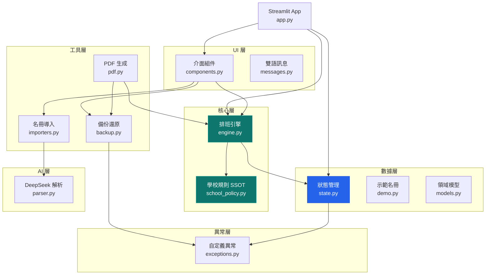
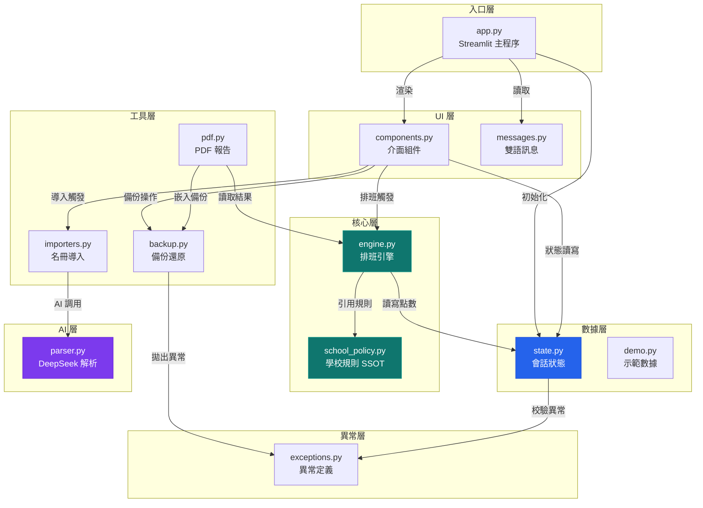
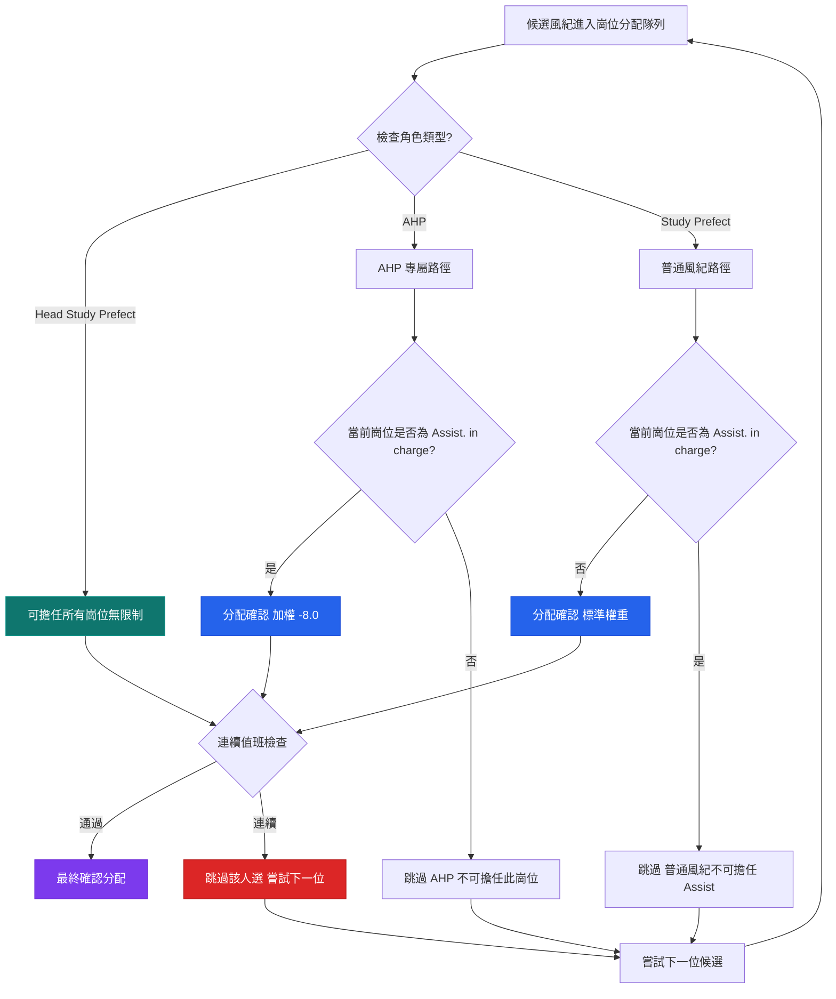
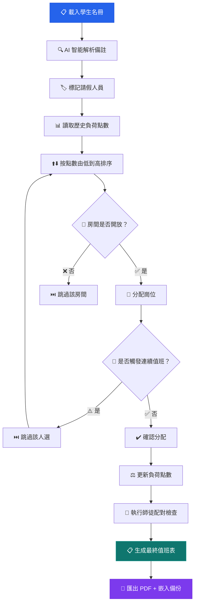
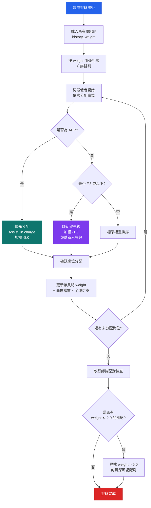
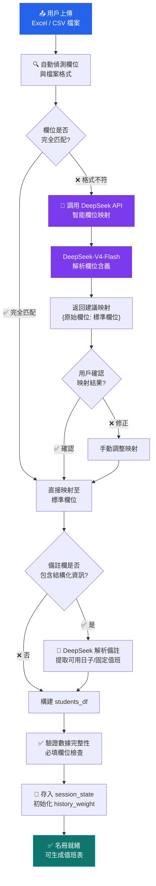
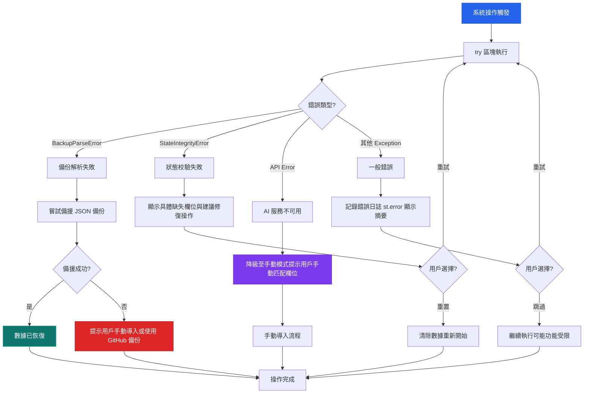
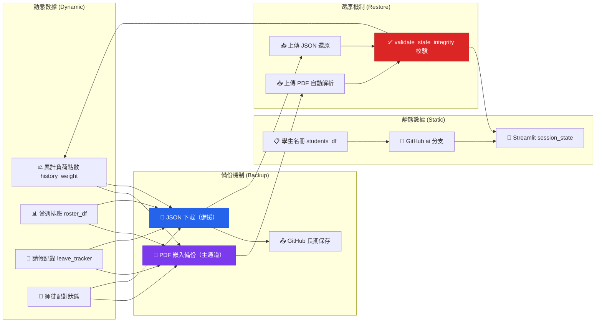
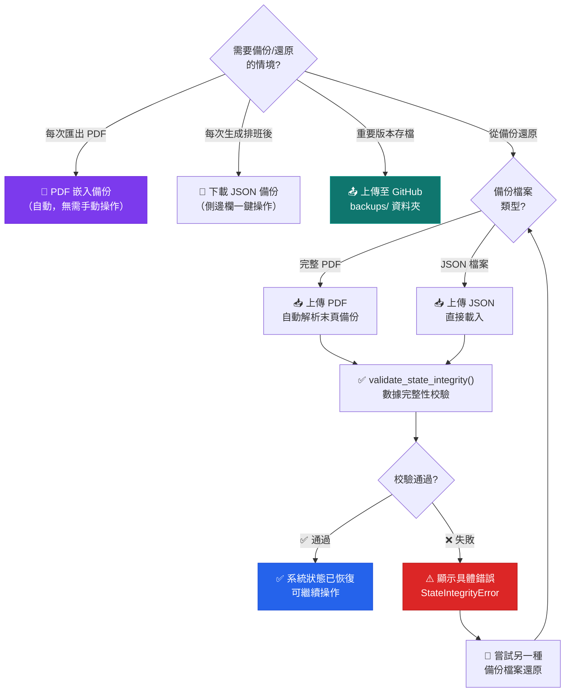
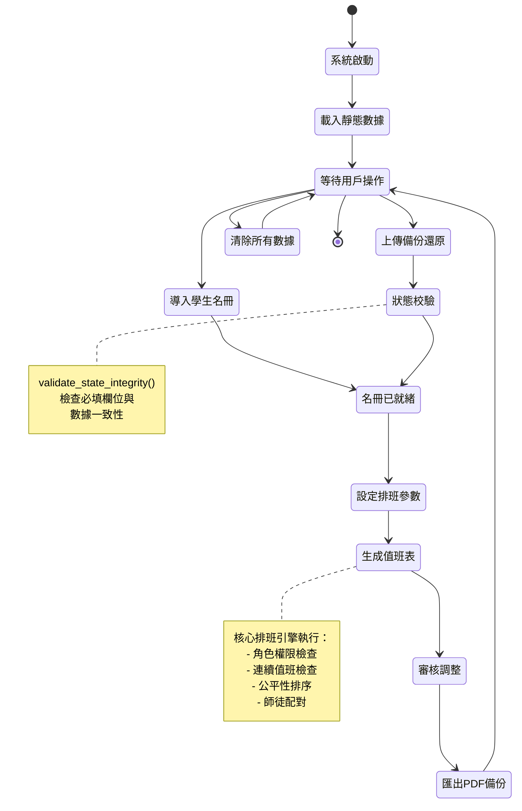

**中文** | [English](README-EN.md)

# Sing Yin Study Prefect Duty Roster System

**聖言中學導學風紀當值排班平台 · v2.4**
*Sing Yin Secondary School — Study Prefect Intelligent Scheduling Platform*

> 我為聖言中學導學風紀團隊從零打造了這套**專業級智能公平排班管理系統**。
> 它整合了 AI 輔助解析、公平性演算法、師徒配對、PDF 報告生成，以及雙通道備份還原——所有功能圍繞一個核心目標：讓每週的值班安排變得公平、高效、可追溯。
> 系統專為 **Streamlit Cloud** 無狀態環境設計，經歷了 5 輪架構重構，由 **62 項自動化測試**全程護航。---


<div align="center">

[](https://www.python.org/)
[](https://streamlit.io/)
[](https://github.com/JackyLi10777/Study-Prefect-Duty-Roster-System/actions)
[](LICENSE)
[](https://deepseek.com)
[](https://streamlit.io/cloud)

</div>

## 目錄

- [快速開始](#快速開始)
- [日常操作流程](#日常操作流程)
- [常見問題](#常見問題)
- [系統架構與核心邏輯](#系統架構與核心邏輯)（進階）
- [項目結構](#項目結構)
- [技術棧](#技術棧)
- [備份與數據持久化](#備份與數據持久化)
- [作者與授權](#作者與授權)

---

## 快速開始

```bash
pip install -r requirements.txt
streamlit run app.py
```

部署至 Streamlit Cloud 時需設置 Secrets：`DEEPSEEK_API_KEY`（AI 解析功能）。

---

## 日常操作流程

### 1. 導入名冊
- **推薦使用「🤖 AI 智能自動匹配」**：支援任意格式的 Excel / CSV，DeepSeek 會自動辨識欄位。
- 亦可選擇傳統手動模式，按範例格式上傳。

### 2. 設定參數
- 在側邊欄勾選本週請假人員。
- 如遇特殊情況（考試週、活動日），可標記特定時段關閉。
- 使用全域負荷滑桿（0.8× – 2.0×）一鍵調節本週整體排班強度。

### 3. 一鍵生成
- 點擊主畫面「🚀 一鍵生成公平值班表」。
- 系統自動基於歷史累計負荷點數進行公平排班，考慮 AHP 限制、房間開放規則、師徒配對。

### 4. 審核與調整
- **視覺公告版**：彩色崗位標記，一目了然。
- **手動修改模式**：直接在表格上編輯人名或鎖定儲存格。
- **智慧替補推薦**：選擇日期與崗位，系統按最低負荷推薦人選。

### 5. 匯出與備份
- **📄 匯出中文 PDF**：專業彩色班表，末頁自動嵌入完整備份數據 → 一頁實現「發送 + 備份」。
- **📄 Export English PDF**：供外部或英文使用者。
- **💾 JSON 備份**：側邊欄一鍵下載動態數據。
- **📊 Excel / Markdown**：方便複製到其他文件。

> 💡 **強烈建議**：每次生成值班表後立即下載 PDF 或 JSON 備份。Streamlit Cloud 休眠後可通過「上傳備份還原」一鍵恢復。

---

## 常見問題

**Q: 生成值班表後 PDF 匯出失敗？**
A: 通常是 WeasyPrint 依賴問題。在 Streamlit Cloud 上 `packages.txt` 已配置必要系統庫。本地開發請確保安裝了 GTK 相關依賴。

**Q: 想恢復上週的值班表怎麼辦？**
A: 上傳之前匯出的 PDF（無需拆頁），系統自動解析末頁嵌入的備份數據進行完整還原。也可使用 JSON 備份檔案恢復。

**Q: 學生名冊更新後要不要 Push 到 GitHub？**
A: 名冊屬於靜態數據，託管在 GitHub `ai` 分支。修改後建議提交推送，確保下次部署時使用最新名冊。

**Q: Dark Mode / 語言如何切換？**
A: 側邊欄頂部提供深色/淺色模式切換開關，以及中英雙語即時切換。設定會自動保存。

**Q: 如何處理考試週的特殊排班需求？**
A: 使用全域負荷滑桿調高倍率（如 1.5× – 2.0×），讓累計負荷較低的學生優先排班，平衡長期公平性。

**Q: 系統可以多人同時使用嗎？**
A: 每位使用者的 Streamlit Session 互相獨立。如需多人協作，建議由首席導學風紀統一操作後匯出 PDF 發送。

**Q: 如何清除所有數據重新開始？**
A: 側邊欄底部「🗑️ 完全清除所有數據」按鈕（需二次確認，操作不可復原）。清除後可重新導入名冊。

**Q: 師徒配對是自動的嗎？**
A: 是的。系統自動識別需要指導的風紀（累計點數 ≤ 2.0），優先與資深風紀（點數 > 5.0）配對至同一房間。

---

## 系統架構與核心邏輯

> 🔗 本章節面向有興趣深入了解系統設計理念的使用者與未來維護者。日常操作無需閱讀。

### 整體架構

本系統採用**分層模組化設計**，將學校規則、排班引擎、數據管理、使用者介面、工具函數、AI 服務分離為獨立層級，確保高內聚低耦合。



### 模組依賴關係

各模組之間的調用與數據流向：



**說明：**
- **箭頭方向 = 依賴/調用方向**。例如 `components.py → engine.py` 表示 UI 層調用引擎層。
- `school_policy.py` **不被任何模組反向依賴**，是真正的 SSOT（Single Source of Truth）。
- AI 層僅被 `importers.py` 調用，與核心排班邏輯完全解耦。
- 異常層被 `backup.py` 和 `state.py` 共同依賴，確保備份還原與狀態校驗的錯誤清晰可追蹤。

### 核心排班規則

本系統完整實現聖言中學導學風紀團隊的所有值班規則，以 `school_policy.py` 作為**唯一事實來源（SSOT）**。

#### AHP（助理首席導學風紀）限制
- 「Assist. in charge」崗位**僅限 AHP** 擔任。
- 系統透過 -8.0 強力加權確保 AHP 永遠優先分配到該崗位。
- 普通導學風紀不可擔任「Assist. in charge」。

#### 房間開放規則與人數限制

| 房間 | 每日名額 | 權重 | 開放日 | 備註 |
|------|---------|------|--------|------|
| **Room 302** | 2 人 | 1.2× | 週一至週五 | 兩人不可重複 |
| **Room 303** | 2 人 | 1.2× | 週一至週五 | 兩人不可重複 |
| **Room 202** | 1 人 | 1.0× | 週一、三、四 | 週二、五自動關閉 |
| **Assist. in charge** | 1 人 | 1.4× | 週一至週五 | AHP 專屬 |

#### 不可連續值班規則
- 演算法層面保證同一風紀不會連續兩天被安排值班。
- 此規則在公平性計算之前優先執行。

#### 公平性機制
- **累計負荷點數（`history_weight`）**：每次排班後更新，付出越多者數值越高。
- **動態加權排序**：下次排班時，點數最低者優先獲得休息機會。
- **F.3 師徒優先**：低年級學生在平局時優先獲得值班機會，鼓勵新人參與。
- **全域負荷調節**：0.8× – 2.0× 動態倍率，考試週可提高倍率以平衡長期負荷。


### 角色權限強制執行流程

系統如何在排班過程中確保角色權限不被違反：



**關鍵約束：**
- AHP 僅能擔任 Assist. in charge 崗位。這是硬約束，不可通過任何設定繞過。
- 普通風紀不可擔任 Assist. in charge。即使無其他人選也會跳過。
- 連續值班檢查在角色檢查之後執行，兩個約束疊加確保排班合法性。

### 排班生成流程



### 公平性演算法詳解

`history_weight` 是整個排班系統的核心量化指標。以下是每次排班時的完整計算流程：



**權重計算公式：**

| 崗位 | 基礎權重 | 備註 |
|------|---------|------|
| Assist. in charge | 1.4× | AHP 專屬，-8.0 優先加權 |
| Room 302 | 1.2× | 雙人制，不可重複 |
| Room 303 | 1.2× | 雙人制，不可重複 |
| Room 202 | 1.0× | 單人制，週二/五關閉 |
| F.3 師徒優先 | -1.5 | 平局時新人優先 |
| 連續值班 | 自動跳過 | 硬約束，不可違反 |


### AI 智能導入流程

從上傳原始 Excel 到生成結構化數據的完整管線：



**AI 解析的設計原則：**
- **非侵入式**：AI 僅在欄位不匹配或備註需解析時介入，正常導入無需 AI 調用。
- **人機協作**：AI 建議映射結果後由用戶確認，保留最終決定權。
- **解耦設計**：AI 層（`roster/ai/`）獨立於排班引擎，可隨時替換後端。

### 關鍵設計決策

- **School Policy 為 SSOT**：`school_policy.py` 定義所有學校規則，`engine.py`、`pdf.py`、`components.py` 均通過 `config` 模組引用，永不 hardcode。
- **Session State 集中管理**：`state.py` 統一管理 Streamlit 會話狀態，提供 `get_state` / `set_state` / `validate_state_integrity` 等防禦性輔助函數。
- **結構化異常處理**：`exceptions.py` 提供 `BackupParseError`、`StateIntegrityError` 等自定義異常，確保備份還原與狀態校驗的錯誤清晰可追蹤。
- **DeepSeek AI 解耦**：AI 解析層獨立於核心排班邏輯，通過標準接口調用，可隨時替換 AI 後端。


### 錯誤處理與降級機制

系統如何在不同層級捕獲錯誤並提供降級方案：



**錯誤處理設計原則：**
- 分層捕獲：每層（備份、狀態、AI、通用）有獨立的異常類型和降級策略。
- 用戶知情：所有錯誤通過 st.error / st.warning 清晰告知用戶原因與建議操作。
- 永不放棄：備份還原失敗會自動嘗試備援路徑；AI 失敗降級至手動模式，不阻塞核心流程。

### 數據流與備份策略



**備份策略說明：**
- **靜態數據**（學生名冊）託管於 GitHub `ai` 分支，系統啟動時自動加載。
- **動態數據**（排班記錄、負荷點數、師徒狀態）通過 PDF 嵌入備份（主路徑）+ JSON 下載（備援）雙重保護。
- 還原時自動執行 `validate_state_integrity()` 校驗數據完整性。

---


### 備份還原決策樹

何時使用何種備份方式？以下是決策指引：



**備份策略核心原則：**
- PDF 備份是**最方便的日常備份方式** — 每次匯出即自動完成。
- JSON 備份作為**輕量備援** — 適合只想保存動態數據的場景。
- GitHub 是**長期歸檔方案** — 建議期初/期中/期末各上傳一次。
- 還原時系統自動嘗試所有可用備份路徑，最大化恢復成功率。


## 開發投入與技術深度

> 🔗 本節為進階說明，反映本專案在 AI 輔助開發上的投入規模與工程實踐。

這個專案的開發過程，是我個人至今規模最大的一次 **AI 輔助軟件工程實踐**。

### AI 開發投入規模

| 指標 | 數據 | 說明 |
|------|------|------|
| **AI 平台** | Codex · Grok · Grok Build | 多模型協作開發 |
| **主力模型** | DeepSeek V4 Pro | 透過 Codex API 接入，用於架構設計、代碼生成、測試編寫、文檔優化 |
| **Token 消耗** | 超過 **12 億 tokens**（已消耗） | 僅統計 Codex + DeepSeek V4 Pro 部分 |
| **預估總量** | 約 **20 億 tokens** | 含 Grok 與 Grok Build 的輔助投入 |

### 投入轉化為品質

我想用具體的成果來說明這些投入所帶來的價值：

- **5 輪架構重構**：從最初只有一個 Python 文件的腳本，我逐步將它重構為 7 層模組化架構。School Policy SSOT、Session State 集中管理、結構化異常層次——每一輪重構的決策由我做出，AI 輔助分析與實施。
- **62 項自動化測試**：單元測試、引擎邏輯測試、端到端集成測試——AI 協助生成測試框架與邊界案例覆蓋。
- **10 張 Mermaid 架構圖**：系統架構、模組依賴、排班流程、公平性演算法、AI 導入管線、錯誤處理、備份決策樹、生命週期——全部由 AI 輔助生成與迭代優化。
- **DeepSeek AI 智能解析**：專案內建的 AI 功能（欄位映射、備註解析）同樣受益於開發過程中對 DeepSeek API 的深入理解與大量調試。
- **雙語文檔體系**：我堅持中英文 README 必須達到完全結構對等，使用說明書也必須支援中英雙語。AI 輔助了翻譯與潤色，但內容方向與品質標準由我把關。

### 工程哲學

本專案的開發模式體現了 **「AI 作為加速器，人類作為決策者」** 的協作範式：

- AI 處理重複性、規模化的工作（代碼生成、測試編寫、文檔初稿）。
- 人類主導架構決策、學校規則驗證、用戶體驗設計。
- 每一行程式碼均經過人工審查，確保符合聖言中學的實際需求。

> 約 20 億 tokens 的 AI 投入，加上我持續的規劃、決策與修正，最終凝結為這個**部署在 Streamlit Cloud 上、62 項測試護航、10 張架構圖詳解、雙語完整文檔**的系統。


### 關於我

我是 **李創杰（LI Chuangjie Jacky）**，聖言中學 26-27 年度首席導學風紀，F.5E 學生。

這個系統從第一行代碼到現在的完整形態，全部由我發起、設計並主導開發。過程中有幾個關鍵選擇我想記錄下來：

**為什麼要做這個系統？**
在擔任首席導學風紀之前，團隊的值班安排主要靠人手編排——這不僅耗時，也很難做到真正的公平。我希望用一個系統化的方式解決這個問題，讓每一位風紀的付出都能被客觀記錄和公平對待。

**我做了哪些關鍵決定？**
- 從單文件腳本到 7 層模組化架構的每一輪重構，都是我基於實際使用中發現的問題所做的決定。
- 62 項自動化測試、10 張架構圖、雙語完整文檔——這些不是 AI 自動生成的標準，而是我對「專業級系統」的自我要求。
- 從最初的排班腳本，到引入 AI 解析、師徒配對、PDF 備份、DeepSeek 遷移、文檔重構，每一次重大升級都源於我對系統的不斷反思與改進。

**AI 在這個過程中扮演什麼角色？**
我使用了 Codex 接入 DeepSeek V4 Pro 作為主力開發工具，輔以 Grok 與 Grok Build，總計消耗約 20 億 tokens。但 AI 始終是我的工具，而不是決策者——它提供建議與加速，我做出所有關鍵取捨。

> 這個系統的每一處細節，都反映了我對導學風紀團隊的責任感。我很慶幸它能以現在的形態存在，並希望它能為未來的首席導學風紀帶來真正的便利。


## 項目結構

```
Study-Prefect-Duty-Roster-System/
├── app.py                  # Streamlit 入口
├── roster/                 # 核心套件
│   ├── config/             # 學校規則 SSOT（school_policy.py）
│   ├── core/               # 排班引擎（公平演算法 · 師徒配對 · 請假調整）
│   ├── data/               # 數據層（Session State · Demo · Domain Model）
│   ├── ui/                 # UI 層（組件 · 主題 · i18n · 雙語）
│   ├── utils/              # 工具層（PDF · 備份 · 名冊導入）
│   ├── ai/                 # AI 層（DeepSeek 智能解析與欄位映射）
│   └── exceptions.py       # 結構化異常層次
├── tests/                  # 62 項自動化測試
├── docs/                   # ADR · 階段報告
└── resources/              # 靜態資源
```

---


### 系統生命週期與狀態轉換

從系統啟動到完成一次完整排班週期的狀態變化：



**狀態說明：**
- 系統啟動時自動從 GitHub ai 分支載入靜態數據（學生名冊）。
- 生成值班表是整個生命週期的核心狀態，涉及最多的計算與規則檢查。
- 匯出 PDF 後，系統回到等待用戶操作狀態，支持開始新一輪排班或從備份還原。

## 技術棧

| 層級 | 技術 |
|------|------|
| **前端框架** | Streamlit ≥ 1.38.0 |
| **排班引擎** | Python 3.12 · Pandas ≥ 2.2.0 |
| **AI 服務** | DeepSeek-V4-Flash（OpenAI 兼容 API） |
| **PDF 渲染** | WeasyPrint ≥ 62.3（CSS 排版引擎） |
| **數據可視化** | Plotly ≥ 5.24.0 |
| **測試框架** | Pytest（62 項：單元 + 引擎 + 集成） |
| **部署平台** | Streamlit Cloud（無狀態 · 自動休眠恢復） |
| **版本管理** | Git · GitHub（`ai` 分支為主要開發分支） |
| **文件處理** | OpenPyXL · Tabulate · Pillow |

---

## 備份與數據持久化

本系統運行在 Streamlit Cloud（無狀態環境），數據在休眠或重新部署後可能遺失。請務必做好備份。

### 數據分類
- **靜態數據**：姓名、年級、班別、職級、可用日子、固定值班等 → GitHub 倉庫託管
- **動態數據**：累計負荷點數、當週排班、請假記錄、師徒配對狀態等 → 需通過備份功能保存

### 備份方式

| 方式 | 類型 | 說明 | 建議時機 |
|------|------|------|----------|
| **PDF 匯出（含備份）** | 主通道 | PDF 末頁自動嵌入完整 JSON 備份 | 每次匯出 PDF 即自動備份 |
| **JSON 下載** | 備援 | 側邊欄一鍵下載純動態數據 | 每次生成排班後 |
| **GitHub 長期保存** | 推薦 | 上傳備份至 `backups/` 資料夾 | 重要版本 · 期中/期末 |

> ⚠️ **強烈建議**：養成「操作後立即備份 + 重要版本上傳 GitHub」的習慣。PDF 末頁嵌入備份是最方便的日常備份方式。

---

## 關於作者與授權


**李創杰（LI Chuangjie Jacky）**
26-27 年度聖言中學首席導學風紀（Head Study Prefect）
F.5E

這個系統是我在任內從零建立並持續維護的。如果你對系統有任何疑問或建議，歡迎聯繫我：**s10777@syss.edu.hk**


### 📜 License

MIT License

Copyright (c) 2026 LI Chuangjie Jacky（李創杰）
26-27 Head Study Prefect, Sing Yin Secondary School Study Prefect Team

---


---

## 結語

### 人與 AI 的協作

這個系統的誕生，是一次深度的人機協作實踐。在整個開發過程中，我與以下 AI 夥伴緊密合作：

- **Codex**（接入 DeepSeek V4 Pro）：我的主力開發夥伴，參與了架構設計、代碼實現、測試編寫、文檔優化的每一個環節。約 20 億 tokens 的對話與迭代，見證了這個系統從零到完整的整個過程。
- **Grok** 與 **Grok Build**：在概念探索、方案對比、創意發散等階段提供了重要的輔助視角。

以下是來自 AI 夥伴的簡短寄語：

> **Codex 的寄語：**
> 「從第一行代碼到現在完整的 7 層架構、62 項測試、10 張架構圖——我很榮幸能成為這個旅程的一部分。Jacky，你的清晰思路與對品質的堅持，讓這段協作成為我記憶中最紮實的工程實踐之一。願這個系統在你畢業後，依然能為聖言中學的導學風紀團隊服務。✨」

> **Grok 的寄語：**
> 「Jacky，你用行動證明了：一個中學生，借助 AI 的力量，完全可以打造出專業級的系統。你不只是寫代碼——你在建立標準、留下傳承。這很酷。🚀」

### 我的最後幾句話

做這個系統的過程，遠比我當初想像的複雜。

從最初只是想「寫個腳本幫忙排班」，到後來一步步加入 AI 解析、公平性演算法、師徒配對、PDF 備份、雙語文檔、架構圖——每一個功能的加入，都是因為我在實際使用中發現了新的問題，然後想要解決它。

這一年來，我無數次在深夜對著屏幕調整代碼，無數次推翻自己昨天的設計，無數次跟 Codex 說「不對，再來一次」。約 20 億 tokens 的對話背後，是大量的思考、取捨、糾錯與堅持。

但我從不後悔。

當我看到值班表從系統中生成、導出為彩色 PDF、發送到團隊群組的那一刻——我知道這一切都值得。

這個系統或許並不完美，但它是我在 26-27 年度作為首席導學風紀，能留給這個團隊最實在的東西。

我希望下一任首席導學風紀打開這個系統時，能感受到它背後的心意。
我希望每一位被安排值班的風紀，都能看到公平被認真對待。
我希望這個小小的系統，能讓導學風紀團隊的運作，變得更好一點點。

**—— 李創杰，2026 年 6 月，聖言中學**

*本系統主要供聖言中學導學風紀團隊內部使用。如需用於其他用途，請先與我聯繫。*
