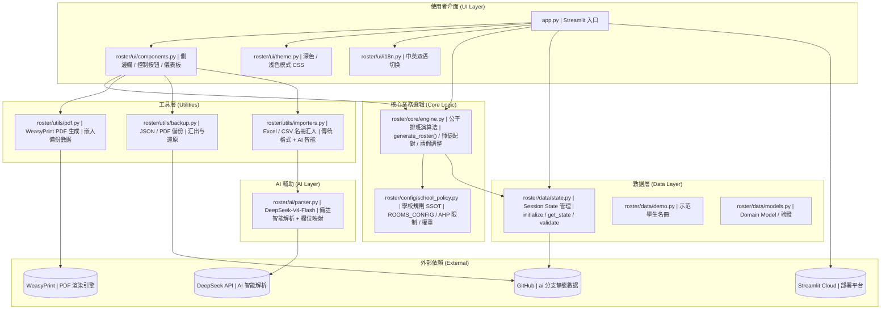
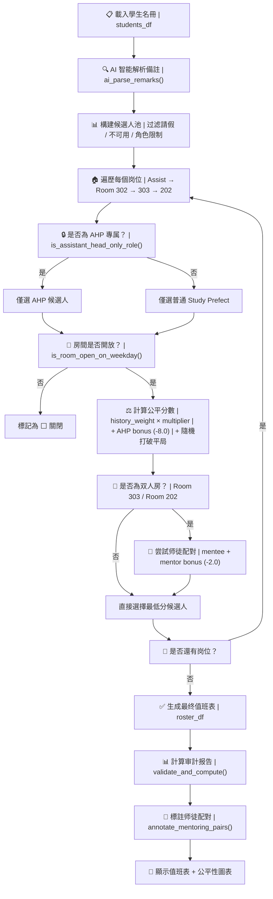
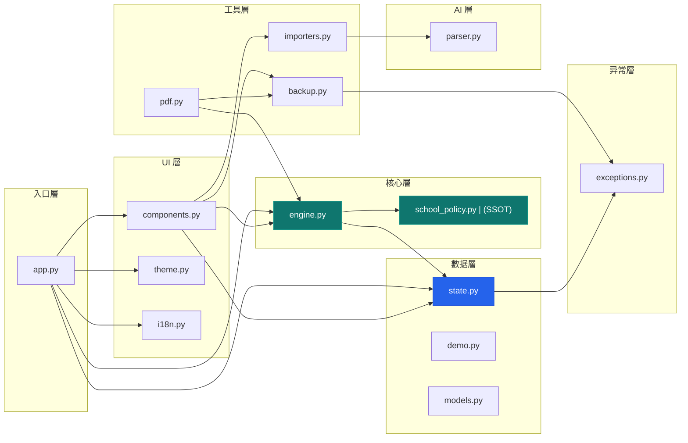
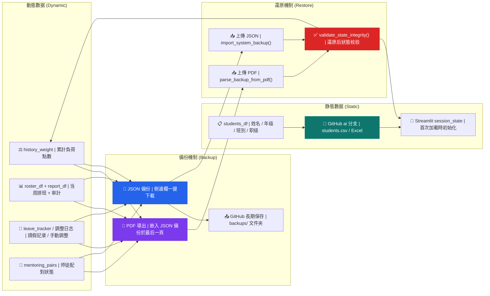

# Sing Yin Study Prefect Duty Roster System

**聖言中學導學風紀當值排班平台 · v2.4**  
*Sing Yin Secondary School — Study Prefect Intelligent Scheduling Platform*

> 為 **30+ 人的導學風紀团隊** 打造的專業级智能公平排班管理系统。  
> 集 AI 輔助解析、公平性演算法、师徒配對、PDF 报告生成、双通道備份還原於一體。  
> 專為 **Streamlit Cloud** 無狀態環境設計，歷经 5 輪架構重構，**62 項自動化测試**全程护航。

---

## 📊 項目規模

| 指標 | 數值 |
|------|------|
| **Python 模塊** | 33 個 |
| **代码行數** | 8153+ 行 |
| **自動化测試** | 62 項（4 個测試文件，611+ 行） |
| **Mermaid 架構圖** | 4 张 |
| **模塊化包** | 1 個主包（`roster/`），含 6 個子模塊 |
| **ADRs（架構決策記录）** | 2 份 |
| **文档** | README · AGENTS.md · 使用說明書 · 階段报告 |
| **AI 后端** | DeepSeek-V4-Flash |
| **PDF 引擎** | WeasyPrint（CSS 排版，專業级） |

---

## 🚀 核心能力

### 🤖 AI 智能導入
DeepSeek-V4-Flash 驱動的智能備註解析与欄位自動映射。支持任意格式的 Excel/CSV 名冊上傳，無需手動調整欄位順序。

### ⚖️ 公平性排班引擎
基於累积負荷點數（`history_weight`）的量化公平機制。每次排班自動更新點數權重，确保「付出越多者獲更多休息」。完整實現：

- **AHP 領導职優先**：-8.0 强力加權确保「Assist. in charge」岗位始终由 AHP 担任
- **房間智能調度**：Room 202 自動識別周二/五關閉，Room 303 双岗不重復
- **F.3 师徒優先**：低年级在平局時優先，鼓勵新人参与
- **全局負荷調节**：0.8×~2.0× 動態倍率，考試周灵活調整
- **不可連续值班**：算法層面避免同一風纪連续兩天当值

### 🤝 师徒配對系统
自動識別需要指導的風纪（點數 ≤ 2.0），配對資深風纪（點數 > 5.0）至同一房間。配對岗位可視化標記 🟦，含獨立進度追踪面板与基準线快照對比。

### 📄 專業 PDF 报告
WeasyPrint 引擎生成中英文双语彩色值班报告，含校徽、工作量审計表、师徒配對摘要、AHP 規則說明。PDF 末頁自動嵌入完整備份數据，一頁實現「發送 + 備份」。

### 💾 双通道備份与還原
- **主通道**：PDF 嵌入備份 → 上傳完整 PDF 自動還原（無需拆頁）
- **備援通道**：JSON 輕量備份 → 側邊欄一键下載/上傳
- **長期存儲**：GitHub `ai` 分支托管静態學生名冊

### 🎨 專業操作體验
深色/浅色模式、中英双语即時切换、歷史負荷趋勢圖、公平性审計儀表板、批量請假/固定值班、智慧替補推荐。Streamlit 原生组件打造，響應式适配平板。

---

## ⚡ 快速開始

```bash
pip install -r requirements.txt
streamlit run app.py
```

部署至 Streamlit Cloud 時需設置 Secrets：`DEEPSEEK_API_KEY`（AI 解析）、`GEMINI_API_KEY`（已废弃，保留兼容）。

---

## 📁 項目结構

```
Study-Prefect-Duty-Roster-System/
├── app.py                  # Streamlit 入口
├── roster/                 # 核心套件
│   ├── config/             # 學校規則 SSOT（school_policy.py）
│   ├── core/               # 排班引擎（公平演算法 · 师徒配對 · 請假調整）
│   ├── data/               # 數据層（Session State · Demo · Domain Model）
│   ├── ui/                 # UI 層（组件 · 主题 · i18n · 多语言）
│   ├── utils/              # 工具層（PDF · 備份 · 名冊導入）
│   ├── ai/                 # AI 層（DeepSeek 智能解析与欄位映射）
│   └── exceptions.py       # 结構化异常層次
├── tests/                  # 62 項自動化测試
├── docs/                   # ADR · 階段报告
└── resources/              # 静態資源
```

---

## 🔧 技术栈

| 層级 | 技术 |
|------|------|
| **前端框架** | Streamlit ≥ 1.38.0 |
| **排班引擎** | Python 3.12 · Pandas ≥ 2.2.0 |
| **AI 服務** | DeepSeek-V4-Flash（OpenAI 兼容 API） |
| **PDF 渲染** | WeasyPrint ≥ 62.3（CSS 排版引擎） |
| **數据可視化** | Plotly ≥ 5.24.0 |
| **测試框架** | Pytest（62 項：单元 + 引擎 + 集成） |
| **部署平台** | Streamlit Cloud（無狀態 · 自動休眠恢復） |
| **版本管理** | Git · GitHub（`ai` 分支為主開發分支） |
| **文件處理** | OpenPyXL · Tabulate · Pillow |

---

## 📖 使用說明書（精简版）

### 日常工作流
1. **導入名冊** → AI 智能匹配 或 傳统格式導入
2. **設定参數** → 請假名单 · 特殊關閉 · 全局負荷倍率
3. **一键生成** → 公平排班演算法自動計算
4. **审核調整** → 手動修改 · 請假撤销 · 智慧替補推荐
5. **導出报告** → 中文/英文 PDF（含備份）· Excel · Markdown
6. **備份保存** → JSON 下載 或 PDF 內置備份 → GitHub 長期存档

> 💡 **完整的使用說明書（11 章節）請在應用內點「📖 使用說明書」展開。**

---

## 🧠 系统架構与核心邏辑

*以下為技术参考內容，面向维护者与下一任 Head Study Prefect。*

### 整體系统概述

本系统是一套為聖言中學導學風紀團隊（Study Prefect Team）設計的**智能公平排班平台**，運行於 Streamlit Cloud。核心目標是在嚴格遵循學校規則的前提下，自動產生一份盡可能公平的每週值班表。

系统設計原則：**規則即代码（不可绕过）· 公平性可量化（history_weight）· 操作體验專業流暢（生成 → 調整 → 導出一體化）**



> 🔗 系统采用分層模塊化設計。`school_policy.py` 是學校規則的**唯一事實來源**，所有排班邏辑通过 `engine.py` 统一調用規則進行公平計算。

---

### 排班核心邏辑

#### 1. AHP（助理首席導學風紀）規則
- 「Assist. in charge」岗位**僅限 AHP**。普通導學風紀不可担任。
- AHP 獲 **-8.0 優先加權**（分數越低越優先），确保領導岗位永遠由 AHP 填补。
- AHP **不可**担任 Room 302/303/202 等普通岗位。

#### 2. Room 配置表

| 房間 | 每日名额 | 權重 | 開放日 | 備註 |
|------|---------|------|--------|------|
| **Room 302**（Study Room） | 1 人 | 1.0 | 周一至周五 | 無额外限制 |
| **Room 303**（HW Completion） | 2 人 | 1.5 | 周一至周五 | 同日兩人不可為同一人 |
| **Room 202**（F1 Study Group） | 2 人 | 1.5 | 周一、三、四 | **周二/五關閉**（F.1 有其他活動） |

#### 3. 公平性機制

- 每位風纪持有 `history_weight`（初始 0.0），每次值班累加岗位權重。
- **點數越低 = 后续排班優先度越高**（體現仆人領袖精神）。
- **F.3 师徒優先**：平局時低年级優先。**不可連续值班**：同日不重復，次日不連续。
- **全局負荷調节**：0.8×~2.0× 滑杆實時調节整體平衡速度。

#### 4. 师徒配對

- 系统自動識別需要指導的風纪（`history_weight` ≤ 2.0）。
- 優先將 mentor（> 5.0）与 mentee 配對至同一房間（Room 303/202）。
- 成功配對顯示 🟦 標記，提供 **-2.0 加分**（遠小於 AHP -8.0，确保領導優先）。



---

### 系统架構設計



**關键設計決策：**
- **School Policy 為 SSOT**：`school_policy.py` 定義所有學校規則。`engine.py`、`pdf.py`、`components.py` 均通过 `config` 模塊引用，永不 hardcode。
- **Session State 集中管理**：`state.py` 统一管理 Streamlit 會話狀態，提供 `get_state`/`set_state`/`validate_state_integrity` 等防御性輔助函數。
- **结構化异常處理**：`exceptions.py` 提供 `BackupParseError`、`StateIntegrityError` 等自定義异常，确保備份還原与狀態校验的错誤清晰可追踪。
- **DeepSeek AI 解耦**：AI 解析層獨立於核心排班邏辑，通过標準接口調用，可隨時替换 AI 后端。

---

### 數据流与備份策略



**備份策略：**
- **静態數据**（學生名冊）托管於 GitHub `ai` 分支，系统启動時自動加載。
- **動態數据**（排班記录、負荷點數、师徒狀態）通过 PDF 嵌入備份（主路径）+ JSON 下載（備援）双重保护。
- 還原時自動执行 `validate_state_integrity()` 校验數据完整性。

---

## 💾 備份与數据持久化

本系统運行在 Streamlit Cloud（無狀態環境），數据在休眠或重新部署后可能遗失。請務必做好備份。

### 數据分类
- **静態數据**：姓名、年级、班別、职级、可用日子、固定值班等 → GitHub 倉库托管
- **動態數据**：累計負荷點數、当周排班、請假記录、师徒配對狀態等 → 需通过備份功能保存

### 備份方式

| 方式 | 类型 | 說明 | 建議時機 |
|------|------|------|----------|
| **PDF 導出（含備份）** | 主通道 | PDF 末頁自動嵌入完整 JSON 備份 | 每次導出 PDF 即自動備份 |
| **JSON 下載** | 備援 | 側邊欄一键下載纯動態數据 | 每次生成排班后 |
| **GitHub 長期保存** | 推荐 | 上傳備份至 `backups/` 文件夹 | 重要版本 · 期中/期末 |

> ⚠️ **强烈建議**：養成「操作后立即備份 + 重要版本上傳 GitHub」的習惯。PDF 末頁嵌入備份是最方便的日常備份方式。

---

## 👤 作者

**26-27 Head Study Prefect（首席導學風紀）**  
**LI Chuangjie Jacky（李創杰）**  
Sing Yin Secondary School（聖言中學）  
F.5E

Email: **s10777@syss.edu.hk**

---

## 📜 License

MIT License

Copyright (c) 2026 LI Chuangjie Jacky（李創杰）  
26-27 Head Study Prefect, Sing Yin Secondary School Study Prefect Team

---

*本專案主要供聖言中學導學風紀團隊內部使用。商業用途或修改發布請先联系作者。*
