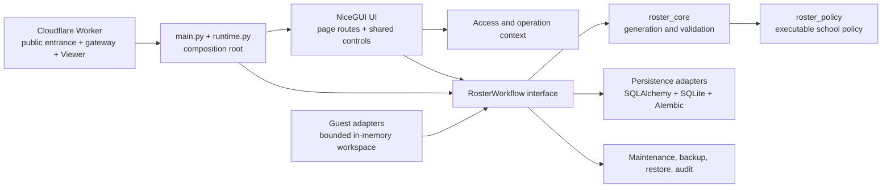
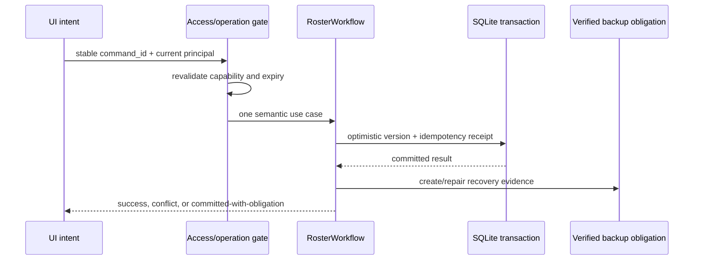

# 架構總覽 / Architecture overview

本文件讓維護者在十分鐘內判斷「一項改動應放在哪裡、可以依賴誰、需要驗證甚麼」。完整交易、資料表、Guest、復原與 UI 細節仍由 [`NICEGUI_ARCHITECTURE.md`](NICEGUI_ARCHITECTURE.md) 擁有；本頁只保留穩定的模組地圖與改動規則。

## 產品範式與固定邊界

「聖言值班表平台」是單一機構、Local-first 的校務值班 B2B Operations Platform，提供 SaaS 級使用體驗。正式資料只在受控 Windows origin 的 SQLite 保存；Cloudflare Worker 是公開入口、身份閘道與加密 Viewer，不是第二個正式資料庫。Admin 與 Guest 共用頁面與互動品質，但 Guest 只接到虛構、短期、隔離的 adapter。

## 模組地圖



依賴方向只可由較外層指向較內層或明確 adapter。UI 只從 runtime composition root 取得身分綁定的 workflow adapter，不直接建立 `RosterWorkflow` 或讀寫 persistence；workflow 與 persistence 不依賴 UI；domain packages 不依賴 NiceGUI application code。

## 模組責任與 seam

| 模組 | Interface 擁有甚麼 | 隱藏的 implementation | 不應放入 |
|---|---|---|---|
| `packages/roster_policy` | 角色、崗位、日期、可分配規則 | 校規細節及正規化 | UI、SQL、HTTP、Session |
| `packages/roster_core` | 生成與驗證結果 | 排班搜尋、完整性與公平計算 | NiceGUI、SQLite、Cloudflare |
| `nicegui_app/persistence` | session factory、models、migration/readiness primitives | SQLAlchemy、SQLite pragma、SQL 診斷 | 頁面、文案、操作流程 |
| `nicegui_app/services` | `RosterWorkflow`、Guest／下載／分享／支援 use cases | 交易、冪等、版本、備份義務、adapter 選擇 | NiceGUI widget 或 CSS |
| `nicegui_app/ui` | 頁面、共用狀態元件、i18n、design/motion contract | Quasar/NiceGUI 呈現與瀏覽器生命週期 | SQLAlchemy model、直接資料庫寫入或直接建立正式 workflow |
| `nicegui_app/main.py`、`runtime.py` | HTTP/runtime composition | 身份接線、啟動、readiness、process lifecycle | 可重用業務規則 |
| `cloudflare/roster_viewer` | 公開入口、Access gateway、Viewer | Token 驗證、KV 密文、edge lifecycle | 正式名單與排班寫入 |

最重要的 deep module 是 `RosterWorkflow`：頁面只需理解 use case、結果及錯誤契約，不需知道交易順序、SQL、備份或 fairness ledger 的實作。

## 一次正式寫入的固定流程



- 同一 UI 意圖只建立一次 `command_id`；雙擊或重試重用該值。
- Timeout 不等於失敗；已提交結果不可自動重送。
- committed-with-obligation 會令新寫入 fail closed，直至備份義務修復。
- Guest 受限操作在進入 loading 及 workflow 之前拒絕，且 service/storage/integration 層仍再次拒絕。

## 改動應放在哪裡

| 想改的內容 | 第一擁有模組 | 常見連動 |
|---|---|---|
| 校規、角色、必需崗位 | `roster_policy` | `roster_core` contract tests、政策文件 |
| 生成策略、公平或完整性 | `roster_core` | workflow adapter、合成規模測試 |
| 寫入、撤回、備份、還原 | `RosterWorkflow`／`workflow_parts` | migration、recovery、operator runbook |
| Guest 能力、容量、保存期 | Guest adapter/workspace | Access policy、UI disabled reason、安全模型 |
| 頁面或互動 | `nicegui_app/ui` 共用 interface | i18n、a11y、Admin/Guest parity、browser evidence |
| 公開登入、Viewer、edge route | Worker | Worker contracts、Access、canonical smoke |
| 啟動、主機、部署 | composition/deployment scripts | readiness、backup、rollback、handover |

若一次小改動需要同時修改三個以上不相鄰模組，先檢查是否有資訊沒有被真正擁有、interface 太淺，或頁面正在重複 workflow 知識；不要先增加另一層 pass-through helper。

## 可執行依賴契約

機器可讀規則在 [`architecture/module-boundaries.json`](architecture/module-boundaries.json)。以下反向依賴會阻塞提交：

- `roster_policy` → `roster_core` 或 `nicegui_app`；
- `roster_core` → `nicegui_app`；
- persistence → workflow services 或 UI；
- services → UI；
- UI → persistence；
- UI → `services.roster_workflow` 的直接建構／匯入（必須經 `runtime.get_workflow()` 取得身分綁定 adapter）。

執行：

```powershell
python -X utf8 scripts/project_governance.py --check
```

此契約保護方向，不假裝證明所有設計都良好。新增 interface 時仍須通過 deletion test：刪掉該模組後，複雜度會否重新散落到多個 caller？若不會，它可能只是淺層包裝。

## 擴展完成定義

一項跨模組更新只有在以下條件成立時才算可迭代：

1. 責任落在上表的一個主要 owner，例外 seam 有 ADR 說明。
2. 公開 interface 描述必要 invariant、錯誤、權限及持久化效果，不暴露內部步驟。
3. 測試從穩定 interface 驗證行為，不綁死私有函式或文案排列。
4. Admin／Guest parity 與 Guest 拒絕邊界均被覆蓋。
5. 改動觸發的文件由 [`documentation-manifest.json`](documentation-manifest.json) 找到並更新。
6. focused evidence 足以支持聲稱；只有跨共享基礎設施或正式發布才擴大至完整 gate。

## English summary

Keep policy and generation framework-independent, persistence presentation-free, workflows UI-independent, and UI free of direct persistence or direct official-workflow construction. `RosterWorkflow` is the primary deep module for transactional use cases; `main.py` and `runtime.py` compose identity-bound adapters. The machine-readable boundary contract prevents reverse imports and UI bypasses, while the detailed architecture document remains authoritative for transactions, recovery, Guest isolation, and runtime behavior.
