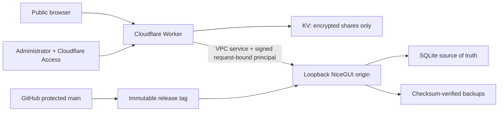

# 公開網站安全與私隱模型 / Public security and privacy model

本文件定義公開入口、Cloudflare Worker、私有 NiceGUI origin、本機 SQLite、
Guest 工作區、GitHub 倉庫及發布流程的安全責任。目標不是宣稱「不可能被攻擊」，
而是讓每個高風險行為預設拒絕、限制損害範圍、留下可診斷證據，並可由已驗證
備份及不可變版本恢復。

This document owns the security contract for the public entrance, Cloudflare
Worker, private NiceGUI origin, local SQLite data, Guest workspace, GitHub
repository, and release path. The goal is not an impossible guarantee of zero
compromise. Every high-risk operation must fail closed, limit blast radius,
leave diagnosable evidence, and remain recoverable from verified backups and an
immutable release.

## 1. 資產及資料分類 / Assets and data classes

| Class | Examples | Authoritative location | Public exposure |
|---|---|---|---|
| Public | landing copy, static assets, capability-only health, fictional demo fixtures | Git repository and Worker | Deliberately public |
| Shared encrypted | published roster ciphertext, nonce, expiry | Cloudflare KV | Ciphertext is retrievable only with a high-entropy share id; the AES key remains in the URL fragment and is not sent to the Worker |
| Guest ephemeral | fictional edits, preferences, generated demo result | bounded origin memory plus signed `sessionStorage` snapshot | Isolated per session/tab; expires and is never written to official SQLite |
| Official operational | prefects, rosters, leave adjustments, fairness ledger, audit trail | loopback-only Windows SQLite and protected backups | Admin only through the verified gateway |
| Secret | Cloudflare tokens, bearer/session/HMAC secrets, exact admin allowlist, host `.env`, SSH private keys | Cloudflare Secret store, protected host file, or operator key store | Never committed, logged, embedded in reports, or returned to browsers |

The public repository intentionally includes source code and fictional evidence.
It must not contain the live database, backup snapshots, `.nicegui` user storage,
runtime logs, `.env`, tokens, or credentials. The school feedback address is
public by design; private backup administrator addresses are not configuration
or documentation data.

## 2. 信任邊界 / Trust boundaries

- The Worker is the only public application boundary. The origin binds to
  `127.0.0.1` and controlled releases require `SING_YIN_REQUIRE_GATEWAY_PRINCIPAL=1`.
- Cloudflare Access proves an allowed administrator identity. The Worker then
  issues its own bounded HttpOnly session; it does not forward the Access JWT.
- Every proxied request receives a short-lived HMAC principal bound to method,
  public host, path/query, authentication epoch, and key id. Missing, stale,
  replayed, or forged principals are rejected by the origin.
- Guest and Admin share the same product routes and experience, but never the
  same storage adapter or capability set.

## 3. 公開入口與 Worker 控制 / Edge and Worker controls

- strict security headers, no framing, no referrer, no indexing, no-store for
  identity and viewer responses, and a restrictive CSP for Worker-owned pages;
- same-origin checks for unsafe methods and WebSocket handshakes;
- bounded request-body streaming before JSON parsing;
- cryptographic randomness and constant-work bearer comparison;
- exact Cloudflare Access issuer, audience, algorithm, JWK, time and secret
  allowlist validation;
- credentials and internal forwarding headers stripped before origin proxying;
- explicit error responses; no fail-open `passThroughOnException`;
- immutable KV content keys plus digest validation and fail-closed collision
  handling because KV does not provide compare-and-swap;
- required Worker secrets inventoried before any deployment version is uploaded.

The exact administrator allowlist is a Cloudflare Secret named
`ADMIN_IDENTITY_ALLOWLIST`, containing a bounded JSON object such as
`{"emails":["admin@example.invalid"]}`. Real values must never be added to
`wrangler.jsonc`, documentation, tests, shell history, or deployment reports.

## 4. 身份、Guest 及權限 / Identity, Guest, and authorization

- Public has no application capability.
- Guest receives only fictional read, in-memory modification, demo download,
  and bounded session preference capabilities.
- AI, import, upload, clipboard ingestion, integrations, sync, official writes,
  background jobs, external delivery, expensive processing, real export,
  backup and restore remain denied below the UI.
- Admin capabilities still pass domain invariants, optimistic version checks,
  confirmation phrases, transaction boundaries, audit and backup obligations.
- Logout revokes the origin session before cookies are cleared; failed
  revocation fails closed.

See [`UNIFIED_GUEST_SECURITY_MODEL.md`](UNIFIED_GUEST_SECURITY_MODEL.md) for the
complete parity and ephemeral-state contract.

## 5. 資料完整性、並行及復原 / Integrity, concurrency, and recovery

SQLite is the official source of truth. WAL mode, foreign keys, bounded busy
timeout, unique constraints, conditional updates, transaction-owned audit
events, and version checks prevent ordinary lost updates and duplicate publish
effects. A UI success message is not the durability point: commit must complete;
where the workflow promises recovery, a verified backup must also complete or
the operator receives the explicit "saved but backup incomplete" state.

Backups are outside Git, checksum verified, integrity checked, restored into an
isolated database, and reconciled against row counts and fairness. Windows ACLs
limit runtime data, backups, logs and `.env` to the dedicated runtime account,
SYSTEM and administrators. Host compromise by an administrator or loss of the
physical disk is outside application-level protection; use Windows device
encryption/BitLocker and an offline encrypted backup when those risks matter.

## 6. GitHub 及供應鏈治理 / Repository and supply-chain governance

The expected live controls are:

- `main` requires a pull request and successful `test-and-audit` plus `analyze`
  checks, including for administrators;
- force pushes and branch deletion are disabled; conversations must be resolved;
- no approval count is required while there is only one human maintainer,
  because an owner cannot approve their own pull request; adding a second trusted
  maintainer must trigger a one-approval and CODEOWNERS-review requirement;
- `GITHUB_TOKEN` defaults to read-only and cannot approve pull requests;
- every `uses:` reference is pinned to a full commit SHA and repository policy
  requires SHA pinning;
- repository ruleset **Protect immutable release tags** applies to `refs/tags/v*`
  and denies both update and deletion, so a published release tag cannot be
  silently retargeted or removed;
- CODEOWNERS routes every change and explicitly marks identity, persistence,
  deployment and workflow paths;
- CodeQL scans both Python and the JavaScript／TypeScript Worker boundary, while
  quality checks run for every pull request and every `main` push;
- Dependabot covers Python, GitHub Actions, and the Worker pnpm lock;
- vulnerability alerts, automated security updates, secret scanning/push
  protection where GitHub makes them available, and private vulnerability
  reporting remain enabled.

Repository history is not the application database. Accidental code deletion is
recoverable from protected `main`, tags and remote history; operational roster
data is recoverable from verified host backups, not from GitHub.

## 7. 發布、偵測與事件處理 / Release, detection, and incident handling

No security-sensitive candidate is deployed from a dirty tree, unpushed commit,
mutable branch name, or report from another fingerprint. The formal verifier,
immutable tag, Windows origin deployment and zero-traffic Worker staging must all
refer to the same source. Promotion occurs only after health, readiness, entrance,
viewer and authenticated-path smoke checks. Rollback restores both the previous
origin tag and previous Worker version.

If compromise is suspected:

1. stop promotion and preserve redacted logs, support references, commit, Worker
   version and timestamps;
2. revoke affected sessions by incrementing `AUTH_EPOCH`;
3. rotate the smallest affected Cloudflare/host secret and remove unknown GitHub
   sessions, tokens, deploy keys or collaborators;
4. withdraw exposed shares and assume copied plaintext cannot be recalled;
5. isolate the host, verify database integrity, restore only from a checksum-
   verified snapshot, and reconcile audit/fairness state;
6. revert to the last verified origin tag and Worker version;
7. patch through a protected pull request, rerun formal gates, document impact,
   and privately coordinate disclosure.

Never paste secrets or full personal-data logs into Issues, pull requests,
Actions output, screenshots, chat, or incident documents.

## 8. 明確限制 / Residual limits

- No internet-facing service can guarantee that it will never be attacked or
  compromised.
- End-to-end encryption protects shared roster content at rest in KV, but anyone
  receiving the complete fragment link can decrypt it until expiry or withdrawal.
- Cloudflare, Windows administrators, browser extensions, endpoint malware and
  physical-device compromise are separate trust domains.
- KV is eventually consistent; immutable keys and conflict detection prevent
  silent replacement but do not turn KV into a transactional database.
- Application backups do not replace encrypted, geographically separate disaster
  recovery when the roster becomes mission critical.

These limits are acceptance inputs, not reasons to weaken the controls above.
