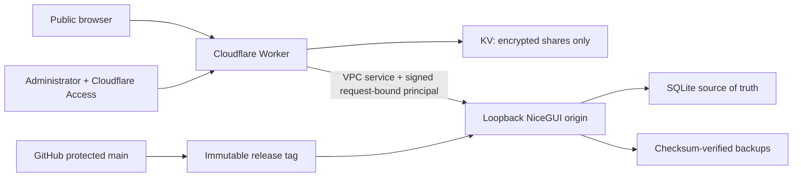

# 公開網站安全與私隱模型 / Public security and privacy model

本文件定義公開入口、Cloudflare Worker、私有 NiceGUI origin、本機 SQLite、
Guest 工作區、GitHub 倉庫及發布流程的安全責任。目標不是宣稱「不可能被攻擊」，
而是讓每個高風險行為預設拒絕、限制損害範圍、留下可診斷證據，並可由已驗證
備份及不可變版本恢復。

This document owns the security contract for the public entrance, Cloudflare
Worker, private NiceGUI origin, local SQLite data, Guest workspace, GitHub
repository, and release path. The goal is not an impossible guarantee of zero
compromise. Every high-risk operation must fail closed, limit blast radius,
leave diagnosable evidence, and remain recoverable from verified backups and an
immutable release.

<!-- SING_YIN_CURRENT_STATUS:START -->
> **Verified production truth (2026-08-02):** the live Windows origin is clean annotated `v1.2.0-rc.47` at `15f53f97eda81b3f4b1518a44567e18171891711` and runs an immutable bundle. Its 310-file fingerprint `3472686105c5a7356da526995438aaef025c52b8c252dc17c21e3de01e27e679` passed 15/15 gates. SQLite is at Alembic `0012`; verified backup `20260801-232211-102949-manual_verified_backup.sqlite3` with SHA-256 `13ca64426a59fcaae098548830de79c3da896a483b2aa8680a0f84488323c432`, isolated restore, health, `writeReady=true`, `maintenance=false`, `recoveryRequired=false`, and `pendingBackups=0` passed. Worker source changed and was promoted; canonical Worker `a7218f51-ec6c-4002-a9be-9dfbb691136c` remains healthy at 100% traffic. `v1.2.0-rc.45` is historical source evidence, not a code-only rollback after migration `0012`; recovery requires the controlled compatible database restore. Supervised human acceptance remains `pending`. See [current system status](status/CURRENT_STATUS.md) for the exact state and update contract.
<!-- SING_YIN_CURRENT_STATUS:END -->

## 1. 資產及資料分類 / Assets and data classes

| Class | Examples | Authoritative location | Public exposure |
|---|---|---|---|
| Public | landing copy, static assets, capability-only health, fictional demo fixtures | Git repository and Worker | Deliberately public |
| Shared encrypted | published roster ciphertext, nonce, expiry | Cloudflare KV | Ciphertext is retrievable only with a high-entropy share id; the AES key remains in the URL fragment and is not sent to the Worker |
| Guest ephemeral | fictional edits, preferences, generated demo result | bounded origin memory plus signed `sessionStorage` snapshot | Isolated per session/tab; expires and is never written to official SQLite |
| Official operational | prefects, rosters, leave adjustments, fairness ledger, audit trail | loopback-only Windows SQLite and protected backups | Admin only through the verified gateway |
| Secret | Cloudflare tokens, bearer/session/HMAC secrets, exact admin allowlist, host `.env`, SSH private keys | Cloudflare Secret store, protected host file, or operator key store | Never committed, logged, embedded in reports, or returned to browsers |

The public repository intentionally includes source code and fictional evidence.
It must not contain the live database, backup snapshots, `.nicegui` user storage,
runtime logs, `.env`, tokens, or credentials. The school feedback address is
public by design; private backup administrator addresses are not configuration
or documentation data.

The local rotating application log remains payload-free across schema upgrades.
Alembic must configure its own handlers without disabling existing application
loggers, and the application logging bootstrap defensively clears a disabled
state after migration. A migration-then-log regression test protects this
boundary; it does not relax the prohibition on names, leave reasons, roster
rows, PDF contents, secrets, or credentials in logs.

## 2. 信任邊界 / Trust boundaries

- The Worker is the only public application boundary. The origin binds to
  `127.0.0.1` and controlled releases require `SING_YIN_REQUIRE_GATEWAY_PRINCIPAL=1`.
- Cloudflare Access proves an allowed administrator identity. The Worker then
  issues its own bounded HttpOnly session; it does not forward the Access JWT.
- Every proxied request receives a short-lived HMAC principal bound to method,
  public host, path/query, authentication epoch, and key id. Missing, stale,
  replayed, or forged principals are rejected by the origin.
- Guest and Admin share the same product routes and experience, but never the
  same storage adapter or capability set.

## 3. 公開入口與 Worker 控制 / Edge and Worker controls

- strict security headers, no framing, no referrer, no indexing, no-store for
  identity and viewer responses, and a restrictive CSP for Worker-owned pages;
- same-origin checks for unsafe methods and WebSocket handshakes;
- bounded request-body streaming before JSON parsing;
- Cloudflare Rate Limiting bindings protect Guest session creation and public
  share retrieval before expensive work. Keys are route-scoped HMAC digests of
  the edge-provided connecting address, so raw addresses are neither sent to
  the limiter nor written by application logs. Limited responses return `429`,
  `Retry-After` and `Cache-Control: no-store`; missing or failed bindings make
  the endpoint and `/healthz` fail closed instead of silently disabling the
  protection;
- cryptographic randomness and constant-work bearer comparison;
- exact Cloudflare Access issuer, audience, algorithm, JWK, time and secret
  allowlist validation;
- credentials and internal forwarding headers stripped before origin proxying;
- explicit error responses; no fail-open `passThroughOnException`;
- immutable KV content keys plus digest validation and fail-closed collision
  handling because KV does not provide compare-and-swap;
- required Worker secrets inventoried before any deployment version is uploaded.

Cloudflare's counters are local to an edge location and eventually consistent;
they are a bounded-abuse control rather than an exact global quota. The Guest
threshold is intentionally tolerant of shared school or household addresses,
while the public viewer has a higher read-only allowance. Identity,
authorization, bounded request bodies and origin capability checks remain the
authoritative security boundaries.

The exact administrator allowlist is a Cloudflare Secret named
`ADMIN_IDENTITY_ALLOWLIST`, containing a bounded JSON object such as
`{"emails":["admin@example.invalid"]}`. Real values must never be added to
`wrangler.jsonc`, documentation, tests, shell history, or deployment reports.

### NiceGUI origin CSP compatibility boundary

Worker-owned public pages keep a strict precompiled-page CSP. The proxied
NiceGUI 3.13 workbench has a separate, tested compatibility boundary: its
framework bootstrap requires inline modules and Vue's runtime template
compiler requires `unsafe-eval`. Removing only `unsafe-eval` returns HTTP 200
but prevents the application DOM from rendering. The origin therefore permits
`unsafe-inline` and `unsafe-eval` as explicit NiceGUI compatibility exceptions
while continuing to block every third-party script and style host. In
particular, `unsafe-inline` permits inline script execution; it is not limited
to same-origin script files, so this policy provides only limited protection
against script injection. Untrusted data must remain escaped, must never enter
an executable inline context, and dynamic HTML attributes must use
`nicegui_app.ui.html_safety`. Browser verification must exercise the production
CSP on representative Admin and Guest routes.

Image access is limited to local/data assets and the two validated YouTube
thumbnail hosts used by the optional search panel. YouTube playback itself is
limited to `www.youtube-nocookie.com` child frames. Parent framing is denied by
both `frame-ancestors 'none'` and `X-Frame-Options: DENY`. NiceGUI's current
local-maintenance and public-proxy WebSocket paths still require `ws:`／`wss:`
scheme sources; replacing those scheme sources with an exact generated host
allowlist remains a hardening item and must be proven in both environments
before narrowing.

## 4. 身份、Guest 及權限 / Identity, Guest, and authorization

`PageContextWorkflowAdapter` retains the verified principal and is wrapped by the runtime identity guard. Every captured workflow invocation rechecks expiry, current `auth_epoch`, current signing-key ID and process-local revocation before reaching the domain workflow. Durable write methods that expose `command_id` must receive the ID created at the user-intent boundary; a retry cannot silently receive a fresh identity. Client polling remains user feedback, never the authorization boundary. Guest receipts retain only bounded request/result digests, operation, revision, and replay metadata; they do not retain full workspace snapshots for every command.

Gateway and snapshot HMAC secrets must be cryptographically generated and must not equal documented placeholders or a repeated single character. This is a deterministic weak-placeholder policy, not a claim that one supplied string's entropy can be measured reliably.

- Public has no application capability.
- Guest receives only fictional read, in-memory modification, demo download,
  and bounded session preference capabilities.
- AI, import, upload, clipboard ingestion, integrations, sync, official writes,
  background jobs, external delivery, expensive processing, real export,
  backup and restore remain denied below the UI.
- Admin capabilities still pass domain invariants, optimistic version checks,
  confirmation phrases, transaction boundaries, audit and backup obligations.
- Logout revokes the origin session before cookies are cleared; failed
  revocation fails closed.
- The browser schedules logout just before principal expiry and navigates away,
  while new HTTP／WebSocket handshakes and every already-captured workflow call
  fail closed independently. Retaining an old transport never extends the
  principal lifetime; explicit socket teardown is defence in depth only.

See [`UNIFIED_GUEST_SECURITY_MODEL.md`](UNIFIED_GUEST_SECURITY_MODEL.md) for the
complete parity and ephemeral-state contract.

## 5. 資料完整性、並行及復原 / Integrity, concurrency, and recovery

SQLite is the official source of truth. WAL mode, foreign keys, bounded busy
timeout, unique constraints, conditional updates, transaction-owned audit
events, and version checks prevent ordinary lost updates and duplicate publish
effects. A UI success message is not the durability point: commit must complete;
where the workflow promises recovery, a verified backup must also complete or
the operator receives the explicit "saved but backup incomplete" state. Every
business write, including new-school-year rollover and external-share delivery,
passes one centralized admission guard. A failed post-commit backup leaves a
durable obligation and keeps all business writes fail-closed until a verified
snapshot settles it. If a durable recovery marker exists at process start, the
runtime enters diagnostic-only mode before migrations, SQLAlchemy sessions, or
SQLite journal mutation; data-free health/readiness remains available, but no
business write is admitted. `/readyz` additionally requires
`workflowInitialized=true`, storage health, no maintenance or recovery marker,
zero pending backup obligations, and no startup-repair failure. Diagnostic-only
startup deliberately returns HTTP 503 with `workflowInitialized=false` and
`writeReady=false`; deleting a marker cannot manufacture workflow sessions, so
controlled recovery and a safe process restart are required before writes can
resume.

Public Viewer publication uses a durable, version-bound outbox. When a
published roster is corrected or withdrawn, the same SQLite transaction marks
every older or possibly delivered share as `revocation_pending` and removes any
queued delivery envelope and decryption key. The UI then attempts idempotent
Worker deletion outside the roster transaction. A lost create response is
treated as possibly delivered rather than incorrectly cancelled; a failed
delete remains retryable and never invites the operator to repeat the committed
roster change. Workers KV is still eventually consistent, so the interface does
not claim instant global disappearance and copied plaintext cannot be recalled.

Backups are outside Git. A trusted recovery point is a self-contained SQLite
snapshot plus a same-name JSON-object manifest; adjacent WAL, SHM, or journal
sidecars are rejected. Verification checks the exact database/manifest digests,
SQLite integrity, a supported migration revision, zero pending obligations, and
the required schema. Managed restore copies those exact bytes to private staging,
re-verifies both digests, migrates only the supported legacy chain from revision
`0007` to the current head in isolation, then validates the current schema,
foreign keys, row counts, and fairness before installation. Unknown or future
revisions are rejected. Handover packaging likewise re-stages and re-verifies the
exact pair immediately before ZIP creation. The off-site recovery seam adds a
path-free receipt bound to the package, snapshot, manifest, schema and immutable
release identity, then restores only from the copied bundle. Its Windows adapter
accepts only a non-system USB／SD NTFS volume with BitLocker protection on and
fully encrypted; it has no internal-disk, cloud-sync, DPAPI／EFS or custom-crypto
fallback. The package is not itself encrypted, so the external volume and its
separately held recovery key are the confidentiality boundary. Exact procedure,
RPO／RTO and custody requirements are owned by
[`OFFSITE_DISASTER_RECOVERY.md`](OFFSITE_DISASTER_RECOVERY.md). Windows ACLs
limit runtime data, backups, logs and `.env` to the dedicated runtime account,
SYSTEM and administrators. An administrator who already controls the host can
still read export-time plaintext and rewrite unsigned receipts; separated
custody and a replacement-location drill remain mandatory.

## 6. GitHub 及供應鏈治理 / Repository and supply-chain governance

The expected live controls are:

- `main` requires a pull request and successful `test-and-audit` plus `analyze`
  checks, including for administrators;
- force pushes and branch deletion are disabled; conversations must be resolved;
- no approval count is required while there is only one human maintainer,
  because an owner cannot approve their own pull request; adding a second trusted
  maintainer must trigger a one-approval and CODEOWNERS-review requirement;
- `GITHUB_TOKEN` defaults to read-only and cannot approve pull requests;
- every `uses:` reference is pinned to a full commit SHA and repository policy
  requires SHA pinning;
- repository ruleset **Protect immutable release tags** applies to `refs/tags/v*`
  and denies both update and deletion, so a published release tag cannot be
  silently retargeted or removed;
- CODEOWNERS routes every change and explicitly marks identity, persistence,
  deployment and workflow paths;
- CodeQL scans both Python and the JavaScript／TypeScript Worker boundary, while
  quality checks run for every pull request and every `main` push;
- Dependabot covers Python, GitHub Actions, and the Worker pnpm lock;
- vulnerability alerts, automated security updates, secret scanning/push
  protection where GitHub makes them available, and private vulnerability
  reporting remain enabled.

Repository history is not the application database. Accidental code deletion is
recoverable from protected `main`, tags and remote history; operational roster
data is recoverable from verified host backups, not from GitHub.

## 7. 發布、偵測與事件處理 / Release, detection, and incident handling

Formal report schema 2 records the exact source commit and tree, clean/dirty state, fingerprint and file count, planned annotated tag, required check identities, start/finish times, tool versions, and `humanAcceptanceRequired`. Origin and Worker deployment scripts compare those fields with the clean tagged `origin/main` source before any switch. A locally editable report is evidence with provenance checks, not a cryptographic attestation; protected GitHub review, immutable annotated tag, controlled deployment, and observed runtime identity remain separate gates.

Admin incident PNG attachments are parsed under compressed-byte, chunk, dimension, decoded-pixel, and sanitized-output limits, converted to RGB/RGBA, and re-encoded without ancillary metadata before their manifest digest is calculated. Signature-only, truncated, malformed, trailing-polyglot, or unsanitizable files fail closed. Guest, Public, and Viewer support remains browser-only.

No security-sensitive candidate is deployed from a dirty tree, unpushed commit,
mutable branch name, or report from another fingerprint. The formal verifier,
immutable tag, Windows origin deployment and zero-traffic Worker staging must all
refer to the same source. Promotion occurs only after health, readiness, entrance,
viewer and authenticated-path smoke checks. Rollback restores both the previous
origin tag and previous Worker version.

Before the protected environment is mutated, the Windows service is stopped, or
its source is switched, the controlled deployer read-only merges the prospective
host settings and requires its loopback port, `AUTH_EPOCH`, and
`ORIGIN_PRINCIPAL_KID` to match the immutable Worker configuration. It repeats
the comparison after applying the environment and before stopping the task.
Either mismatch fails closed. The deployment report may record only the
non-secret host／Worker identifiers and `preflightMatched`／`postApplyMatched`,
but never records the shared principal secret.

If compromise is suspected:

1. stop promotion and preserve redacted logs, support references, commit, Worker
   version and timestamps;
2. revoke affected sessions by incrementing `AUTH_EPOCH`;
3. rotate the smallest affected Cloudflare/host secret and remove unknown GitHub
   sessions, tokens, deploy keys or collaborators;
4. withdraw exposed shares and assume copied plaintext cannot be recalled;
5. isolate the host and restore only from an exact staged database／manifest pair
   that has no SQLite sidecars or pending obligations, uses a supported schema
   revision, and passes checksum, integrity, current-schema and fairness checks;
6. revert to the last verified origin tag and Worker version;
7. patch through a protected pull request, rerun formal gates, document impact,
   and privately coordinate disclosure.

Never paste secrets or full personal-data logs into Issues, pull requests,
Actions output, screenshots, chat, or incident documents.

The product's `/support` flow is the preferred first report. Admin persistence
is opt-in, host-local, size-limited, integrity-hashed, and outside roster
transactions and backups. Guest, Public, and Viewer reports are browser-only.
The detailed operator steps are in
[`SUPPORT_AND_INCIDENT_WORKFLOW.md`](SUPPORT_AND_INCIDENT_WORKFLOW.md); attack
surface, trust assumptions, retention, quarantine, and residual risks are in
[`THREAT_MODEL_SUPPORT_INBOX.md`](THREAT_MODEL_SUPPORT_INBOX.md). A public
GitHub report must contain only a support reference and a redacted technical
summary; attachments with names, leave details, rosters, cookies, tokens,
databases, backups, or complete logs remain in a private controlled channel.

## 8. 明確限制 / Residual limits

- No internet-facing service can guarantee that it will never be attacked or
  compromised.
- End-to-end encryption protects shared roster content at rest in KV, but anyone
  receiving the complete fragment link can decrypt it until expiry or withdrawal.
- Cloudflare, Windows administrators, browser extensions, endpoint malware and
  physical-device compromise are separate trust domains.
- KV is eventually consistent; immutable keys and conflict detection prevent
  silent replacement but do not turn KV into a transactional database.
- Source support for an off-site bundle does not prove disaster recovery. A real
  approved BitLocker device, separated key custody, offline retention and a
  replacement-location drill are still required; see
  [`OFFSITE_DISASTER_RECOVERY.md`](OFFSITE_DISASTER_RECOVERY.md).

These limits are acceptance inputs, not reasons to weaken the controls above.
