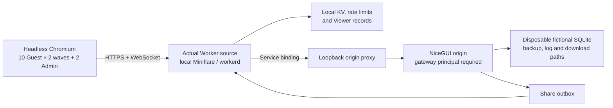

# 本機混合 Gateway 負載驗收 / Local mixed-gateway load acceptance

日期：2026-08-01

裁決：**PASS — 關閉 `ITR-005` 的來源驗收；不是正式部署或 Cloudflare edge 證據**

精確來源：`be13c9f731cfc6fc7ebc081db42cd1e1ec831d25`，`sourceDirty=false`

## 驗收目標

本輪補上過往各自存在、但未在同一實際代理及 WebSocket 路徑共同量度的證據：多個 Guest、Admin 讀取、一次正式寫入、PDF 下載、備份、Viewer 發布／解密及 outbox delivery 在同一個本機 Worker gateway 下同時運作，而且不跨 session 洩漏、不讓 Guest 寫入正式 SQLite、不破壞公平帳本，也不出現未處理 lock／5xx。

這是一個有界、可重現的工程驗收。它不把 localhost 數據冒充正式使用者延遲或 Cloudflare 全球網路容量。

## 實際拓撲



- `run_mixed_gateway_workerd.mjs` 執行版本庫內的實際 `worker.js`，並以 Miniflare／workerd 提供本機 KV、rate-limit bindings 及 service binding。
- loopback adapter 只把受簽署 principal 的 gateway request 轉送到臨時 NiceGUI origin；所有程序、URL 及檔案路徑均限制在本機測試拓撲。
- Python verifier 建立一次性虛構正式 SQLite、備份、日誌與瀏覽器 contexts。父程序只傳入明確 OS allowlist；Cloudflare account、正式 secret 及一般 `.env` 不會繼承到 Node launcher。
- `miniflare 4.20260708.1` 是直接、精確鎖定的 **dev-only** 依賴，因 verifier 直接使用其 API 啟動 workerd；它不進入 NiceGUI 或正式 Worker runtime，也不新增遙測或部署入口。
- launcher 先驗證完整參數、路徑及測試 secrets，之後才動態載入 Miniflare；即使 dev dependency 尚未安裝，缺少參數仍會得到正確、無 account fallback 的 fail-closed 診斷。

## 可重現命令

```powershell
python -X utf8 scripts\verify_mixed_gateway_load.py
```

執行前以 `pnpm install --frozen-lockfile --offline` 核對已鎖定依賴。結果寫入被 Git 忽略的 `logs/mixed-gateway-load/verification.json`；該 JSON 是本機診斷輸出，不是簽署 release evidence，也不可單獨證明部署。

## 精確結果

| Evidence | Result |
|---|---|
| Runtime | actual gateway Worker source under local workerd via Miniflare; `cloudflareNetwork=false` |
| Guest capacity | 10 同時 sessions × 2 waves，共 20 次 start；設定上限 24，並保持每分鐘 20 次 start 的正式本機 gate 預算 |
| Admin capacity | 2 同時 Admin sessions；一個正式寫入與其餘 Admin／Guest 讀取並行 |
| Transport | 22 個 WebSockets observed；66 個 navigation samples |
| Guest isolation | 建立及示範發布虛構 roster；observer history 仍為 0；正式 delivery 被拒絕；PDF 839,989 bytes |
| Admin path | 正式虛構寫入 3,348.40 ms；PDF 838,196 bytes；Viewer share 4,595.33 ms 並成功解密 |
| Database | 13 tables／110 fixture rows；只在 Admin 操作後改變；fairness balanced |
| Backup／outbox | backups `0 → 2`；outbox 1 record、1 delivered、1 attempt |
| Navigation timing | p95 4,240.73 ms；max 4,276.12 ms。包含本機 headless 混合負載及 180 ms settle，不是正式 SLO |
| Memory | origin baseline 141,840,384 bytes；兩輪 cleanup 後 262,586,368／257,191,936 bytes；第二輪比第一輪約低 5.14 MiB；peak／final 相對 baseline 約 +115.15／+110.01 MiB，均低於 128 MiB stop budget |
| Stop conditions | cross-session leak、unhandled lock／5xx、fairness mismatch、Guest DB write、cleanup memory budget exceeded 全部為 `false` |

開始時間為 `2026-08-01T15:54:18Z`，完成時間為 `2026-08-01T15:55:32Z`。預設成功時刪除臨時工作目錄；使用 `--retain` 時成功亦會保留並輸出本機 temp path，失敗時同樣保留供診斷。

## 判讀與限制

- 這是實際 Worker source、workerd 和瀏覽器 WebSocket transport 的證據，但**不是** Cloudflare edge network／VPC Service 的線上證據。
- 這是一次約 74 秒的有界驗收，不是長時間 soak、峰值壓力或容量上限證明。
- 環境只是一部 Windows 主機與 headless Chromium；實體 iPhone／Android、真實身份及教師顧問驗收仍由 `ITR-001` 負責。
- 本輪量度 10／24 個同時 Guest，並刻意不超過 20 starts／minute；它證明目前操作基線，不宣稱 24-session 飽和後仍有相同延遲。
- 一個 Admin writer 與 Admin／Guest reads 並行；多 Admin 寫入序列化、optimistic version 和 idempotency 仍由交易層並發測試擁有。
- p95 是本機測試拓撲的比較基線，不是使用者體驗 SLO；真實 edge 延遲只能由經批准的線上觀察另行證明。

上述限制已被寫入驗收、架構、更新流程與文件索引，因此 `ITR-005` 可以關閉，而不是把未量度範圍靜默算成完成。

## 安全、回退與正式狀態

驗證器不接受 production URL、正式資料路徑或 account credential；測試報告明確記錄 `productionTouched=false`、`data=fictional-disposable`。本輪沒有 schema、產品政策、路由、UI、Session、正式 Worker 設定或部署變更。若工具本身有問題，回退來源 commit 即可；正式 rc45、SQLite 和 Worker 完全不受影響。

## English summary

The exact clean source commit passed a bounded local mixed-load acceptance run using the real gateway Worker source under Miniflare/workerd, real browser WebSockets, a loopback NiceGUI origin, local KV/outbox, and disposable fictional data. Ten simultaneous Guest sessions across two waves plus two Admin sessions produced 22 WebSockets, isolated Guest state, successful Admin write/PDF/backup/outbox/Viewer paths, balanced fairness, no unhandled lock or 5xx, and bounded cleanup memory. This closes the source-evidence scope of `ITR-005`; it is not a Cloudflare-edge soak test, production SLO, deployment claim, or substitute for physical-device and supervised human acceptance.
